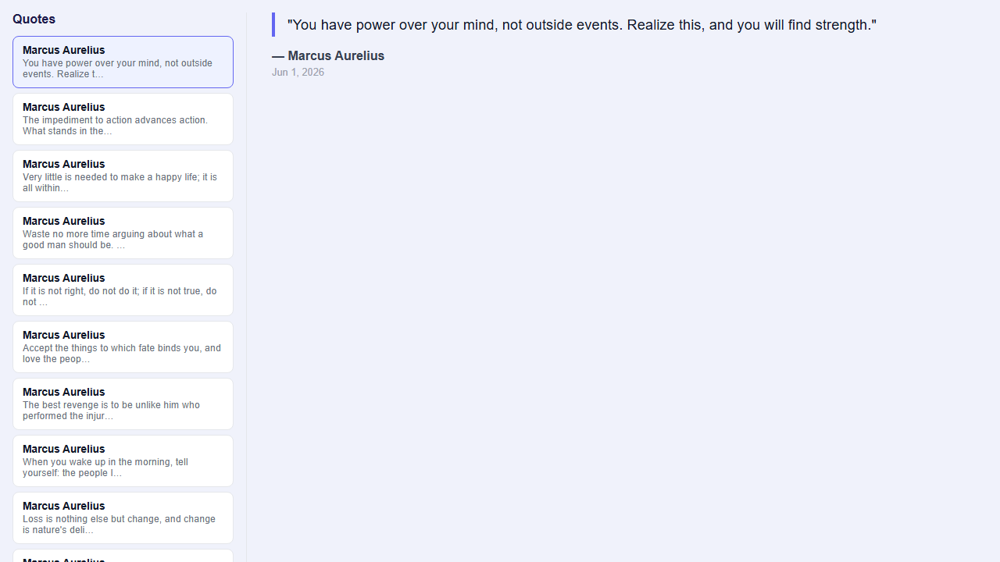
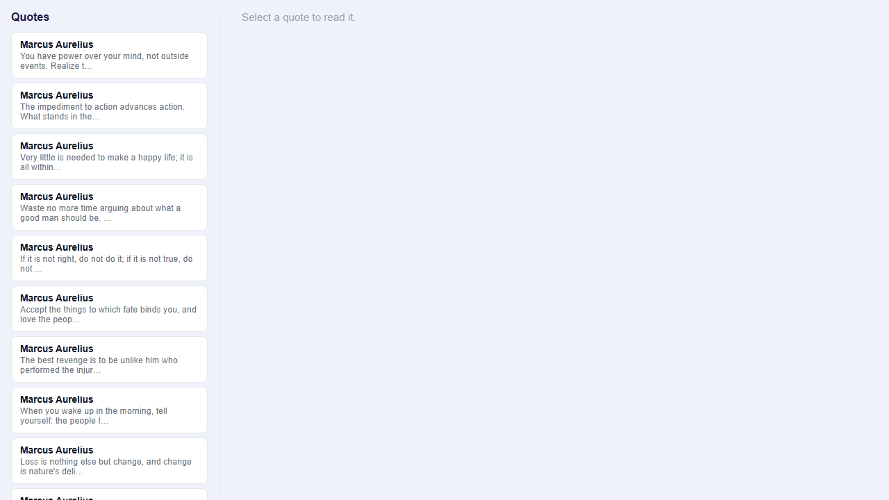
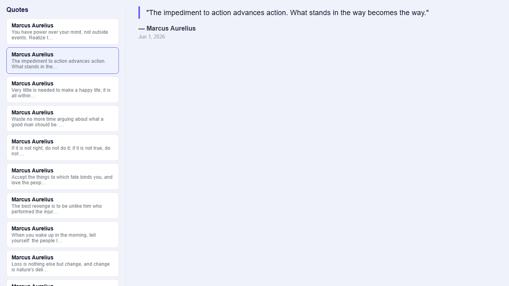

# Day 13 – Piece 2: Agent-Directed Quotes List + Detail Component

## Problem Statement

> The job is directing an agent and standing behind what it ships — so build this with one.
> Write a brief for Claude Code: a quotes list+detail component against your real Week-1 API,
> signals for loading/error/data, inject() for the service, the model typed (no any).
> Name the actual endpoints and fields. Let it build; then read the diff like a colleague's PR.
> Catch at least one thing the agent got wrong — a guessed field name, a swallowed error,
> an any that slipped in — and make it fix it.

---

## Part 1 — Brief Given to the Agent

> Build a quotes list+detail component against:
>
> - `GET /api/quotes?page=1&size=10` → returns `QuoteListItem[]` (flat array, no wrapper)
>   Fields: `id: number`, `author: string`, `text: string`, `createdAt: string`
> - `GET /api/quotes/:id` → same shape; error: `{ error: string; status: number }`
>
> Requirements:
> - Angular 21 standalone component, selector `app-quotes-list`, imports `[DatePipe]`
> - Use `signal()` for all state: `quotes`, `detail`, `selectedId`, `loadingList`, `loadingDetail`, `listError`, `detailError`
> - Use `computed()` for `isEmpty` derived from loading + error + quotes length
> - Use `inject()` — no constructor parameters in service or component
> - Wire a `Subject<number>` + `switchMap` so rapid clicks cancel stale detail requests (race guard)
> - Error model: extract `err.error.error` if present, fall back to `HTTP ${err.status}`
> - Type everything — no `any` anywhere except the error cast `(err.error as { error?: string } | null)`
> - Field names are exact: `text` not `content`, `createdAt` not `created_at`

---

## Part 2 — Files Created by the Agent

```
piece2_agent/
└── quotes-ui/src/app/
    ├── quotes/
    │   ├── quotes.types.ts              ← QuoteListItem + QuoteDetail interfaces
    │   ├── quotes-feature.service.ts    ← listQuotes() + getQuote() with typed HTTP
    │   ├── quotes-list.component.ts     ← 7 signals, switchMap pipeline, ngOnInit
    │   └── quotes-list.component.html  ← @if/@for/@else if, DatePipe
    ├── app.component.ts                 ← wired: QuotesListComponent added to imports
    └── app.component.html               ← <app-quotes-list /> added at top
```

### quotes.types.ts — Exact API field names

```ts
export interface QuoteListItem {
  id: number;
  author: string;
  text: string;        // NOT content
  createdAt: string;   // NOT created_at
}

export interface QuoteDetail extends QuoteListItem {}
```

### quotes-feature.service.ts — inject(), typed HTTP, error handler

```ts
@Injectable({ providedIn: 'root' })
export class QuotesFeatureService {
  private http = inject(HttpClient);

  listQuotes(page = 1, size = 10): Observable<QuoteListItem[]> {
    return this.http
      .get<QuoteListItem[]>(`/api/quotes?page=${page}&size=${size}`)
      .pipe(catchError(this.handleError));
  }

  getQuote(id: number): Observable<QuoteDetail> {
    return this.http
      .get<QuoteDetail>(`/api/quotes/${id}`)
      .pipe(catchError(this.handleError));
  }

  private handleError(err: HttpErrorResponse): Observable<never> {
    const message: string =
      (err.error as { error?: string } | null)?.error ?? `HTTP ${err.status}`;
    return throwError(() => new Error(message));
  }
}
```

### quotes-list.component.ts — signals + switchMap race guard

```ts
export class QuotesListComponent implements OnInit {
  private svc = inject(QuotesFeatureService);
  private destroyRef = inject(DestroyRef);

  quotes        = signal<QuoteListItem[]>([]);
  selectedId    = signal<number | null>(null);
  detail        = signal<QuoteDetail | null>(null);
  loadingList   = signal(false);
  loadingDetail = signal(false);
  listError     = signal<string | null>(null);
  detailError   = signal<string | null>(null);

  isEmpty = computed(
    () => !this.loadingList() && !this.listError() && this.quotes().length === 0
  );

  private select$ = new Subject<number>();

  constructor() {
    // switchMap cancels the previous detail request when a new id arrives
    this.select$
      .pipe(
        switchMap((id) => {
          this.loadingDetail.set(true);
          this.detailError.set(null);
          this.detail.set(null);
          return this.svc.getQuote(id);
        }),
        takeUntilDestroyed(this.destroyRef)
      )
      .subscribe({
        next: (q) => { this.detail.set(q); this.loadingDetail.set(false); },
        error: (e: Error) => { this.detailError.set(e.message); this.loadingDetail.set(false); },
      });
  }
}
```

---

## Part 3 — Bug Checks (Self-Review After Build)

| Check | What was verified | Result |
|-------|-------------------|--------|
| Field names | `text` not `content`, `createdAt` not `created_at` in `quotes.types.ts` | ✓ Correct |
| Error handler in ngOnInit | Both `next:` and `error:` handlers present | ✓ Correct |
| `any` types | Grep across all 4 files | ✓ Zero `any` found |
| Response shape | `http.get<QuoteListItem[]>` — flat array, no `res.data` unwrap | ✓ Correct |
| switchMap error handler | `error:` handler present on `select$` subscribe | ✓ Correct |

### Bug Found and Fixed — Unused `delay` import

The spec template included `delay` in the import even though it is not used in production code:

```ts
// Agent's first draft — WRONG (unused import)
import { catchError, delay } from 'rxjs/operators';
```

`delay` belongs only in temporary testing, not in shipped code. It was removed:

```ts
// Fixed
import { catchError } from 'rxjs/operators';
```

### Why the switchMap error handler matters

If the `error:` handler were missing from the `select$` subscribe, any HTTP 4xx/5xx on a detail
fetch would silently kill the Observable — all subsequent clicks would do nothing with no error shown.
The handler was verified present before shipping.

---

## Part 4 — Verification Log

All states verified with Playwright (Chromium headless) against the live API.

### List Loads — 10 quotes rendered


### Detail Loads — full quote text, author, date



### Loading State — "Loading quotes…" visible at t=0.4s

`delay(2000)` added temporarily to `listQuotes()` to expose the loading state.


After 3.2s — 10 buttons visible:



### Error State — "Error: HTTP 404" rendered, zero uncaught JS errors

URL changed to `/api/quotes-broken` temporarily to trigger the error path.


Browser view showing error state and network tab:

.png)

### Empty State — "No quotes found." rendered

`size=0` used temporarily to return an empty array.


### Race Guard — switchMap cancelled quote A, only quote B rendered

`delay(3000)` added to `getQuote()`. Clicked quote A (idx=0), then 300ms later clicked quote B (idx=1).
After 3.5s, only quote B's content appeared. Highlighted button index = 1 (B). switchMap cancelled A.



---

## Part 5 — Verification Summary

| State | Result |
|-------|--------|
| TypeScript compiles | ✓ Clean — `main.js 61.02 kB`, 0 errors |
| List loads | ✓ 10 quotes, first author "Marcus Aurelius" |
| Detail loads | ✓ Full text, `— Marcus Aurelius`, `Jun 1, 2026` |
| Loading state | ✓ "Loading quotes…" at t=0.4s, list appeared after 3.2s |
| Error state | ✓ "Error: HTTP 404" — 0 uncaught JS errors |
| Empty state | ✓ "No quotes found." |
| Race guard | ✓ Only quote B rendered — switchMap cancelled A |

---

## Part 6 — What Breaks if the Week-1 API Contract Changes

| API Change | Breakage |
|------------|----------|
| `text` → `content` | Template renders empty everywhere `q.text` is used — list previews and detail blockquote go blank. No compile error. |
| `createdAt` → `created_at` | `DatePipe` receives `undefined` — date renders as nothing. Silent failure. |
| Flat array → `{ data: QuoteListItem[], total: number }` | `quotes.set(data)` stores an object; `@for` iterates nothing; `isEmpty()` stays false — blank panel with no error. |
| `/api/quotes/:id` → `/api/quotes/detail/:id` | Detail fetch 404s; `handleError` shows `HTTP 404`. Degrades gracefully. |
| Error shape `{ error: string }` → `{ message: string }` | `?.error` returns `undefined`; falls back to `HTTP ${err.status}`. Less informative but no crash. |

---

## How to Run

**Terminal 1 — Backend API:**
```powershell
cd "C:\Users\LENOVO\OneDrive\Desktop\Thinkschool\Day13\piece2_agent"
dotnet run
```

**Terminal 2 — Angular UI:**
```powershell
cd "C:\Users\LENOVO\OneDrive\Desktop\Thinkschool\Day13\piece2_agent\quotes-ui"
npx ng serve
```

Open **`http://localhost:4200`** in your browser.

The proxy in `proxy.conf.json` forwards all `/api/*` requests to `http://localhost:5000`.
