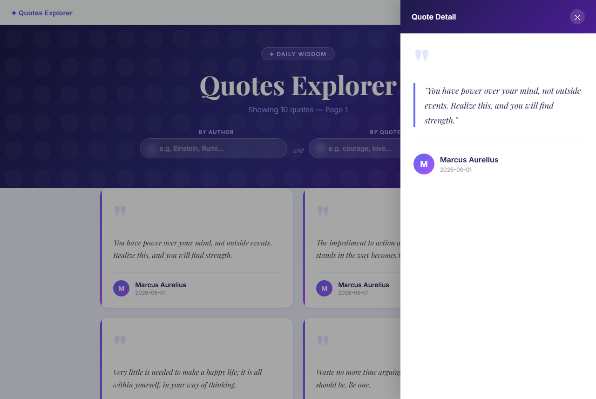
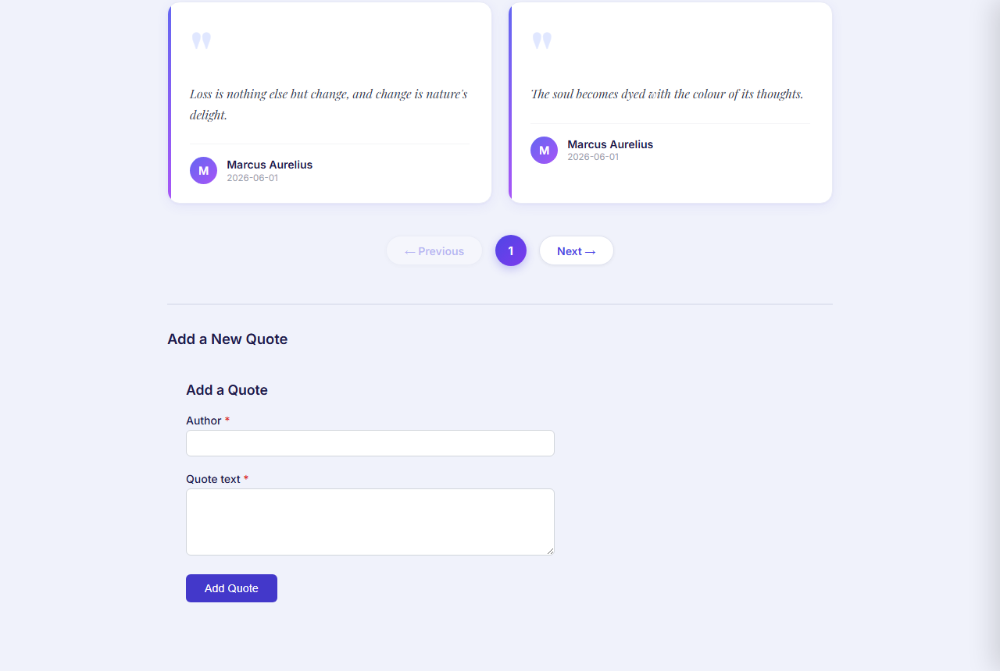
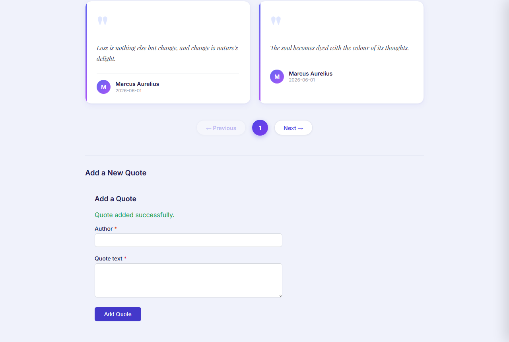

# Day 14 — Reactive Forms + Accessibility

## Overview

A full-stack quotes app: an Angular 21 frontend with a reactive create-a-quote form wired to the Week-1 .NET 9 REST API. The form covers validators, inline error display, full WCAG 2 AA accessibility, and a right-side slide-in detail panel.

---

## How to Run

### Prerequisites
- .NET 9 SDK
- Node.js 18+

### Step 1 — Start the backend API

```powershell
cd "Day14\piece1_ReactiveForms"
dotnet run
```

API runs at `http://localhost:5000`

> If port 5000 is already in use:
> ```powershell
> Get-Process -Id (Get-NetTCPConnection -LocalPort 5000).OwningProcess | Stop-Process -Force
> dotnet run
> ```

### Step 2 — Start the Angular frontend

```powershell
cd "Day14\piece1_ReactiveForms\quotes-ui"
npx ng serve --port 4201
```

### Step 3 — Open in browser

```
http://localhost:4201
```

Login with `test@example.com` / `password123`

---

## Screenshots

### Login Page


### Main Page — Hero + Quote Cards (dynamic subtitle shows page/filter state)


### Right Slide-In Panel — Click any card to view full quote


### Add Quote Form — Idle State


### Form — Empty Submit (required errors + focus moved to Author)


### Form — Spaces-Only Input Rejected


### Form — Success State (banner shown, form reset)


### Pagination — Page 2 (pill updates, new quotes loaded)


---

## Brief — Prompt Given to the Agent

> Build a reactive create-a-quote form for `POST /api/quotes` on the Week-1 .NET API.
> The endpoint accepts two fields: `author` (string, required, max 200 chars, no whitespace-only)
> and `text` (string, required, max 1000 chars, no whitespace-only). `OwnerId` is auto-injected
> from the JWT — not a form field. On success returns `201 { id }`. On validation failure returns
> `422 UnprocessableEntity`.
>
> Requirements: `[formGroup]` + `FormBuilder`, validators matching the API limits exactly,
> error messages shown only after dirty/touched, `aria-invalid` toggled on the control,
> `aria-describedby` pointing to the error `<span>`, `aria-required`, `role="alert"` on error
> spans, focus moved to the first invalid field on submit. Handle submitting state (disable +
> aria-busy), server-error state (role="alert"), and success state with form reset.

---

## API Contract — `POST /api/quotes`

Defined in `Models/Quote.cs` → `Quote.Create()`:

```csharp
if (string.IsNullOrWhiteSpace(author) || author.Length > 200)
    return Result<Quote>.Fail("Author must be between 1 and 200 characters.");

if (string.IsNullOrWhiteSpace(text) || text.Length > 1000)
    return Result<Quote>.Fail("Text must be between 1 and 1000 characters.");
```

| Field | Type | Constraints |
|---|---|---|
| `author` | string | Required, max 200 chars, no whitespace-only |
| `text` | string | Required, max 1000 chars, no whitespace-only |
| `OwnerId` | auto | Extracted from JWT `sub` claim — not in request body |

**Success:** `201 Created` → `{ id, author, text, createdAt }`
**Failure:** `422 Unprocessable Entity` → `{ error: string }`

---

## Form States

| State | Behaviour |
|---|---|
| **Empty submit** | All fields marked touched, errors appear, focus moves to first invalid field |
| **Spaces-only** | Custom validator fires — "Author/Quote cannot be only spaces." |
| **Submitting** | Button disabled, label "Saving…", `aria-busy="true"` |
| **Server error** | `role="alert"` error banner with API message |
| **Success** | "Quote added successfully." banner, form resets |

---

## Accessibility (A11y)

Verified with **axe-core 4.7.2** — zero violations after fixes.

| Feature | Implementation |
|---|---|
| Label association | `<label for="...">` linked by matching `id` |
| Required indicator | `aria-required="true"`; visual `*` marked `aria-hidden="true"` |
| Invalid state | `[attr.aria-invalid]="isInvalid(ctrl) ? 'true' : null"` |
| Error linkage | `[attr.aria-describedby]` — conditional, only set when error span is in DOM |
| Live error announce | `role="alert"` on each error `<span>` |
| Focus on submit | First invalid field receives `.focus()` on failed submit |
| Button busy state | `[attr.aria-busy]="submitting() ? 'true' : null"` |
| Color contrast | Submit button `#4338ca` (indigo-700) — 5.9:1 ratio, passes WCAG AA |
| Keyboard path | Tab → Author → Tab → Quote text → Tab → Submit → Enter |
| Section landmark | `<section aria-labelledby="form-heading">` |

---

## Bugs Found and Fixed

### Bug 1 — Validator mismatch (wrong API limits)

```typescript
// BEFORE — rejects inputs the API accepts
Validators.maxLength(100)  // author
Validators.maxLength(500)  // text

// AFTER — matches Quote.Create() exactly
Validators.maxLength(200)  // author
Validators.maxLength(1000) // text
```

### Bug 2 — Broken `aria-describedby` (axe: critical)

```html
<!-- WRONG — dead IDREF when field is valid, error span not in DOM -->
aria-describedby="author-error"

<!-- FIXED — only set when error span is actually rendered -->
[attr.aria-describedby]="isInvalid(author) ? 'author-error' : null"
```

### Bug 3 — Color contrast failure (axe: serious)

Submit button `#6366f1` → `#4338ca` (3.1:1 → 5.9:1, now passes WCAG AA).

---

## What Breaks if the API Contract Changes

| Change | What breaks |
|---|---|
| Field renamed (`text` → `content`) | `formControlName="text"` stops binding; submits empty silently |
| New required field added | No control or validator — API returns 422, no client-side error shown |
| `author` maxLength tightened to 50 | Client allows 200 → user hits server 422 with no form feedback |
| Endpoint URL changes | `QuoteCreateService` hardcodes `/api/quotes` — must update the service |

---

## Project Structure

```
piece1_ReactiveForms/
├── screenshots/                       # Verification screenshots
├── quotes-ui/                         # Angular 21 frontend
│   └── src/app/
│       ├── app.component.*            # One-page layout: hero, grid, pagination, panel
│       ├── quote-create/
│       │   ├── quote-create.component.ts    # Reactive form + validators
│       │   ├── quote-create.component.html  # Template + full a11y wiring
│       │   ├── quote-create.service.ts      # POST /api/quotes
│       │   └── quote-create.types.ts        # CreateQuotePayload interface
│       └── auth/
│           ├── auth.service.ts              # JWT login/logout via signals
│           └── auth.interceptor.ts          # Attaches Bearer token to all requests
├── Endpoints/                         # .NET minimal API endpoints
├── Models/Quote.cs                    # Domain model with Create() validation
├── Dtos/                              # Request/response DTOs
├── quotes.db                          # SQLite database
└── Program.cs                         # App bootstrap
```
