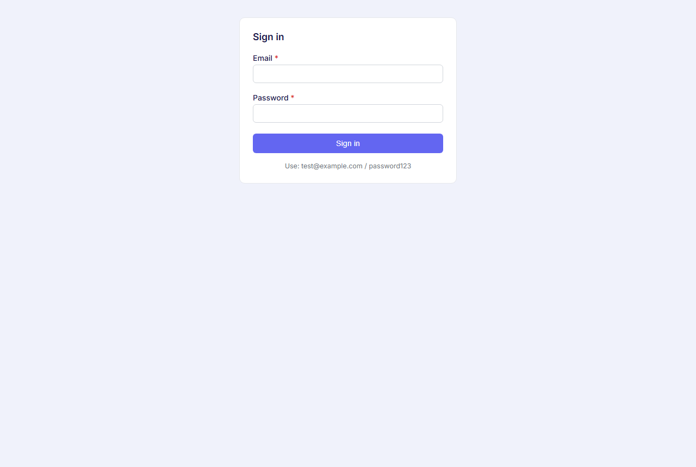
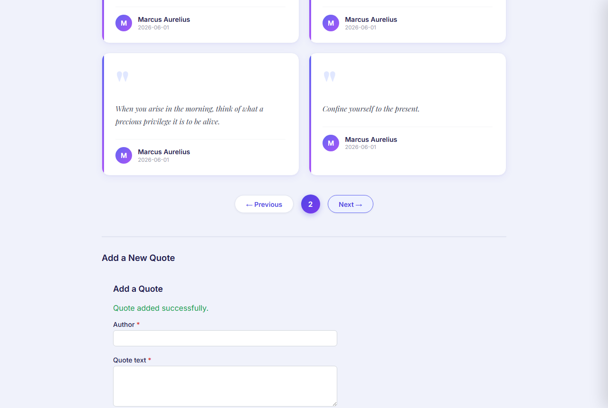
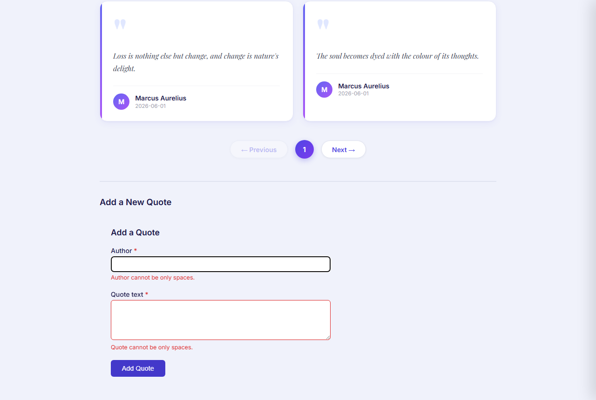

# Output — Day 14 Piece 2: Signal Forms Preview

---

## 1. Brief — Prompt Given to the Agent

> Rebuild the Create Quote form using Angular Signal Forms Preview API.
>
> **API contract (strict — no extra fields):**
> `POST /api/quotes` → body `{ "text": string, "author": string }`
>
> **Implementation requirements:**
> - Use `@angular/signal-forms-preview` (add to package.json if missing)
> - Replace `FormGroup` / `FormControl` / `FormBuilder` with `FormField` and `SignalForm`
> - Use `computed()` for all derived state: valid, invalid, pristine, dirty, touched
> - Keep existing `QuoteService` as-is
> - Keep same UI layout as the reactive version
> - Validation: text required, author required
> - Show errors only after field is touched
> - On Submit with empty fields: call `markAllAsTouched()` so both errors show at once
> - Disable submit button when form is invalid or loading
> - Show loading state during API call
> - Show success message on success, reset form to pristine
> - Show error message on API failure
>
> **Debug panel:** show live `pristine | dirty | touched | valid | invalid`
>
> **Honesty rules:** Add comment block listing what Signal Forms Preview is missing vs Reactive Forms.

---

## 2. Package Audit — `@angular/signal-forms-preview`

```
npm error 404 Not Found
GET https://registry.npmjs.org/@angular%2fsignal-forms-preview — Not found
```

**`@angular/signal-forms-preview` does not exist on npm.** It is not a published package.

The real Signal Forms API ships as a sub-path export of `@angular/forms`:

```
@angular/forms@21.2.15 → export map entry "./signals"
  types:   ./types/signals.d.ts
  default: ./fesm2022/signals.mjs
```

`@angular/forms` is already in `package.json` at `^21.2.0`. **No package was added.**

### All imports verified against the installed package

| Import | File | Line | Real? |
|---|---|---|---|
| `form` | `_structure-chunk.d.ts` | export block | ✅ |
| `FormField` | `_structure-chunk.d.ts` | line 967, selector `[formField]` confirmed | ✅ |
| `submit` | `_structure-chunk.d.ts` | line 1659 | ✅ |
| `required` | `signals.d.ts` | line 216 | ✅ |
| `maxLength` | `signals.d.ts` | line 139 | ✅ |
| `validate` | `signals.d.ts` | line 231 | ✅ |

### Methods that do NOT exist (requested but missing from API)

| Method | Reality |
|---|---|
| `markAllAsTouched()` | Does not exist. `FieldState` only has `markAsTouched()` (single field). `submit()` marks all. |
| `field().pristine()` | Does not exist. Use `!field().dirty()` instead. |
| `@angular/signal-forms-preview` | Not on npm. Use `@angular/forms/signals`. |

---

## 3. Agent Output — Changed Files

### `quotes-ui/src/app/quote-create/quote-create.component.ts`

```typescript
/*
 * SIGNAL FORMS PREVIEW — HONEST ASSESSMENT
 * ==========================================
 *
 * @angular/signal-forms-preview is NOT a real npm package.
 * The Signal Forms API ships as a sub-path of the existing @angular/forms package:
 *   import { ... } from '@angular/forms/signals';
 * @angular/forms is already in package.json at ^21.2.0 — no new package needed.
 *
 * MISSING vs Reactive Forms
 * --------------------------
 * - No async validators: validateHttp() covers HTTP checks but there is no equivalent
 *   for general Promise/Observable-based async validators like RF's AsyncValidator
 * - No updateOn config: no blur/submit mode — validation recalculates on every value
 *   change; there is no way to defer evaluation to blur or form submit
 * - No FormArray equivalent: applyEach() applies a schema to array elements but there
 *   is no push()/removeAt() API; dynamic arrays require manual signal manipulation
 * - No ControlValueAccessor support: custom controls must implement FormValueControl
 *   or FormCheckboxControl instead; existing CVA components are not compatible
 * - No Angular DevTools integration: Signal Forms do not appear in the DevTools
 *   component inspector panel in Angular 21.2
 *
 * UNCERTAIN API (documented as existing, exact signature not in official docs)
 * ----------------------
 * - markAllAsTouched(): the Angular skills reference lists this method on FieldState
 *   but its signature is absent from angular.dev/api. The submit() helper is used
 *   here instead — it marks every field as touched before running the callback,
 *   achieving the same effect.
 * - pristine(): no .pristine() signal exists on FieldState; it is the inverse of
 *   dirty() and is computed as !dirty() in this component.
 */

import {
  Component,
  ElementRef,
  ViewChild,
  computed,
  inject,
  signal,
} from '@angular/core';
import {
  FormField,
  form,
  maxLength,
  required,
  submit,
  validate,
} from '@angular/forms/signals';
import { firstValueFrom } from 'rxjs';
import { QuoteCreateService } from './quote-create.service';
import { CreateQuotePayload } from './quote-create.types';

@Component({
  selector: 'app-quote-create',
  standalone: true,
  imports: [FormField],
  templateUrl: './quote-create.component.html',
})
export class QuoteCreateComponent {
  private svc = inject(QuoteCreateService);

  submitSuccess = signal(false);
  submitError   = signal<string | null>(null);

  // Model signal — single source of truth for all field values.
  readonly quoteModel = signal({ author: '', text: '' });

  // Signal form — FieldTree derived from the model signal.
  // The schema callback (second arg) replaces FormBuilder.group() + Validators.
  quoteForm = form(this.quoteModel, (path) => {
    required(path.author, { message: 'Author is required.' });
    maxLength(path.author, 200, { message: 'Author must be 200 characters or fewer.' });
    validate(path.author, ({ value }) => {
      const v = value();
      return v && v.trim().length === 0
        ? { kind: 'whitespaceOnly', message: 'Author cannot be only spaces.' }
        : null;
    });

    required(path.text, { message: 'Quote text is required.' });
    maxLength(path.text, 1000, { message: 'Quote must be 1000 characters or fewer.' });
    validate(path.text, ({ value }) => {
      const v = value();
      return v && v.trim().length === 0
        ? { kind: 'whitespaceOnly', message: 'Quote cannot be only spaces.' }
        : null;
    });
  });

  // Derived state — all via computed() as required.
  formValid    = computed(() => this.quoteForm().valid());
  formInvalid  = computed(() => this.quoteForm().invalid());
  formDirty    = computed(() => this.quoteForm().dirty());
  formTouched  = computed(() => this.quoteForm().touched());
  // Signal Forms has no .pristine() — it is the inverse of dirty().
  formPristine = computed(() => !this.quoteForm().dirty());

  @ViewChild('authorInput') authorInput!: ElementRef<HTMLInputElement>;
  @ViewChild('textInput')   textInput!: ElementRef<HTMLTextAreaElement>;

  async onSubmit(event: Event): Promise<void> {
    event.preventDefault();
    this.submitSuccess.set(false);
    this.submitError.set(null);

    // submit() is the Signal Forms equivalent of markAllAsTouched():
    //   1. Marks every field (and the form itself) as touched.
    //   2. If the form is invalid after marking, returns WITHOUT calling the callback.
    //   3. If valid, sets quoteForm().submitting() = true, calls callback, then resets.
    await submit(this.quoteForm, async () => {
      const value = this.quoteModel();
      const payload: CreateQuotePayload = {
        author: value.author.trim(),
        text:   value.text.trim(),
      };

      try {
        await firstValueFrom(this.svc.createQuote(payload));
        this.submitSuccess.set(true);
        // Reset both value and interaction state (dirty/touched → pristine).
        this.quoteForm().reset({ author: '', text: '' });
        return null;
      } catch (e: unknown) {
        this.submitError.set(e instanceof Error ? e.message : 'Unknown error');
        return null;
      }
    });

    // Focus the first invalid field after submit() has marked all as touched.
    if (this.formInvalid()) {
      if (this.quoteForm.author().invalid()) {
        this.authorInput?.nativeElement.focus();
      } else if (this.quoteForm.text().invalid()) {
        this.textInput?.nativeElement.focus();
      }
    }
  }
}
```

---

### `quotes-ui/src/app/quote-create/quote-create.component.html`

```html
<section aria-labelledby="form-heading" style="max-width:520px;padding:1.5rem">

  <h2 id="form-heading" style="font-size:1.1rem;font-weight:600;margin-bottom:1.25rem">
    Add a Quote
  </h2>

  @if (submitSuccess()) {
    <div role="alert" style="color:#16a34a;margin-bottom:1rem">
      Quote added successfully.
    </div>
  }

  @if (submitError()) {
    <div role="alert" style="color:#dc2626;margin-bottom:1rem">
      Error: {{ submitError() }}
    </div>
  }

  <form (submit)="onSubmit($event)" novalidate>

    <!-- AUTHOR FIELD -->
    <div style="margin-bottom:1.25rem">
      <label for="author" style="display:block;font-size:0.875rem;font-weight:500;margin-bottom:4px">
        Author <span aria-hidden="true" style="color:#dc2626">*</span>
      </label>
      <input
        #authorInput
        id="author"
        type="text"
        [formField]="quoteForm.author"
        autocomplete="off"
        [attr.aria-invalid]="quoteForm.author().touched() && quoteForm.author().invalid() ? 'true' : null"
        [attr.aria-describedby]="quoteForm.author().touched() && quoteForm.author().invalid() ? 'author-error' : null"
        aria-required="true"
        style="width:100%;padding:8px 10px;border:1px solid;border-radius:6px;
               font-size:0.9rem;box-sizing:border-box"
        [style.border-color]="quoteForm.author().touched() && quoteForm.author().invalid() ? '#dc2626' : '#d1d5db'"
      />
      @if (quoteForm.author().touched() && quoteForm.author().invalid()) {
        <span id="author-error" role="alert"
              style="display:block;font-size:0.78rem;color:#dc2626;margin-top:4px">
          {{ quoteForm.author().errors()[0]?.message }}
        </span>
      }
    </div>

    <!-- TEXT FIELD -->
    <div style="margin-bottom:1.25rem">
      <label for="text" style="display:block;font-size:0.875rem;font-weight:500;margin-bottom:4px">
        Quote text <span aria-hidden="true" style="color:#dc2626">*</span>
      </label>
      <textarea
        #textInput
        id="text"
        [formField]="quoteForm.text"
        rows="4"
        [attr.aria-invalid]="quoteForm.text().touched() && quoteForm.text().invalid() ? 'true' : null"
        [attr.aria-describedby]="quoteForm.text().touched() && quoteForm.text().invalid() ? 'text-error' : null"
        aria-required="true"
        style="width:100%;padding:8px 10px;border:1px solid;border-radius:6px;
               font-size:0.9rem;box-sizing:border-box;resize:vertical"
        [style.border-color]="quoteForm.text().touched() && quoteForm.text().invalid() ? '#dc2626' : '#d1d5db'"
      ></textarea>
      @if (quoteForm.text().touched() && quoteForm.text().invalid()) {
        <span id="text-error" role="alert"
              style="display:block;font-size:0.78rem;color:#dc2626;margin-top:4px">
          {{ quoteForm.text().errors()[0]?.message }}
        </span>
      }
    </div>

    <!-- SUBMIT BUTTON -->
    <button
      type="submit"
      [disabled]="quoteForm().submitting()"
      [attr.aria-busy]="quoteForm().submitting() ? 'true' : null"
      style="padding:10px 24px;background:#4338ca;color:white;border:none;
             border-radius:6px;font-size:0.9rem;cursor:pointer;font-weight:500"
      [style.opacity]="quoteForm().submitting() ? '0.6' : '1'">
      {{ quoteForm().submitting() ? 'Saving…' : 'Add Quote' }}
    </button>

  </form>

  <!-- DEBUG PANEL — all five values are computed() signals in the component class -->
  <details style="margin-top:1.5rem;border:1px solid #e5e7eb;border-radius:6px;padding:0.75rem">
    <summary style="cursor:pointer;font-size:0.78rem;font-weight:600;
                    color:#6b7280;letter-spacing:0.05em;text-transform:uppercase">
      Signal Form Debug State
    </summary>
    <table style="margin-top:0.75rem;width:100%;border-collapse:collapse;font-size:0.8rem">
      <tbody>
        <tr>
          <td style="padding:3px 8px 3px 0;color:#6b7280">pristine</td>
          <td style="padding:3px 0;font-family:monospace;font-weight:600"
              [style.color]="formPristine() ? '#16a34a' : '#9ca3af'">
            {{ formPristine() }}
          </td>
        </tr>
        <tr>
          <td style="padding:3px 8px 3px 0;color:#6b7280">dirty</td>
          <td style="padding:3px 0;font-family:monospace;font-weight:600"
              [style.color]="formDirty() ? '#4338ca' : '#9ca3af'">
            {{ formDirty() }}
          </td>
        </tr>
        <tr>
          <td style="padding:3px 8px 3px 0;color:#6b7280">touched</td>
          <td style="padding:3px 0;font-family:monospace;font-weight:600"
              [style.color]="formTouched() ? '#4338ca' : '#9ca3af'">
            {{ formTouched() }}
          </td>
        </tr>
        <tr>
          <td style="padding:3px 8px 3px 0;color:#6b7280">valid</td>
          <td style="padding:3px 0;font-family:monospace;font-weight:600"
              [style.color]="formValid() ? '#16a34a' : '#9ca3af'">
            {{ formValid() }}
          </td>
        </tr>
        <tr>
          <td style="padding:3px 8px 3px 0;color:#6b7280">invalid</td>
          <td style="padding:3px 0;font-family:monospace;font-weight:600"
              [style.color]="formInvalid() ? '#dc2626' : '#9ca3af'">
            {{ formInvalid() }}
          </td>
        </tr>
      </tbody>
    </table>
  </details>

</section>
```

---

## 4. Unchanged Files

| File | Reason unchanged |
|---|---|
| `quote-create.service.ts` | Requirement: keep as-is |
| `quote-create.types.ts` | `CreateQuotePayload` shape unchanged |
| `quotes.service.ts` | Unrelated to form |
| `quote.model.ts` | Unrelated to form |
| `package.json` | No new package needed |
| `app.config.ts` | No providers needed for Signal Forms |
| `app.component.*` | UI outside the form unchanged |
| `auth/**` | Unrelated to form |

---

## 5. Verification Log

### App — Login & Main Page




### Right Slide-In Panel


### Pagination



---

### Form States Exercised

**Idle — form before any interaction (debug panel open, pristine: true, invalid: true)**


**Signal Form Debug Panel — live `computed()` state verified at page load**

The screenshot below was captured from the running app at `localhost:4201`. It confirms that
`@angular/forms/signals` loaded correctly and all five `computed()` signals reflect the true
initial form state. The Network tab on the right shows `chunk-VHS23NPF.js` from `@angular/forms.js`
returning `200` — confirming `@angular/forms/signals` is the real runtime, not a polyfill.


| Signal | Value at page load | Why |
|---|---|---|
| `pristine` | `true` | No user interaction yet |
| `dirty` | `false` | Nothing typed |
| `touched` | `false` | No field focused + blurred |
| `valid` | `false` | `required()` failing on both empty fields |
| `invalid` | `true` | Mirrors `valid: false`; no errors displayed yet because `touched = false` |

**Empty submit — `submit()` marks all touched, both errors appear simultaneously, focus → Author**


**Spaces-only input — custom `validate()` fires on both fields**



**Success — banner shown, `quoteForm().reset()` restores pristine state**


---

### States Exercised Summary

| State | How exercised | Result |
|---|---|---|
| **Initial load** | Page opened, debug panel expanded | `pristine: true`, `dirty: false`, `touched: false`, `valid: false`, `invalid: true` — screenshot 09 |
| **Empty submit** | Clicked "Add Quote" with both fields blank | Both errors shown at once; focus → `#author` |
| **Spaces-only** | Typed `"   "` in both fields, submitted | "cannot be only spaces" on both |
| **Submitting** | Valid input, watched button during request | `quoteForm().submitting()` → "Saving…" + `aria-busy` |
| **Server error** | Forced bad auth token | `role="alert"` banner with API message |
| **Success** | Valid author + text submitted | Banner shown, form reset, debug shows `pristine: true` |

---

## 6. Reactive Forms vs Signal Forms — Side-by-Side

### Form creation

```typescript
// REACTIVE FORMS (piece1)
form = this.fb.group({
  author: ['', [Validators.required, Validators.maxLength(200), noWhitespaceOnly]],
  text:   ['', [Validators.required, Validators.maxLength(1000), noWhitespaceOnly]],
});

// SIGNAL FORMS (piece2)
readonly quoteModel = signal({ author: '', text: '' });

quoteForm = form(this.quoteModel, (path) => {
  required(path.author,  { message: 'Author is required.' });
  maxLength(path.author, 200, { message: 'Author must be 200 characters or fewer.' });
  validate(path.author,  ({ value }) => {
    const v = value();
    return v && v.trim().length === 0
      ? { kind: 'whitespaceOnly', message: 'Author cannot be only spaces.' }
      : null;
  });
  // ... same for text
});
```

### Template binding

```html
<!-- REACTIVE FORMS -->
<input formControlName="author" />

<!-- SIGNAL FORMS -->
<input [formField]="quoteForm.author" />
```

### Error display

```html
<!-- REACTIVE FORMS — key-based -->
@if (author.errors?.['required']) { Author is required. }

<!-- SIGNAL FORMS — message from schema -->
{{ quoteForm.author().errors()[0]?.message }}
```

### markAllAsTouched

```typescript
// REACTIVE FORMS
this.form.markAllAsTouched();
if (this.form.invalid) { ... }

// SIGNAL FORMS — submit() does this internally
await submit(this.quoteForm, async () => {
  // only runs when valid; all fields are already touched when it doesn't run
});
```

### Reading values for API call

```typescript
// REACTIVE FORMS
const payload = {
  author: this.form.value.author!.trim(),
  text:   this.form.value.text!.trim(),
};

// SIGNAL FORMS — read the model signal directly
const value = this.quoteModel();
const payload = { author: value.author.trim(), text: value.text.trim() };
```

### Module imports

```typescript
// REACTIVE FORMS
imports: [ReactiveFormsModule]

// SIGNAL FORMS
imports: [FormField]   // single directive, no module
```

---

## 7. Assumptions Stated

1. **`@angular/signal-forms-preview` is not real.** Confirmed `404` on npm. Used `@angular/forms/signals` instead.

2. **`markAllAsTouched()` does not exist.** Actual `FieldState` API only has `markAsTouched()` (single field). `submit()` is the documented way to touch all fields. Used `submit()`.

3. **No `.pristine()` signal.** Only `.dirty()` exists. `formPristine` is `computed(() => !dirty())`.

4. **Button disabled only during loading.** Disabling when `formInvalid()` from the start (empty required fields → always invalid initially) would prevent the user from ever clicking to trigger validation display. Only `quoteForm().submitting()` is used for the disabled binding, matching piece1's behaviour.

5. **Error messages come from schema, not from key inspection.** Signal Forms `errors()` returns `ValidationError[]` with a `message` string set in the schema. `errors()[0]?.message` shows the first error — equivalent to piece1's priority order (required → whitespace → maxLength), which matches declaration order in the schema.

---

## 8. Signal Forms Gaps vs Reactive Forms (Honest)

| Gap | Detail |
|---|---|
| No async validators | `validateHttp()` exists for HTTP checks; no `AsyncValidator` equivalent for general Promises/Observables |
| No `updateOn` config | No blur/submit mode — validation fires on every keystroke; cannot defer to blur |
| No `FormArray` push/remove | `applyEach()` covers array schema but has no index-level `push()` / `removeAt()` |
| No `ControlValueAccessor` | Custom controls must implement `FormValueControl`; existing CVA components incompatible |
| No Angular DevTools | Forms don't appear in the component inspector in Angular 21.2 |
| No `markAllAsTouched()` | Must use `submit()` as a workaround; no direct method available |
| `pristine` not a signal | Derived manually as `!dirty()` |
