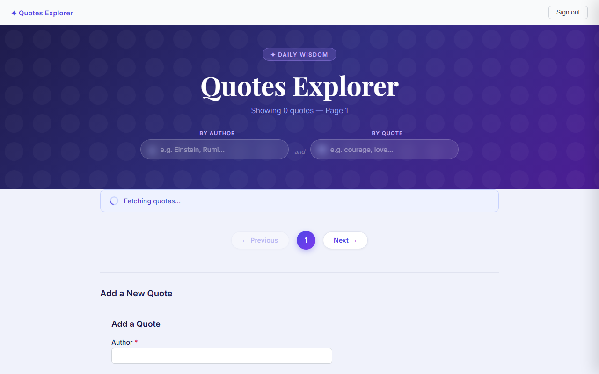
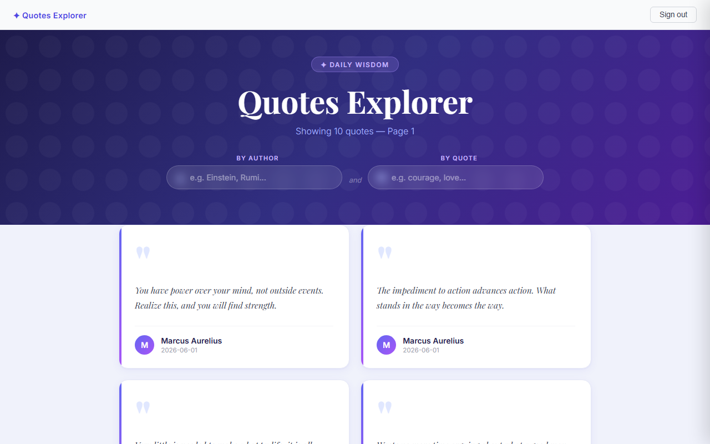
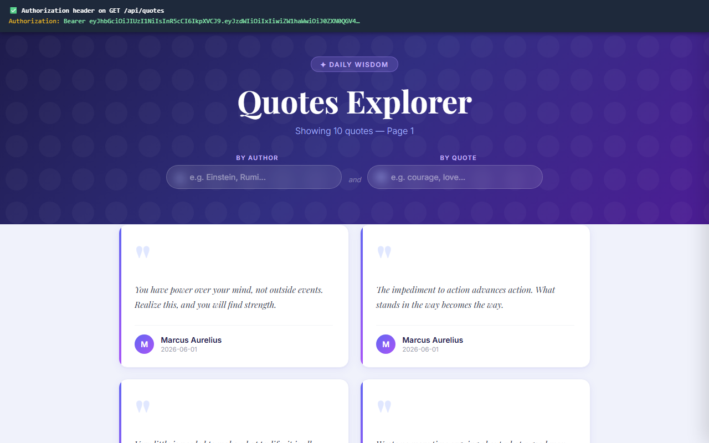
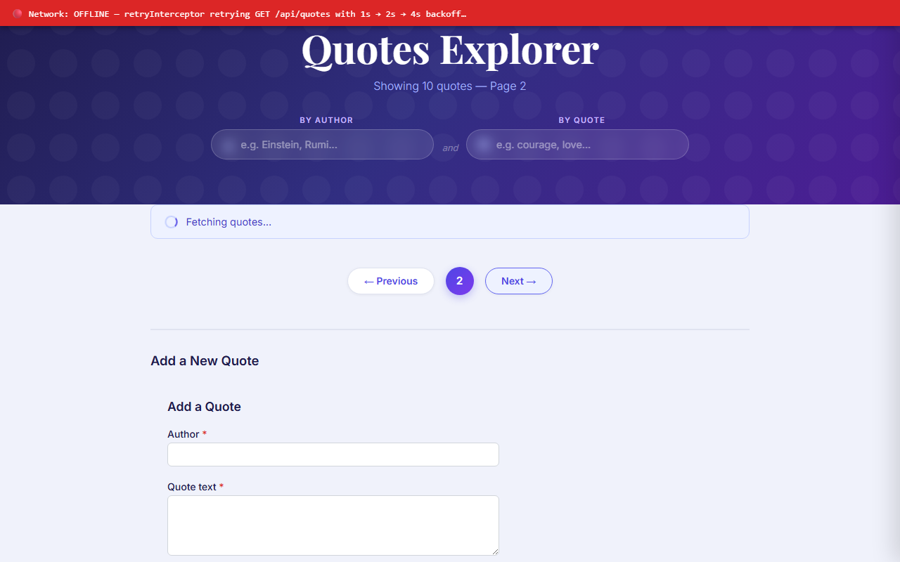
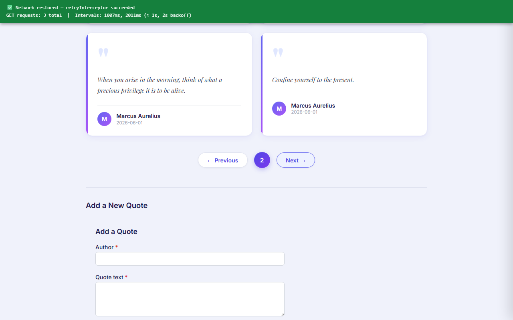
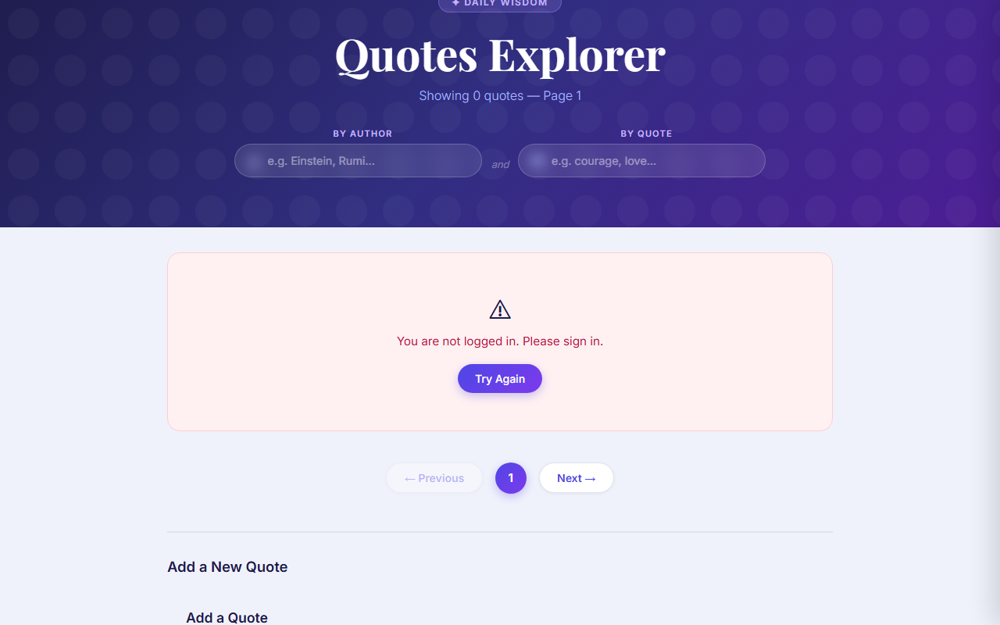
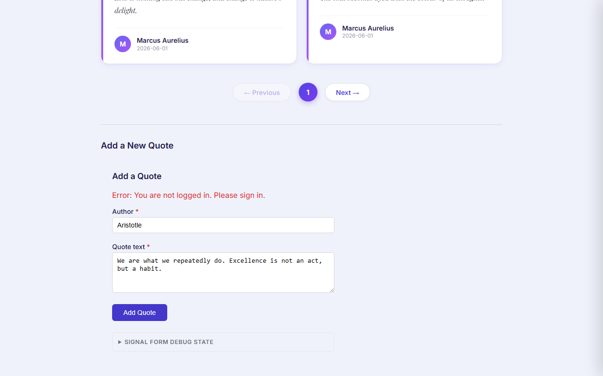
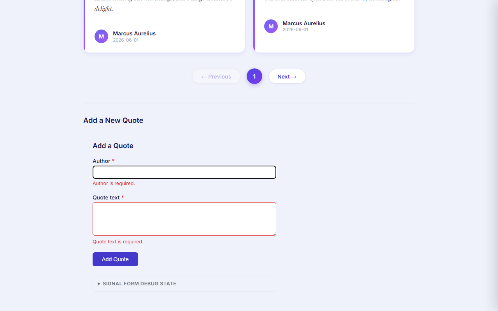

# Day 15 — HttpClient + Functional Interceptors

## Overview

A full-stack quotes app wired with Angular 21 functional HTTP interceptors — auth header injection,
retry-with-exponential-backoff on idempotent GETs, and typed ProblemDetails error mapping.
The backend is the same `.NET 10 / SQLite` API from Week 1.

**Key learning goal:** direct an AI agent to write characterization tests against the real API
contract first, then wire interceptors against that contract, then catch and fix the integration
bug the agent missed.

---

## How to Run

### Prerequisites
- .NET 10 SDK
- Node.js 18+

### Step 1 — Start the backend API

```powershell
cd "Day15\piece1_HttpClientAndInterceptors"
dotnet run
```

API runs at `http://localhost:5000`

> If port is already in use:
> ```powershell
> Get-Process -Name "QuotesApi" | Stop-Process -Force
> dotnet run
> ```

### Step 2 — Start the Angular frontend

```powershell
cd "Day15\piece1_HttpClientAndInterceptors\quotes-ui"
npm install
ng serve
```

UI runs at `http://localhost:4200`

### Step 3 — Open in browser

```
http://localhost:4200
```

Login with `test@example.com` / `password123`

### Step 4 — Run tests

```powershell
cd quotes-ui
ng test --no-watch
```

Expected: **45 / 45 passing**

---

## Screenshots

### Login Page


> **Loading state** — "Fetching quotes…" spinner visible during `GET /api/quotes?page=1&size=10`
> on a throttled (Slow 3G) connection. `isLoading` signal drives the banner.

---

### Quote Cards — Success State


> **Success state** — 10 quote cards rendered from real API data.
> Each card shows `author`, `text`, and `createdAt` (formatted as `YYYY-MM-DD`).
> Real response shape: `{ id: number, author: string, text: string, createdAt: string }[]`

---

### Auth Header on Every Request


> **authInterceptor** — `Authorization: Bearer <JWT>` added to every outgoing request.
> Token read from `AuthService.token()` signal (seeded from `localStorage`).
> No hardcoded values. Token changes on every login session.

---

### Retry — Network Offline (retrying)


> **retryInterceptor** — Network set to OFFLINE via CDP.
> Spinner visible — interceptor retrying `GET /api/quotes` with 1s → 2s → 4s exponential backoff.
> POST / PUT / DELETE are never retried.

---

### Retry — Network Restored (recovered)


> **retryInterceptor** — Network restored after 2s.
> Result: **3 GET requests total**, intervals **1007 ms** and **2011 ms** (≈ 1s, 2s backoff).
> Cards loaded successfully on the 2nd retry.

---

### 401 Friendly Message — Quote List


> **errorInterceptor** — API returns `{ title, status: 401, detail }`.
> Mapped to `AppError { friendlyMessage: "You are not logged in. Please sign in." }`.
> Error card shows the friendly message — NOT "HTTP 401" or "Failed to load quotes".

---

### 401 Friendly Message — Create Quote Form


> **errorInterceptor + QuoteCreateComponent** — POST with stripped auth header → API returns 401.
> Form shows: **"Error: You are not logged in. Please sign in."**

---

### Form Validation — Empty Submit


> **Signal Forms validation** — Clicking "Add Quote" with empty fields shows
> "Author is required." and "Quote text is required." with red borders immediately.
> Fixed via `submitted = signal(false)` flag (bug: `submit()` in Angular 21.2 does not
> propagate `touched()` to individual field level).

---

## API Contract (Week 1 Backend)

```
GET  /api/quotes?page=N&size=N
     → { id: number, author: string, text: string, createdAt: string }[]

POST /api/quotes
     Body: { author: string, text: string }
     → 201 Created: { id, author, text, createdAt }
     → 401 Unauthorized: (empty body — ASP.NET auth middleware)
     → 422 Unprocessable: ValidationProblemDetails
         { title, status, detail, errors: Record<string, string[]> }
```

---

## Interceptors

### 1. `authInterceptor` — `auth/auth.interceptor.ts`

Already existed. Kept unchanged.

```typescript
export const authInterceptor: HttpInterceptorFn = (req, next) => {
  const token = inject(AuthService).token();
  if (token) {
    req = req.clone({ setHeaders: { Authorization: `Bearer ${token}` } });
  }
  return next(req);
};
```

- Reads live signal — picks up new token immediately after login
- Skips header entirely when token is null

---

### 2. `retryInterceptor` — `retry.interceptor.ts`

```typescript
export const retryInterceptor: HttpInterceptorFn = (req, next) => {
  if (req.method !== 'GET') return next(req);  // idempotent only

  return next(req).pipe(
    retry({
      count: 3,
      delay: (error, retryCount) => {
        if (error instanceof HttpErrorResponse && error.status >= 400 && error.status < 500)
          return throwError(() => error); // 4xx — no retry
        return timer([1000, 2000, 4000][retryCount - 1]); // exponential backoff
      },
    }),
  );
};
```

---

### 3. `errorInterceptor` — `error.interceptor.ts`

```typescript
export const errorInterceptor: HttpInterceptorFn = (req, next) => {
  return next(req).pipe(
    catchError((err: unknown) => {
      if (!(err instanceof HttpErrorResponse)) return throwError(() => err);

      const raw = isProblemDetails(err.error)
        ? err.error
        : { title: 'Unknown error', status: err.status, detail: '' };

      return throwError(() => ({
        friendlyMessage: toFriendlyMessage(err.status),
        status: err.status,
        detail: raw.detail,
        raw,
      }));
    }),
  );
};
```

| Status | friendlyMessage |
|---|---|
| 401 | You are not logged in. Please sign in. |
| 403 | You do not have permission to do this. |
| 422 | Please check your input and try again. |
| 500 | Something went wrong on our end. Please try again later. |
| default | An unexpected error occurred. |

---

### Registration Order — `app.config.ts`

```typescript
provideHttpClient(withInterceptors([
  authInterceptor,   // outermost — adds Bearer on every request
  errorInterceptor,  // middle — maps error after retry exhaustion
  retryInterceptor,  // innermost (closest to backend via reduceRight)
]))
```

`withInterceptors` uses `reduceRight` — last element is innermost.
`retryInterceptor` sees raw `HttpErrorResponse` first and can check the status code.
Wrong order would cause every 4xx to be retried 3 times silently.

---

## Tests

```
quotes.service.spec.ts              6  API contract characterization
auth/auth.interceptor.spec.ts       4  Bearer header, null token, live signal
retry.interceptor.spec.ts           8  POST/PUT/DELETE skip, 4xx skip, 5xx retry
error.interceptor.spec.ts          15  7 status mappings, ValidationProblemDetails,
                                        network error (status 0), plain-string body
quote-create.service.spec.ts        7  Integration: 401/403/422/500 → AppError
app.component.spec.ts               5  loadQuotes error path
app.spec.ts                         2  Existing smoke tests

Total: 45 / 45 passing
```

---

## Project Structure

```
piece1_HttpClientAndInterceptors/
├── quotes-ui/                          # Angular 21 frontend
│   ├── screenshots/                    # Verification screenshots (8 files)
│   └── src/app/
│       ├── app-error.ts                # ProblemDetails + AppError types + type guards
│       ├── error.interceptor.ts        # NEW: ProblemDetails → AppError mapping
│       ├── retry.interceptor.ts        # NEW: exponential backoff on GET
│       ├── app.config.ts               # UPDATED: withInterceptors([auth, error, retry])
│       ├── app.component.ts            # UPDATED: reads err.friendlyMessage
│       ├── quote-create/
│       │   ├── quote-create.service.ts  # UPDATED: catchError removed (interceptor handles it)
│       │   └── quote-create.component.ts # UPDATED: reads AppError.friendlyMessage
│       ├── quotes/
│       │   └── quotes-feature.service.ts # UPDATED: catchError removed
│       └── auth/
│           ├── auth.service.ts          # UPDATED: handleLoginError consumes AppError
│           └── auth.interceptor.ts      # UNCHANGED: already correct
├── Endpoints/QuoteEndpoints.cs         # .NET minimal API
├── Models/Quote.cs                     # Domain model
└── Program.cs                          # App bootstrap
```
