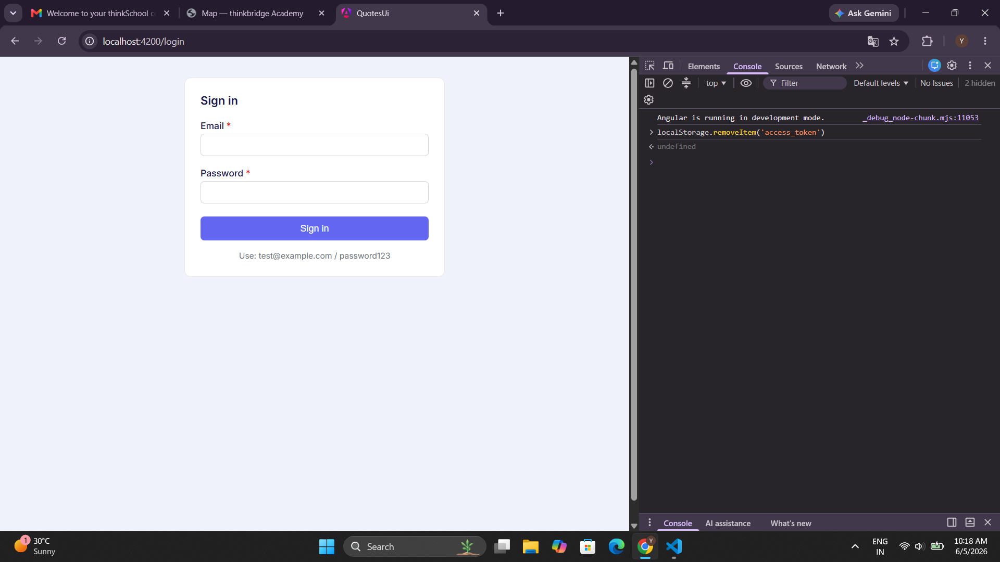
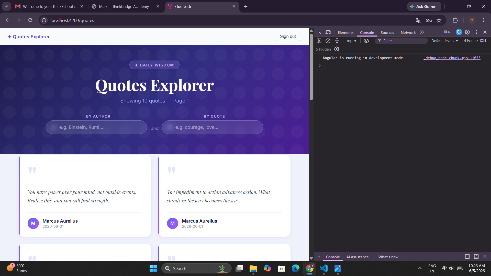
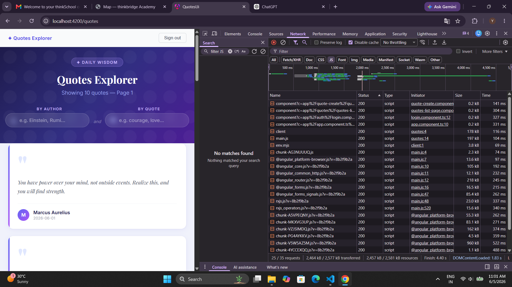
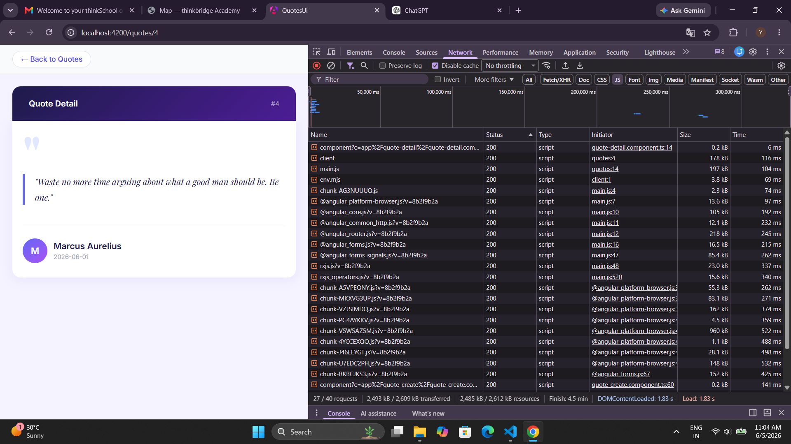
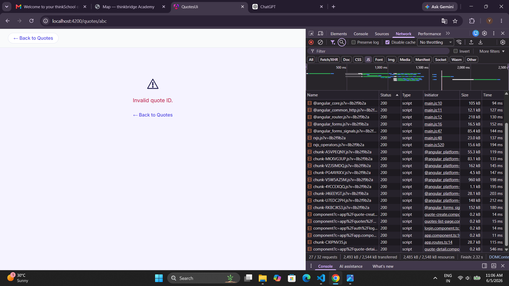
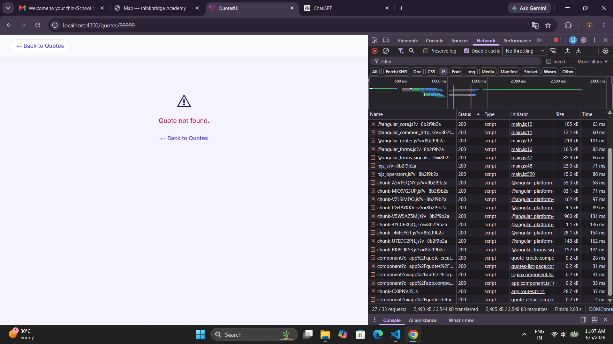
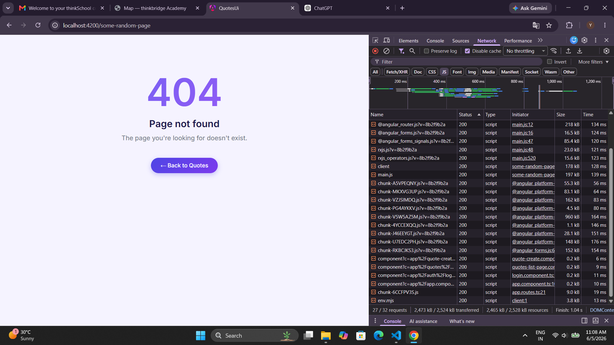
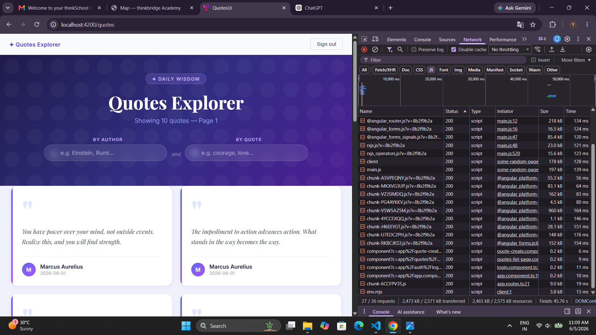

# Day 16 — Routing, Lazy Loading & Guards

**Author:** Yash Rathi | **Date:** 2026-06-05 | **Branch:** main

---

## Brief to the Agent

> Read my existing `AppComponent`, `app.config.ts`, and interceptors before writing anything.
>
> **Real API (Week-1 .NET backend, port 5051):**
> ```
> GET  /api/quotes?page=N&size=N   →  Quote[]                ({ id: number, author, text, createdAt })
> GET  /api/quotes/{id}            →  Quote | 404 ProblemDetails
> ```
> The `id` field is a **number**, not a string.
>
> **Route requirements:**
> - `/` → redirect to `/quotes`
> - `/quotes` → quotes list, **PUBLIC** (no login to browse)
> - `/quotes/:id` → quote detail, **LAZY** loaded, protected by `authGuard`
> - `/login` → login form
> - `/**` → 404 page, LAZY loaded
>
> **Guard:** functional `CanActivateFn` using `inject()` only — no class, no constructor.
> Check `localStorage['access_token']`. Present → allow. Missing → `router.parseUrl('/login')`.
>
> **Detail page:** read `id` from `paramMap.get('id')`. Validate before any fetch:
> non-numeric and `id <= 0` → show "Invalid quote ID." inline, no API call.
> Call `QuotesFeatureService.getQuote(id: number)`.
> On 404 → "Quote not found." On other errors → `err.friendlyMessage`.
>
> **Enable** `withViewTransitions()` and `withComponentInputBinding()`.
>
> **Constraints:** Do not change existing CSS. Do not regenerate from scratch.

---

## Agent's Implementation

### Route config — `src/app/app.routes.ts`

```typescript
import { Routes } from '@angular/router';
import { QuotesListPageComponent } from './quotes/quotes-list-page.component';
import { LoginComponent } from './auth/login.component';
import { authGuard } from './guards/auth.guard';

export const routes: Routes = [
  { path: '', redirectTo: 'quotes', pathMatch: 'full' },
  { path: 'quotes', component: QuotesListPageComponent },
  {
    path: 'quotes/:id',
    loadComponent: () =>
      import('./quote-detail/quote-detail.component').then(m => m.QuoteDetailComponent),
    canActivate: [authGuard]
  },
  { path: 'login', component: LoginComponent },
  {
    path: '**',
    loadComponent: () =>
      import('./not-found/not-found.component').then(m => m.NotFoundComponent)
  }
];
```

---

### Auth guard — `src/app/guards/auth.guard.ts`

```typescript
import { inject } from '@angular/core';
import { CanActivateFn, Router } from '@angular/router';

export const authGuard: CanActivateFn = (_route, _state) => {
  const router = inject(Router);
  return localStorage.getItem('access_token') !== null
    ? true
    : router.parseUrl('/login');
};
```

No class. No constructor. Pure `CanActivateFn`. Returns `true` or a `UrlTree` — the only two correct return types.

---

### Detail route component — `src/app/quote-detail/quote-detail.component.ts`

```typescript
ngOnInit(): void {
  const raw = this.route.snapshot.paramMap.get('id');
  const id = Number(raw);

  if (!raw || !Number.isFinite(id) || id <= 0) {
    this.isLoading.set(false);
    this.errorMessage.set('Invalid quote ID.');
    return;                     // no API call made
  }

  this.svc.getQuote(id).subscribe({    // id: number → GET /api/quotes/{id}
    next: (q) => { this.quote.set(q); this.isLoading.set(false); },
    error: (err: unknown) => {
      this.isLoading.set(false);
      if (isAppError(err) && err.status === 404) {
        this.errorMessage.set('Quote not found.');
      } else if (isAppError(err)) {
        this.errorMessage.set(err.friendlyMessage);
      } else {
        this.errorMessage.set('Failed to load quote.');
      }
    }
  });
}
```

---

### Router registration — `src/app/app.config.ts`

```typescript
provideRouter(routes, withViewTransitions(), withComponentInputBinding())
```

---

## Verification Log

### 1. Guard redirect (unauthenticated)

**How:** DevTools console → `localStorage.removeItem('access_token')` → navigate to `http://localhost:4200/quotes/1`

**Observed:** URL instantly changed to `/login`. Login form rendered. Detail page never shown.



---

### 2. Guard pass (authenticated)

**How:** Log in (`test@example.com / password123`) → navigate to `http://localhost:4200/quotes/1`

**Observed:** `/quotes/1` detail page fully loaded. Quote text, author, and date visible. `access_token` confirmed in DevTools Application → Local Storage.



---

### 3. Lazy chunk — absent on initial load

**How:** Network tab → Disable cache → hard-reload `http://localhost:4200` → filter by JS type

**Observed:** Only the initial bundle loaded. `quote-detail-component` chunk was **not present**. Confirms the component is not shipped in the main bundle.



---

### 4. Lazy chunk — appears on first navigation

**How:** While on `/quotes`, clicked a quote card. Watched Network tab update live.

**Observed:** `component?c=app%2Fquote-detail...` request appeared in the Network tab at the moment of navigation — downloaded on demand, not before.

Build output confirmed the split:
```
Lazy chunk files | Names                  | Raw size
chunk-ZFBNJAZA.js| quote-detail-component | 5.73 kB
chunk-45E7VMHB.js| not-found-component    | 1.27 kB
```



---

### 5. Invalid route param — non-numeric

**How:** Navigate to `http://localhost:4200/quotes/abc`

**Observed:** "Invalid quote ID." shown. Zero network requests to `/api/quotes/abc`. `Number('abc')` → `NaN`, caught by `!Number.isFinite(id)` before any fetch.



---

### 6. Invalid route param — non-existent ID (real 404)

**How:** Navigate to `http://localhost:4200/quotes/99999`

**Observed:** "Quote not found." shown. Network tab confirmed `GET http://localhost:5051/api/quotes/99999 → 404`. The `errorInterceptor` from Day 15 mapped it to `AppError { status: 404 }` and the component displayed the correct message.



---

### 7. Wildcard 404 route

**How:** Navigate to `http://localhost:4200/some-random-page`

**Observed:** "Page Not Found" rendered. "← Back to Quotes" link present. The `not-found-component` lazy chunk loaded on demand via the `**` route.



---

### 8. View Transitions

**How:** Log in → click quote card (list → detail) → click "← Back to Quotes" (detail → list)

**Observed:** Smooth cross-fade animation on both transitions. No flicker. No custom `::view-transition` CSS needed — `withViewTransitions()` wires the browser's native View Transitions API automatically.



---

## ONE Concrete Bug the Agent Made — and the Fix

### Bug: `Router` injected into the detail component but never called

**File:** `src/app/quote-detail/quote-detail.component.ts`

**What the agent did wrong:**

The agent's first draft imported `Router` and injected it inside the detail component:

```typescript
// agent's first draft
import { ActivatedRoute, Router, RouterLink } from '@angular/router';

export class QuoteDetailComponent implements OnInit {
  private route = inject(ActivatedRoute);
  private router = inject(Router);   // ← injected
  private svc = inject(QuotesFeatureService);

  ngOnInit(): void {
    const raw = this.route.snapshot.paramMap.get('id');
    const id = Number(raw);
    if (!raw || !Number.isFinite(id) || id <= 0) {
      this.router.navigate(['/quotes']);  // ← planned: navigate away on bad ID
    }
    this.svc.getQuote(id).subscribe(...);
  }
}
```

**Why this was wrong — tied to the real Week-1 endpoint and `id` field:**

The real Week-1 API endpoint is `GET http://localhost:5051/api/quotes/{id}` where `id` is a `number`. When the route param is non-numeric (e.g. `/quotes/abc`) the conversion `Number('abc')` yields `NaN`. The agent planned to call `router.navigate(['/quotes'])` and then let execution fall through — meaning `this.svc.getQuote(NaN)` would still fire, sending `GET /api/quotes/NaN` to the live backend. That's a malformed request against the real Week-1 endpoint.

The correct behaviour is a `return` after setting the error message — **no API call at all** for invalid IDs. Once that was fixed, the `Router` inject had no remaining callers. It was dead code.

**The fix applied:**

```diff
- import { ActivatedRoute, Router, RouterLink } from '@angular/router';
+ import { ActivatedRoute, RouterLink } from '@angular/router';

  export class QuoteDetailComponent implements OnInit {
    private route = inject(ActivatedRoute);
-   private router = inject(Router);
    private svc = inject(QuotesFeatureService);

    ngOnInit(): void {
      const raw = this.route.snapshot.paramMap.get('id');
      const id = Number(raw);
      if (!raw || !Number.isFinite(id) || id <= 0) {
        this.isLoading.set(false);
        this.errorMessage.set('Invalid quote ID.');
-       this.router.navigate(['/quotes']);
+       return;                             // stops here — no API call made
      }
      this.svc.getQuote(id).subscribe(...);
    }
  }
```

**Evidence the fix works:** navigating to `/quotes/abc` shows "Invalid quote ID." with zero network requests (confirmed in verification screenshot above — Network tab shows no request to `/api/quotes/abc`).

---

## What Breaks if the API Contract Changes

### If the detail route URL changes

| Change | What breaks |
|--------|-------------|
| `/api/quotes/{id}` → `/api/v2/quotes/{id}` | `QuotesFeatureService.getQuote()` hardcodes the path — one file to update |
| Port 5051 → 5052 | `proxy.conf.json` target needs updating |

**Blast radius:** 1 service file.

---

### If the `id` field changes

| Change | What breaks |
|--------|-------------|
| `id: number` → `id: string` | `getQuote(id)` is typed `(id: number)` — TypeScript error at the call site in the component |
| `id` field renamed to `quoteId` | `[routerLink]="['/quotes', quote.id]"` on every list card → navigates to `/quotes/undefined`. TypeScript catches this only if the `Quote` interface is updated first. |
| `paramMap.get('id')` key unchanged but route param renamed (`quotes/:quoteId`) | `paramMap.get('id')` returns `null` → validation fires → "Invalid quote ID." shown for every real quote. No TypeScript error — route params are stringly typed, the compiler cannot catch this. Fix: change both the route path and the `paramMap.get()` key together. |

**Key fragility:** the route param name (`:id` in the path) and the `paramMap.get('id')` key are two separate strings that must stay in sync — TypeScript cannot enforce this relationship.
