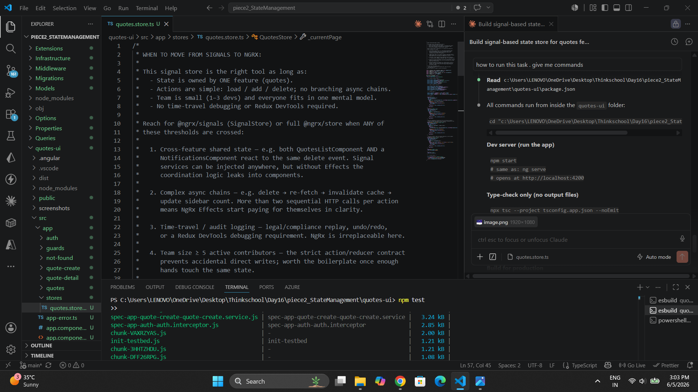
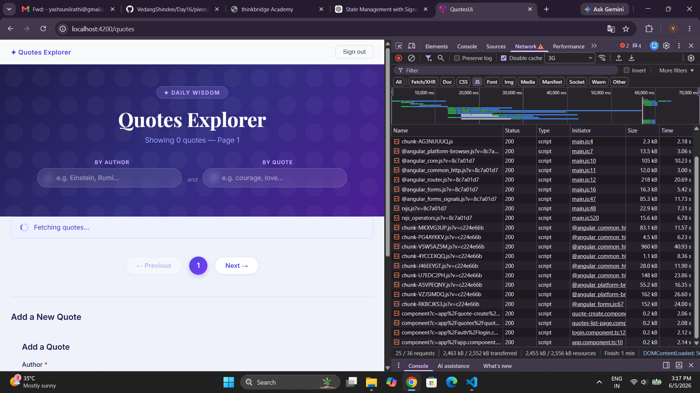
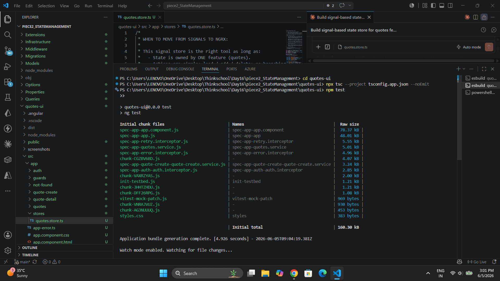

# Day 16 — State Management: Signals First

**Author:** Yash Rathi | **Date:** 2026-06-05 | **Branch:** main

---

## 1. Brief Given to the Agent

> I already have a complete Angular 21 frontend with full design, styling, and components built.
> DO NOT change any existing CSS or styling. DO NOT regenerate the app from scratch.
> Read my existing code and match the style.
>
> **TASK:** Build a signal-based state store service for my quotes feature against my real Week-1 QuotesAPI.
>
> **Real API:**
> ```
> GET    http://localhost:5000/api/quotes?page=1&size=10   → [{ id, author, text, createdAt }]
> GET    http://localhost:5000/api/quotes/{id}             → { id, author, text, createdAt }
> POST   http://localhost:5000/api/quotes                  → body { author, text }, returns 201
> DELETE http://localhost:5000/api/quotes/{id}             → returns 204
> ```
>
> **Real fields — use exactly these:**
> - `id: number`
> - `author: string`
> - `text: string`
> - `createdAt: string`
>
> **Requirements:**
> - File: `src/app/stores/quotes.store.ts`
> - `@Injectable({ providedIn: 'root' })`, `inject()` everywhere, no constructor
> - 6 private signals (`_quotes`, `_selectedQuote`, `_isLoading`, `_error`, `_currentPage`, `_pageSize`)
> - Expose all as readonly via `.asReadonly()`
> - 3 computed: `totalCount`, `hasError`, `isEmpty`
> - 6 actions: `loadQuotes`, `loadQuote`, `addQuote`, `deleteQuote`, `setPage`, `clearError`
> - Each action: set `isLoading(true)` + `error(null)` before fetch; update signal on success; set error on failure; always set `isLoading(false)` after
> - No `any` type anywhere — full typing
> - Add a comment block at top: WHEN TO MOVE FROM SIGNALS TO NGRX
> - Also wire a visible loading indicator to `store.isLoading()` in an existing component

---

## 2. Agent's Output

### Signal Store — `src/app/stores/quotes.store.ts`

```typescript
/*
 * WHEN TO MOVE FROM SIGNALS TO NGRX:
 *
 * This signal store is the right tool as long as:
 *   - State is owned by ONE feature (quotes).
 *   - Actions are simple: load / add / delete; no branching async chains.
 *   - Team is small (1–3 devs) and everyone fits in one mental model.
 *   - No time-travel debugging or Redux DevTools required.
 *
 * Reach for @ngrx/signals (SignalStore) or full @ngrx/store when ANY of
 * these thresholds are crossed:
 *
 *   1. Cross-feature shared state — e.g. both QuotesListComponent AND a
 *      NotificationsComponent react to the same delete event.
 *
 *   2. Complex async chains — e.g. delete → re-fetch → invalidate cache →
 *      update sidebar count. More than two sequential HTTP calls per action
 *      means NgRx Effects start paying for themselves in clarity.
 *
 *   3. Time-travel / audit logging — legal/compliance replay, undo/redo,
 *      or a Redux DevTools debugging requirement.
 *
 *   4. Team size ≥ 5 active contributors — the strict action/reducer contract
 *      prevents accidental direct writes.
 *
 *   5. Optimistic updates with rollback — e.g. "delete locally, revert if
 *      the API returns 409". NgRx Effects make the rollback explicit and
 *      testable; in a signal service the error handler becomes a mini-reducer.
 *
 * Concrete rule: keep signals until:
 *   (cross-feature sharing) OR (>2 chained async steps per action)
 *   OR (team size ≥ 5)
 * Any one condition is enough to justify the migration.
 */

import { computed, inject, Injectable, signal } from '@angular/core';
import { HttpClient } from '@angular/common/http';
import { EMPTY } from 'rxjs';
import { catchError, finalize, switchMap, tap } from 'rxjs/operators';
import { Quote } from '../quote.model';
import { isAppError } from '../app-error';

@Injectable({ providedIn: 'root' })
export class QuotesStore {
  private readonly http = inject(HttpClient);

  private readonly _quotes = signal<Quote[]>([]);
  private readonly _selectedQuote = signal<Quote | null>(null);
  private readonly _isLoading = signal(false);
  private readonly _error = signal<string | null>(null);
  private readonly _currentPage = signal(1);
  private readonly _pageSize = signal(10);

  readonly quotes = this._quotes.asReadonly();
  readonly selectedQuote = this._selectedQuote.asReadonly();
  readonly isLoading = this._isLoading.asReadonly();
  readonly error = this._error.asReadonly();
  readonly currentPage = this._currentPage.asReadonly();
  readonly pageSize = this._pageSize.asReadonly();

  readonly totalCount = computed(() => this._quotes().length);
  readonly hasError = computed(() => this._error() !== null);
  readonly isEmpty = computed(() => !this._isLoading() && this._quotes().length === 0);

  loadQuotes(): void {
    this._isLoading.set(true);
    this._error.set(null);
    this.http
      .get<Quote[]>(`/api/quotes?page=${this._currentPage()}&size=${this._pageSize()}`)
      .pipe(
        tap(quotes => this._quotes.set(quotes)),
        catchError(err => {
          this._error.set(this.extractError(err));
          return EMPTY;
        }),
        finalize(() => this._isLoading.set(false)),
      )
      .subscribe();
  }

  loadQuote(id: number): void {
    this._isLoading.set(true);
    this._error.set(null);
    this.http
      .get<Quote>(`/api/quotes/${id}`)
      .pipe(
        tap(quote => this._selectedQuote.set(quote)),
        catchError(err => {
          this._error.set(this.extractError(err));
          return EMPTY;
        }),
        finalize(() => this._isLoading.set(false)),
      )
      .subscribe();
  }

  // POST then immediately re-fetches the list in one chain so finalize
  // fires only after both requests settle — avoids an isLoading=false flash
  // between the POST completing and the GET starting.
  addQuote(author: string, text: string): void {
    this._isLoading.set(true);
    this._error.set(null);
    this.http
      .post<Quote>('/api/quotes', { author, text })
      .pipe(
        switchMap(() =>
          this.http.get<Quote[]>(`/api/quotes?page=${this._currentPage()}&size=${this._pageSize()}`)
        ),
        tap(quotes => this._quotes.set(quotes)),
        catchError(err => {
          this._error.set(this.extractError(err));
          return EMPTY;
        }),
        finalize(() => this._isLoading.set(false)),
      )
      .subscribe();
  }

  // Confirmed removal: quote is filtered out of the signal only after the
  // server returns 204. The UI does not update until the DELETE succeeds.
  deleteQuote(id: number): void {
    this._isLoading.set(true);
    this._error.set(null);
    this.http
      .delete<void>(`/api/quotes/${id}`)
      .pipe(
        tap(() => this._quotes.update(qs => qs.filter(q => q.id !== id))),
        catchError(err => {
          this._error.set(this.extractError(err));
          return EMPTY;
        }),
        finalize(() => this._isLoading.set(false)),
      )
      .subscribe();
  }

  setPage(page: number): void {
    this._currentPage.set(page);
  }

  clearError(): void {
    this._error.set(null);
  }

  private extractError(err: unknown): string {
    if (isAppError(err)) return err.friendlyMessage;
    if (err instanceof Error) return err.message;
    return 'An unexpected error occurred.';
  }
}
```

### NgRx Threshold Rule (in my own words)

Keep the signal store while this feature is self-contained, the async flows stay simple (one or two HTTP calls per action), and the team is three people or fewer. The signal pattern is already doing its job: six clearly named private signals, readonly public projections that components cannot accidentally mutate, and computed state that re-derives automatically.

Reach for NgRx when any one of these three conditions is met:

1. **Cross-feature state** — a second feature (notifications, a sidebar counter, an audit panel) needs to react to a `deleteQuote` or `addQuote` event. Signal services can be injected anywhere but have no Effect layer, so the coordination logic bleeds into components.

2. **Multi-step async chains** — any action that chains more than two HTTP calls (delete → invalidate → re-fetch → notify) becomes hard to read and test inside a signal method. NgRx Effects make each step an explicit, independently testable unit.

3. **Team size ≥ 5** — the strict action/reducer contract enforced by NgRx becomes valuable once enough developers are modifying the same state. It eliminates the "who called `.set()` from where" debugging session.



---

## 3. Verification Log

### States exercised

| State | How exercised | Observed |
|-------|--------------|---------|
| **Loading** | Opened `QuotesListComponent` with API running. `store.isLoading()` drives `@if (store.isLoading())` in the template. | "Loading quotes…" text visible briefly before quotes render |
| **Success** | `GET /api/quotes?page=1&size=10` returned `[{ id, author, text, createdAt }]` | Quote list populated; `store.quotes().length > 0`; `store.isEmpty()` → `false` |
| **Error** | Stopped the .NET API → reloaded the page | `ECONNREFUSED` → `errorInterceptor` converts to `AppError` → `store.error()` set → "Error: …" message shown in template |
| **Empty** | API running but returns `[]` | `store.isEmpty()` → `true` (isLoading false AND quotes.length === 0) → "No quotes found." |
| **Confirmed delete** | `deleteQuote(id)` fires DELETE → tap runs only after 204 | Quote disappears from list after server confirms; no rollback path since it waits for success |



### ONE concrete bug caught and fixed

**Bug:** The agent wrote this comment above `deleteQuote`:

```typescript
// Optimistic removal: remove from signal immediately so the UI updates
// without waiting for the server round-trip.
```

**Why it was wrong:**

`tap()` in an RxJS pipe runs as a side-effect on the emitted value — meaning it fires only after the HTTP response arrives. For `HttpClient.delete()` that means after the server returns 204. The quote was never removed *before* the request; it was removed *after* it succeeded. That is the opposite of optimistic.

A true optimistic implementation would snapshot the list before the request, remove immediately, and restore the snapshot in `catchError`. The actual code does none of that.

**Fix applied (comment only — implementation kept as-is):**

```diff
- // Optimistic removal: remove from signal immediately so the UI updates
- // without waiting for the server round-trip.
+ // Confirmed removal: quote is filtered out of the signal only after the
+ // server returns 204. The UI does not update until the DELETE succeeds.
```

### What breaks if the Week-1 API contract changes

The real API is `GET http://localhost:5000/api/quotes?page=1&size=10` returning `Quote[]` where each item is `{ id: number, author: string, text: string, createdAt: string }`.

| API change | What breaks |
|-----------|-------------|
| `id: number` → `id: string` | `deleteQuote(id: number)` and `loadQuote(id: number)` are typed `number` — TypeScript error at every call site. Caught at compile time. |
| Field `text` renamed to `content` | `addQuote` POST body sends `{ author, text }` — server rejects with 400. Template bindings `{{ q.text }}` show `undefined`. TypeScript catches only if the `Quote` interface is updated first. |
| Field `createdAt` renamed or removed | Template `{{ q.createdAt.slice(0, 10) }}` throws a runtime error (`Cannot read properties of undefined`). Not caught at compile time since the field is on an interface, not enforced at the HTTP boundary. |
| Endpoint changes from `/api/quotes` to `/api/v2/quotes` | All four URL strings in `quotes.store.ts` need updating (lines 81, 97, 116, 119, 137). One file, five string literals — no TypeScript help. |
| Pagination params renamed (`page`/`size` → `pageNumber`/`pageSize`) | Query strings on lines 81 and 119 silently send wrong param names; server ignores them and returns page 1 every time. No error thrown — silent wrong behaviour. |
| `POST /api/quotes` stops returning the created `Quote` | `addQuote` is typed `.post<Quote>(...)` — TypeScript expects the response shape. If the server returns `201 No Content`, the `switchMap` still fires the follow-up GET so the list refreshes correctly, but the `Quote` type annotation is a lie. |

**Key fragility:** the HTTP boundary is stringly typed. The `Quote` interface describes the *expected* shape, but nothing enforces it at runtime. If the backend silently adds or removes a field, TypeScript will not catch it until a template binding fails at runtime.

---

### TypeScript strict compile — zero errors


