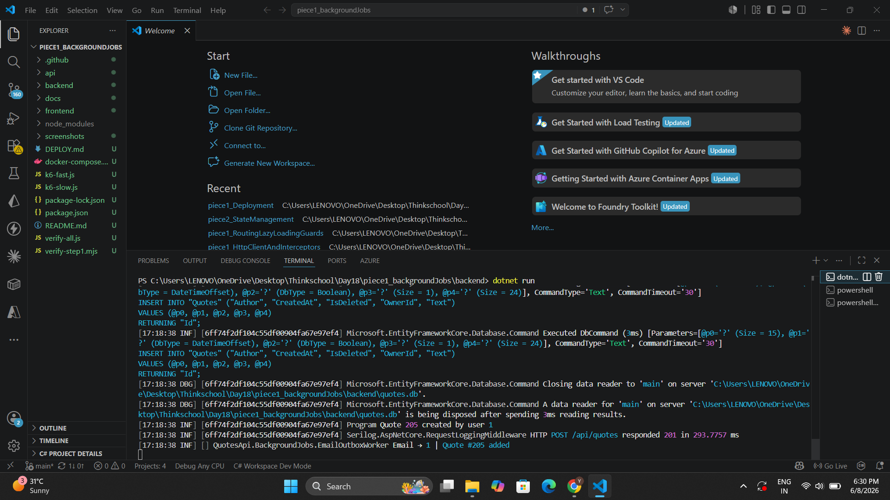
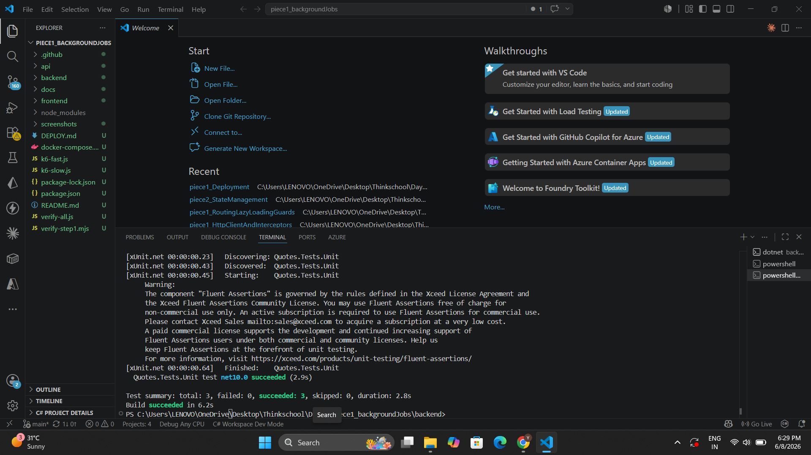

# Day 18 — Background Jobs

Move slow work off the request thread. Implement a `BackgroundService` that drains a `Channel<T>` queue, contrast it with `IHostedService` and Hangfire for scheduled work, and handle graceful shutdown via the cancellation token.

---

## Concepts Covered

| Concept | Description |
|---|---|
| `BackgroundService` | Convenience wrapper over `IHostedService` — override `ExecuteAsync` and run for the app's lifetime |
| `Channel<T>` | Thread-safe bounded queue; provides backpressure when the consumer falls behind |
| `IHostedService` | Lower-level interface — full control over `StartAsync` / `StopAsync` lifecycle |
| Graceful shutdown | `TryComplete()` seals the writer; `base.StopAsync()` waits for the drain loop to finish |
| Hangfire (contrast) | Use when jobs need persistence across restarts, automatic retries, a dashboard, or cron scheduling across scaled-out instances |

---

## Key Files

```
backend/
├── BackgroundJobs/
│   ├── EmailOutboxJob.cs            # work-item record
│   ├── IEmailOutbox.cs              # producer interface (injected into endpoints)
│   ├── EmailOutboxWorker.cs         # BackgroundService + IEmailOutbox (queue drain loop)
│   └── DailyReportHostedService.cs  # IHostedService contrast (timer-driven)
├── Endpoints/QuoteEndpoints.cs      # POST /api/quotes → EnqueueAsync after success
└── Extensions/InfrastructureExtensions.cs  # DI registration
```

---

## BackgroundService — Graceful Shutdown

```csharp
// ReadAllAsync WITHOUT a cancellation token — exits only when the writer is
// completed AND the channel is empty. Passing stoppingToken would abort the
// loop mid-drain and silently drop buffered jobs.
protected override async Task ExecuteAsync(CancellationToken stoppingToken)
{
    await foreach (var job in _channel.Reader.ReadAllAsync())
    {
        try   { await ProcessAsync(job, stoppingToken); }
        catch (Exception ex) when (ex is not OperationCanceledException)
        { _logger.LogError(ex, "Failed to process email to {To}", job.To); }
    }
}

// Shutdown sequence:
//   1. TryComplete()       — seal the writer; buffered items stay readable
//   2. base.StopAsync()    — cancel stoppingToken, then await ExecuteAsync
// The loop drains all remaining items before returning — no jobs are dropped.
public override async Task StopAsync(CancellationToken cancellationToken)
{
    _channel.Writer.TryComplete();
    await base.StopAsync(cancellationToken);
}
```

---

## When Hangfire over a Hosted Service?

> Use **Hangfire** when jobs must survive a process restart — it persists the queue to a database, retries with back-off, fires cron schedules exactly once across scaled-out instances, and provides a built-in dashboard. Use a **hosted service** when in-process delivery is enough and losing buffered jobs on restart is acceptable.

---

## How to Run

```bash
# Run the API (watch both hosted services start in the logs)
cd backend
dotnet run
```

```powershell
# Create a quote to trigger the background email job
$login = Invoke-RestMethod -Method Post -Uri http://localhost:5000/api/auth/login `
  -ContentType "application/json" `
  -Body '{"email":"test@example.com","password":"password123"}'

Invoke-RestMethod -Method Post -Uri http://localhost:5000/api/quotes `
  -Headers @{ Authorization = "Bearer $($login.accessToken)" } `
  -ContentType "application/json" `
  -Body '{"author":"Marcus Aurelius","text":"The obstacle is the way."}'
```

```bash
# Run tests
dotnet test "Quotes.Tests.Unit/Quotes.Tests.Unit.csproj" --filter "EmailOutboxWorker"
```

---

## Screenshots

### 1. `dotnet run` — Workers start and process a queued email



Both hosted services start on app launch. When a quote is created via `POST /api/quotes`, the endpoint enqueues an `EmailOutboxJob` and the worker processes it in the background — the HTTP response returns immediately.

---

### 2. Background job unit tests passing



Three focused tests verify the worker behaviour:

| Test | What it proves |
|---|---|
| `EnqueuedJob_IsProcessed_ByRunningWorker` | Jobs enqueued on a live worker are processed |
| `StopAsync_DrainsAllInFlightJobs_BeforeReturning` | Graceful shutdown drains all buffered items before exit |
| `EnqueueAsync_AfterStopAsync_ThrowsChannelClosedException` | Sealed channel rejects new writes fast-fail |
