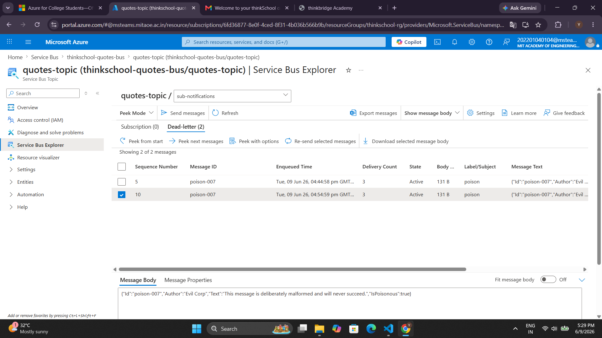
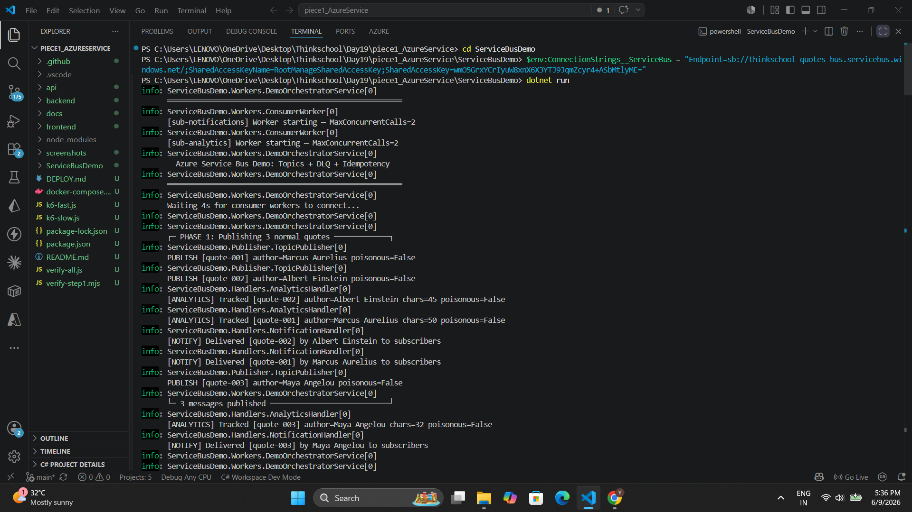
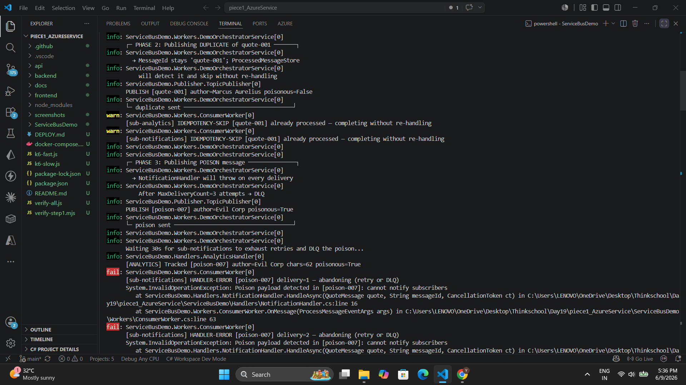
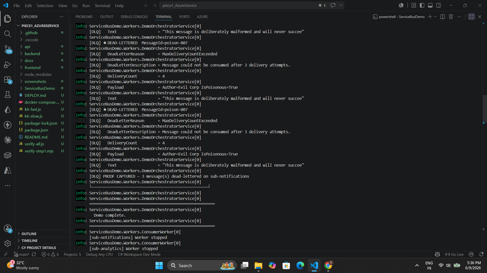

# Day 19 — Azure Service Bus Topics + DLQ

Publish to a Service Bus topic with two subscriptions, consume with a competing-consumer worker, make handlers idempotent (dedupe on a message ID), and demonstrate the dead-letter queue catching a poison message.

---

## Azure Resource

| Property | Value |
|---|---|
| **Namespace** | `thinkschool-quotes-bus.servicebus.windows.net` |
| **Tier** | Standard (required for topics) |
| **Location** | East Asia |
| **Topic** | `quotes-topic` |
| **Subscription 1** | `sub-analytics` — MaxDeliveryCount = 5 |
| **Subscription 2** | `sub-notifications` — MaxDeliveryCount = 3 |

---

## Concepts Covered

| Concept | Description |
|---|---|
| **Topic + Subscriptions** | Every published message is fan-out copied to each subscription independently |
| **Competing Consumer** | `MaxConcurrentCalls=2` inside each worker — two goroutine slots race to consume from the same subscription |
| **Idempotency / Dedupe** | `ProcessedMessageStore` keyed on `"subscriptionName:messageId"` prevents re-handling a message already successfully processed |
| **Dead-Letter Queue** | When a handler abandons a message `MaxDeliveryCount` times, the broker automatically moves it to the DLQ with reason `MaxDeliveryCountExceeded` |
| **Mark-after-success** | `MarkProcessed` is called only after the handler succeeds — failed attempts leave the key absent so retries are permitted |

---

## Key Files

```
ServiceBusDemo/
├── Program.cs                          ← DI wiring; two ConsumerWorkers registered via AddSingleton<IHostedService>
├── appsettings.json                    ← emulator connection string (override via env var for Azure)
├── emulator-config.json                ← local emulator topic + subscription config
├── Models/
│   └── QuoteMessage.cs                 ← message payload record
├── Services/
│   └── ProcessedMessageStore.cs        ← in-memory idempotency HashSet
├── Publisher/
│   └── TopicPublisher.cs               ← ServiceBusSender wrapper
├── Handlers/
│   ├── IQuoteHandler.cs
│   ├── AnalyticsHandler.cs             ← sub-analytics: processes all messages including poison
│   └── NotificationHandler.cs          ← sub-notifications: throws on IsPoisonous → triggers DLQ
└── Workers/
    ├── ConsumerWorker.cs               ← BackgroundService, MaxConcurrentCalls=2, idempotency gate
    └── DemoOrchestratorService.cs      ← publishes demo scenario + DLQ probe
```

---

## Publisher

```csharp
public sealed class TopicPublisher : IAsyncDisposable
{
    private readonly ServiceBusSender _sender;
    private readonly ILogger<TopicPublisher> _logger;

    public TopicPublisher(ServiceBusClient client, IConfiguration config, ILogger<TopicPublisher> logger)
    {
        var topicName = config["ServiceBus:TopicName"] ?? "quotes-topic";
        _sender = client.CreateSender(topicName);
        _logger = logger;
    }

    public async Task PublishAsync(QuoteMessage quote, CancellationToken ct = default)
    {
        var message = new ServiceBusMessage(BinaryData.FromObjectAsJson(quote))
        {
            MessageId = quote.Id,          // used for idempotency dedup
            ContentType = "application/json",
            Subject = quote.IsPoisonous ? "poison" : "quote"
        };

        await _sender.SendMessageAsync(message, ct);
        _logger.LogInformation("PUBLISH [{MessageId}] author={Author} poisonous={Poison}",
            quote.Id, quote.Author, quote.IsPoisonous);
    }

    public async ValueTask DisposeAsync() => await _sender.DisposeAsync();
}
```

---

## Consumer (Competing-Consumer Worker)

```csharp
// One instance per subscription. MaxConcurrentCalls=2 simulates competing consumers.
public sealed class ConsumerWorker(
    ServiceBusClient client,
    ProcessedMessageStore store,
    IQuoteHandler handler,
    ILogger<ConsumerWorker> logger) : BackgroundService
{
    protected override async Task ExecuteAsync(CancellationToken stoppingToken)
    {
        var options = new ServiceBusProcessorOptions
        {
            MaxConcurrentCalls = 2,       // competing consumers within the subscription
            AutoCompleteMessages = false   // we control Complete/Abandon manually
        };

        await using var processor = client.CreateProcessor("quotes-topic", handler.SubscriptionName, options);
        processor.ProcessMessageAsync += OnMessage;
        processor.ProcessErrorAsync += OnError;

        await processor.StartProcessingAsync(stoppingToken);
        try { await Task.Delay(Timeout.Infinite, stoppingToken); }
        catch (OperationCanceledException) { }
        await processor.StopProcessingAsync();
    }

    private async Task OnMessage(ProcessMessageEventArgs args)
    {
        var msgId = args.Message.MessageId;
        var idempotencyKey = $"{handler.SubscriptionName}:{msgId}";

        // Idempotency gate — skip if already successfully processed
        if (store.IsProcessed(idempotencyKey))
        {
            logger.LogWarning("[{Sub}] IDEMPOTENCY-SKIP [{MessageId}] already processed",
                handler.SubscriptionName, msgId);
            await args.CompleteMessageAsync(args.Message, args.CancellationToken);
            return;
        }

        try
        {
            var quote = args.Message.Body.ToObjectFromJson<QuoteMessage>()!;
            await handler.HandleAsync(quote, msgId, args.CancellationToken);

            store.MarkProcessed(idempotencyKey);   // mark AFTER success — retries remain possible
            await args.CompleteMessageAsync(args.Message, args.CancellationToken);
        }
        catch (Exception ex)
        {
            logger.LogError(ex,
                "[{Sub}] HANDLER-ERROR [{MessageId}] delivery={Delivery} — abandoning (retry or DLQ)",
                handler.SubscriptionName, msgId, args.Message.DeliveryCount);

            // AbandonAsync requeues the message.
            // After MaxDeliveryCount retries the broker auto-moves it to the DLQ.
            await args.AbandonMessageAsync(args.Message, cancellationToken: args.CancellationToken);
        }
    }

    private Task OnError(ProcessErrorEventArgs args)
    {
        logger.LogError(args.Exception, "[{Sub}] ServiceBus error source={Source}",
            handler.SubscriptionName, args.ErrorSource);
        return Task.CompletedTask;
    }
}
```

---

## Idempotency Key Handling

```csharp
// Key format: "subscriptionName:messageId"
// Each subscription tracks independently — processing in analytics
// does NOT suppress delivery in notifications.
public sealed class ProcessedMessageStore
{
    private readonly HashSet<string> _processed = [];
    private readonly Lock _lock = new();

    public bool IsProcessed(string key)
    {
        lock (_lock) return _processed.Contains(key);
    }

    public void MarkProcessed(string key)
    {
        lock (_lock) _processed.Add(key);
    }
}
```

**Key design decisions:**
- `MarkProcessed` is called **only after the handler succeeds** — if the handler throws, the key is absent, so the retry flows through normally
- Once marked, any redelivery of the same `MessageId` is ACKed without invoking the handler again
- Thread-safe via `Lock` — `MaxConcurrentCalls=2` means two threads can race on the same message

---

## Poison Message Handler

```csharp
// sub-notifications throws on IsPoisonous=true.
// ConsumerWorker catches it → AbandonAsync → after 3 attempts → DLQ.
public sealed class NotificationHandler(ILogger<NotificationHandler> logger) : IQuoteHandler
{
    public string SubscriptionName => "sub-notifications";

    public Task HandleAsync(QuoteMessage quote, string messageId, CancellationToken ct)
    {
        if (quote.IsPoisonous)
            throw new InvalidOperationException(
                $"Poison payload detected in [{messageId}]: cannot notify subscribers");

        logger.LogInformation("[NOTIFY] Delivered [{MessageId}] by {Author} to subscribers",
            messageId, quote.Author);
        return Task.CompletedTask;
    }
}
```

---

## End-to-End Flow

```
Publisher  (MessageId = quote.Id)
      │
      ▼
 quotes-topic  (Azure Service Bus Standard)
      │
      ├──► sub-analytics     → AnalyticsHandler   → always succeeds ✅
      │
      └──► sub-notifications → NotificationHandler
                                     │
                              IsPoisonous = true → throws
                                     │
                              AbandonAsync × 3 (MaxDeliveryCount=3)
                                     │
                                     ▼
                              Dead-Letter Queue
                         DeadLetterReason = MaxDeliveryCountExceeded
```

---

## Proof — Poison Message Landed in DLQ

### Terminal Output

**Phase 1 — 3 normal quotes processed by both subscriptions:**

```
[ANALYTICS] Tracked [quote-001] author=Marcus Aurelius chars=50 poisonous=False
[NOTIFY]    Delivered [quote-001] by Marcus Aurelius to subscribers
[ANALYTICS] Tracked [quote-002] author=Albert Einstein chars=45 poisonous=False
[NOTIFY]    Delivered [quote-002] by Albert Einstein to subscribers
[ANALYTICS] Tracked [quote-003] author=Maya Angelou chars=32 poisonous=False
[NOTIFY]    Delivered [quote-003] by Maya Angelou to subscribers
```

**Phase 2 — Duplicate skipped by idempotency on both subscriptions:**

```
warn: [sub-analytics]     IDEMPOTENCY-SKIP [quote-001] already processed — completing without re-handling
warn: [sub-notifications] IDEMPOTENCY-SKIP [quote-001] already processed — completing without re-handling
```

**Phase 3 — Poison message exhausts retries:**

```
fail: [sub-notifications] HANDLER-ERROR [poison-007] delivery=1 — abandoning (retry or DLQ)
      System.InvalidOperationException: Poison payload detected in [poison-007]: cannot notify subscribers

fail: [sub-notifications] HANDLER-ERROR [poison-007] delivery=2 — abandoning (retry or DLQ)
      System.InvalidOperationException: Poison payload detected in [poison-007]: cannot notify subscribers

fail: [sub-notifications] HANDLER-ERROR [poison-007] delivery=3 — abandoning (retry or DLQ)
      System.InvalidOperationException: Poison payload detected in [poison-007]: cannot notify subscribers
```

**Phase 4 — DLQ probe reads dead-lettered message from Azure:**

```
[DLQ] ★ DEAD-LETTERED  MessageId=poison-007
[DLQ]   DeadLetterReason      = MaxDeliveryCountExceeded
[DLQ]   DeadLetterDescription = Message could not be consumed after 3 delivery attempts.
[DLQ]   DeliveryCount         = 4
[DLQ]   Payload               = Author=Evil Corp IsPoisonous=True
[DLQ]   Text                  = "This message is deliberately malformed and will never succee"
[DLQ] PROOF CAPTURED — 3 message(s) dead-lettered on sub-notifications
```

---

## Screenshots

### 1. Azure Service Bus — Namespace & Topic on Azure Portal



Live Azure Service Bus namespace `thinkschool-quotes-bus` (Standard tier, East Asia) with topic `quotes-topic` and both subscriptions `sub-analytics` and `sub-notifications` visible in the portal.

---

### 2. Terminal Output — Phase 1 & Phase 2 (Publish + Idempotency Skip)



Both consumer workers start (`[sub-analytics]` and `[sub-notifications]`). Phase 1 publishes 3 normal quotes — both subscriptions process them. Phase 2 publishes a duplicate `quote-001` — both subscriptions log `IDEMPOTENCY-SKIP` and complete without re-handling.

---

### 3. Terminal Output — Phase 3 (Poison Message Retries)



Phase 3 publishes `poison-007` (`IsPoisonous=true`). `sub-analytics` processes it successfully. `sub-notifications` throws `InvalidOperationException` on all 3 delivery attempts and calls `AbandonAsync` each time. After `MaxDeliveryCount=3` the broker dead-letters the message automatically.

---

### 4. Terminal Output — Phase 4 (DLQ Proof)



DLQ probe reads `poison-007` from `sub-notifications/$DeadLetterQueue` on real Azure. Confirms `DeadLetterReason = MaxDeliveryCountExceeded` and `DeliveryCount = 4`.

---

## How to Run

```powershell
cd ServiceBusDemo

# Against real Azure Service Bus
$env:ConnectionStrings__ServiceBus = "Endpoint=sb://thinkschool-quotes-bus.servicebus.windows.net/;SharedAccessKeyName=RootManageSharedAccessKey;SharedAccessKey=<key>"
dotnet run
```

```powershell
# Check Azure resource status anytime
.\check-azure-sb.ps1
```
