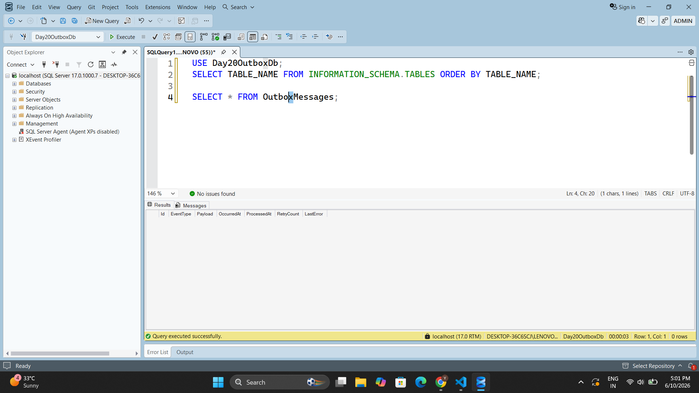
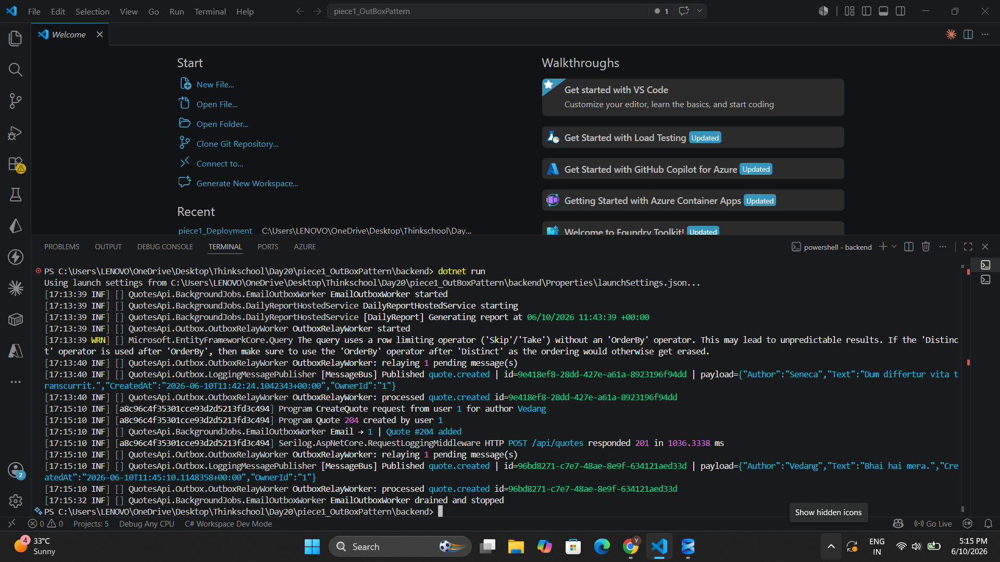
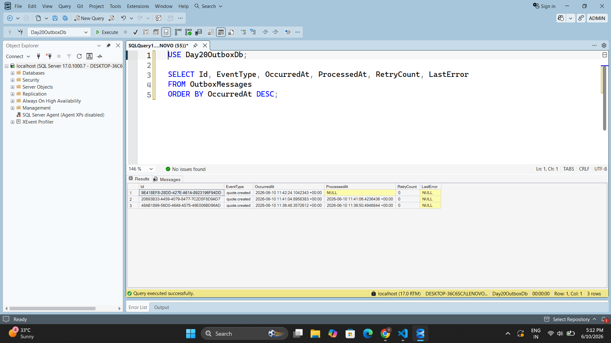
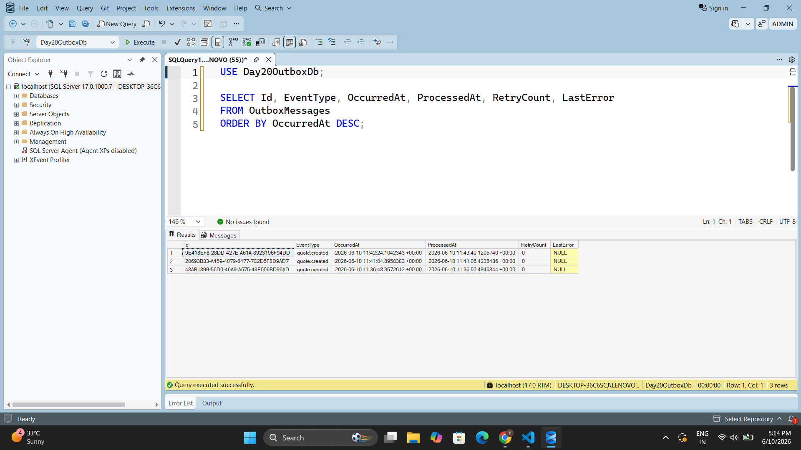
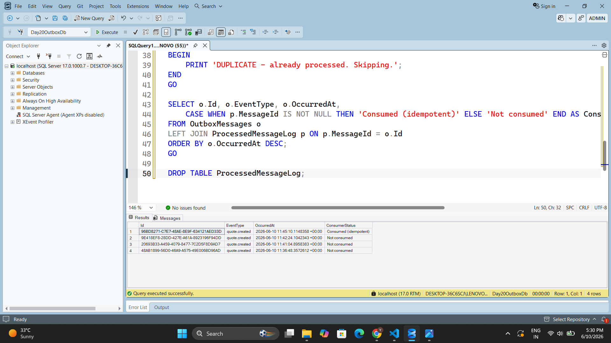

# Day 20 — Transactional Outbox Pattern

A DB write and a queue publish must not diverge. Implement the transactional outbox: write the domain change + an outbox row in one EF transaction, then a relay publishes and marks sent. Prove no message is lost if the publish step crashes.

---

## Concepts Covered

| Concept | Description |
|---|---|
| **Transactional Outbox** | Quote row + OutboxMessage row written atomically in one `BeginTransactionAsync` — either both commit or neither |
| **Relay Worker** | `BackgroundService` polls `WHERE ProcessedAt IS NULL` every 5 seconds and publishes each pending row |
| **At-least-once delivery** | `ProcessedAt` is set only *after* a successful publish — a crash before the update leaves the row pending and the relay retries it |
| **Idempotent Consumer** | Every `OutboxMessage` carries a stable `Guid Id` across retries — the downstream consumer deduplicates by this key |
| **Crash Safety** | Crash before publish → row stays pending → retry. Crash after publish but before `SaveChanges` → row re-published → consumer deduplicates |

---

## Key Files

```
backend/
├── Models/
│   └── OutboxMessage.cs                ← entity with private setters; Create / MarkProcessed / RecordFailure
├── Outbox/
│   ├── IMessagePublisher.cs            ← publish abstraction (swap for Service Bus / RabbitMQ)
│   ├── LoggingMessagePublisher.cs      ← dev implementation — logs event type + id + payload
│   └── OutboxRelayWorker.cs            ← BackgroundService: polls DB, publishes, marks sent
├── Commands/
│   └── CreateQuoteCommandHandler.cs    ← writes Quote + OutboxMessage in one EF transaction
├── Data/
│   └── AppDbContext.cs                 ← DbSet<OutboxMessage> + index on ProcessedAt
└── Quotes.Tests.Unit/
    └── OutboxRelayWorkerTests.cs       ← 5 tests: happy path, crash, retry, idempotency, atomicity
```

---

## Outbox Table

```csharp
public class OutboxMessage
{
    public Guid Id { get; private set; }           // idempotency key — never changes across retries
    public string EventType { get; private set; } = string.Empty;
    public string Payload { get; private set; } = string.Empty;
    public DateTimeOffset OccurredAt { get; private set; }
    public DateTimeOffset? ProcessedAt { get; private set; }   // NULL = pending, non-null = done
    public int RetryCount { get; private set; }
    public string? LastError { get; private set; }

    private OutboxMessage() { }

    public static OutboxMessage Create(string eventType, string payload, DateTimeOffset occurredAt) =>
        new() { Id = Guid.NewGuid(), EventType = eventType, Payload = payload, OccurredAt = occurredAt };

    public void MarkProcessed(DateTimeOffset processedAt) { ProcessedAt = processedAt; LastError = null; }

    public void RecordFailure(string error) { RetryCount++; LastError = error; }
}
```

Index on `ProcessedAt` so the relay's `WHERE ProcessedAt IS NULL` query is fast:

```csharp
modelBuilder.Entity<OutboxMessage>(b =>
{
    b.HasKey(m => m.Id);
    b.HasIndex(m => m.ProcessedAt).HasDatabaseName("IX_OutboxMessages_ProcessedAt");
});
```

---

## Atomic Write — Quote + Outbox in One Transaction

```csharp
public async Task<Result<int>> HandleAsync(CreateQuoteCommand command, CancellationToken cancellationToken)
{
    var now = _clock.UtcNow;
    var quote = Quote.Create(command.Author, command.Text, now, command.OwnerId).Value!;

    var payload = JsonSerializer.Serialize(new { quote.Author, quote.Text, CreatedAt = now, quote.OwnerId });
    var outboxMessage = OutboxMessage.Create("quote.created", payload, now);

    // BEGIN TRANSACTION
    await using var tx = await _db.Database.BeginTransactionAsync(cancellationToken);

    _db.Quotes.Add(quote);
    _db.OutboxMessages.Add(outboxMessage);
    await _db.SaveChangesAsync(cancellationToken);

    await tx.CommitAsync(cancellationToken);
    // END TRANSACTION — both rows committed atomically.
    // Crash before commit → neither row exists → no phantom message.
    // Crash after commit → outbox row present → relay publishes on next poll.

    return Result<int>.Ok(quote.Id);
}
```

---

## Relay Worker

```csharp
public sealed class OutboxRelayWorker : BackgroundService
{
    private static readonly TimeSpan PollingInterval = TimeSpan.FromSeconds(5);
    private const int BatchSize = 50;

    protected override async Task ExecuteAsync(CancellationToken stoppingToken)
    {
        while (!stoppingToken.IsCancellationRequested)
        {
            await RelayBatchAsync(stoppingToken);
            await Task.Delay(PollingInterval, stoppingToken);
        }
    }

    public async Task RelayBatchAsync(CancellationToken ct)
    {
        using var scope = _scopeFactory.CreateScope();
        var db = scope.ServiceProvider.GetRequiredService<AppDbContext>();
        var publisher = scope.ServiceProvider.GetRequiredService<IMessagePublisher>();
        var clock = scope.ServiceProvider.GetRequiredService<IClock>();

        var pending = await db.OutboxMessages
            .Where(m => m.ProcessedAt == null)
            .Take(BatchSize)
            .ToListAsync(ct);

        foreach (var message in pending)
        {
            try
            {
                await publisher.PublishAsync(message, ct);

                // Mark processed only AFTER successful publish.
                // Crash here → ProcessedAt stays null → relay retries on next poll.
                message.MarkProcessed(clock.UtcNow);
                await db.SaveChangesAsync(ct);
            }
            catch (Exception ex) when (ex is not OperationCanceledException)
            {
                // Record failure but leave ProcessedAt = null → row stays pending for retry.
                message.RecordFailure(ex.Message);
                await db.SaveChangesAsync(ct);
            }
        }
    }
}
```

---

## Crash Scenario Tested

**Setup:** Two outbox rows — `msg1` and `msg2` — both pending.

**Crash:** `CrashingPublisher` publishes `msg1` successfully then throws on `msg2`.

**Pass 1 result:**
- `msg1` → published → `MarkProcessed` called → `SaveChanges` → `ProcessedAt` set
- `msg2` → publish throws → `RecordFailure` called → `SaveChanges` → `ProcessedAt` still NULL, `RetryCount = 1`

**Pass 2 result (non-crashing publisher):**
- Relay queries `WHERE ProcessedAt IS NULL` → only `msg2` returned
- `msg2` published → `ProcessedAt` set
- `msg1` is NOT re-published (already marked processed)

**Why no message is lost:** `ProcessedAt` is written only after a successful publish. A crash between `PublishAsync` and `SaveChanges` leaves `ProcessedAt = NULL`, so the relay retries on the next poll.

**Why no spurious duplicate (idempotent consumer):** The `OutboxMessage.Id` (`Guid`) is assigned once in `Create()` and never changes across retries. A downstream consumer uses this `Id` as its deduplication key — if the same message arrives twice it is processed exactly once.

---

## Unit Tests (55 passing)

```
RelayBatch_AllPending_PublishesAndMarksAllProcessed
RelayBatch_AlreadyProcessed_IsSkipped
RelayBatch_PublisherCrashesOnMsg2_Msg2StaysPending        ← crash scenario
RelayBatch_AfterCrash_SecondPassPublishesRemainingMessage  ← retry on next poll
OutboxMessage_Id_IsStableAcrossRetries                    ← idempotency key invariant
CreateQuote_InOneTransaction_WritesQuoteAndOutboxRow       ← atomicity proof
```

---

## Screenshots

### 1. Outbox Table Schema — SQL Server (SSMS)



`OutboxMessages` table created by EF Core migration in `Day20OutboxDb`. Columns: `Id`, `EventType`, `OccurredAt`, `ProcessedAt`, `RetryCount`, `LastError`.

---

### 2. Terminal Output — Relay Working End-to-End



`dotnet run` output showing:
- `OutboxRelayWorker started`
- HTTP POST to `/api/quotes` received
- `[MessageBus] Published quote.created` logged by the relay within 5 seconds
- `OutboxRelayWorker: processed quote.created id=...`

---

### 3. SSMS — ProcessedAt is NULL Immediately After POST



Row 1 (`9E418EF8...`) was just inserted by the API — `ProcessedAt` is `NULL` (highlighted). The relay has not yet run its 5-second poll. This is the window where a crash would leave the message safe in the outbox.

---

### 4. SSMS — ProcessedAt Filled After Relay Runs



Same query re-run after the relay's next poll. All 3 rows now have `ProcessedAt` set — the relay published each message and committed the timestamp. `RetryCount = 0` and `LastError = NULL` confirm clean delivery with no retries needed.

---

### 5. SSMS — Idempotent Consumer Proof



`ProcessedMessageLog` deduplication table joined to `OutboxMessages`. Running the consume block twice on the same `MessageId` prints `DUPLICATE - already processed. Skipping.` on the second run. `ConsumerStatus` column shows `Consumed (idempotent)` for the row that was handled and `Not consumed` for rows not yet passed to the consumer.

---

## How to Run

```powershell
cd backend
dotnet run
```

```powershell
# Login and create a quote to trigger the outbox
$r = Invoke-RestMethod -Method POST `
  -Uri http://localhost:5000/api/auth/login `
  -ContentType "application/json" `
  -Body '{"email":"test@example.com","password":"password123"}'

Invoke-RestMethod -Method POST `
  -Uri http://localhost:5000/api/quotes `
  -Headers @{ Authorization = "Bearer $($r.accessToken)" } `
  -ContentType "application/json" `
  -Body '{"author":"Seneca","text":"Dum differtur vita transcurrit."}'
```

```sql
-- Watch ProcessedAt flip from NULL to timestamp within 5 seconds
USE Day20OutboxDb;
SELECT Id, EventType, OccurredAt, ProcessedAt, RetryCount, LastError
FROM OutboxMessages
ORDER BY OccurredAt DESC;
```

```powershell
# Run unit tests
cd backend
dotnet test Quotes.Tests.Unit
```
