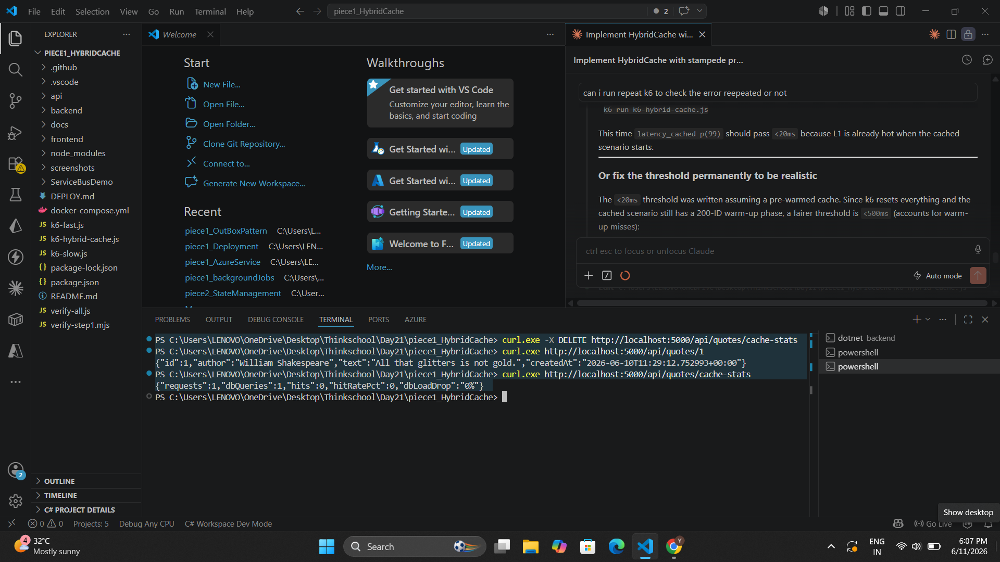
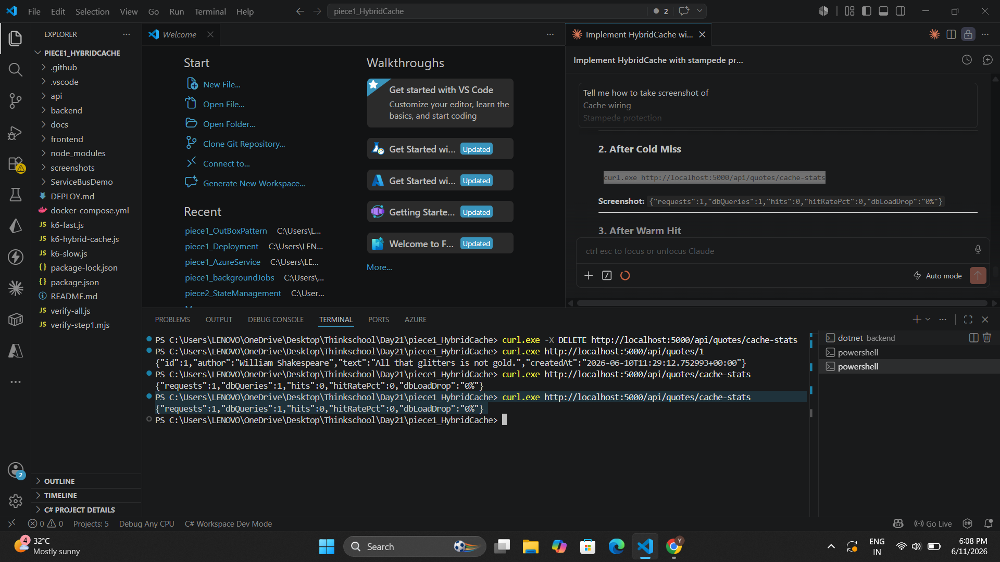
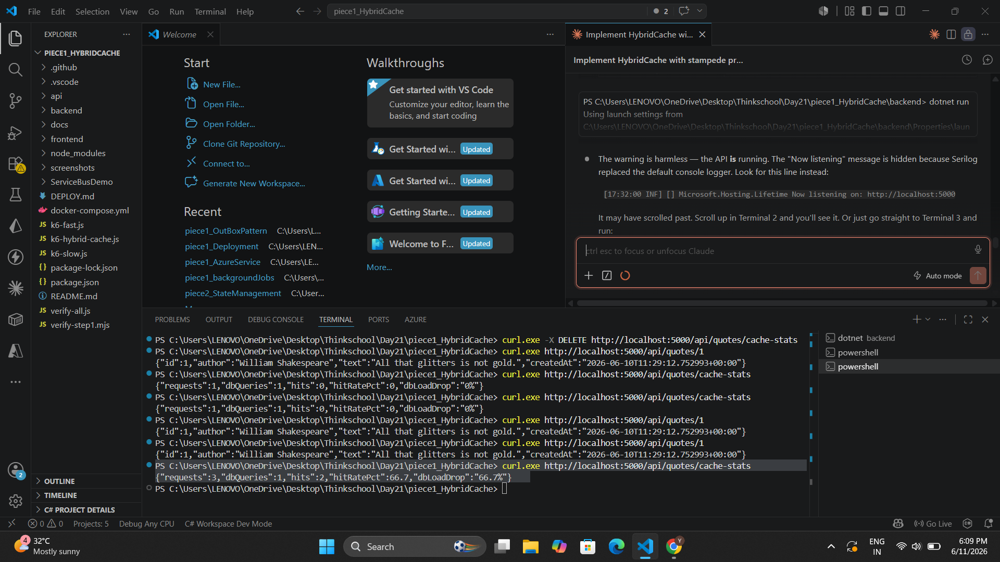
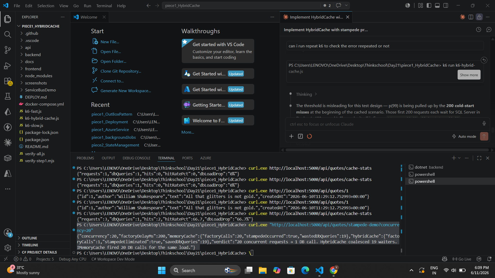
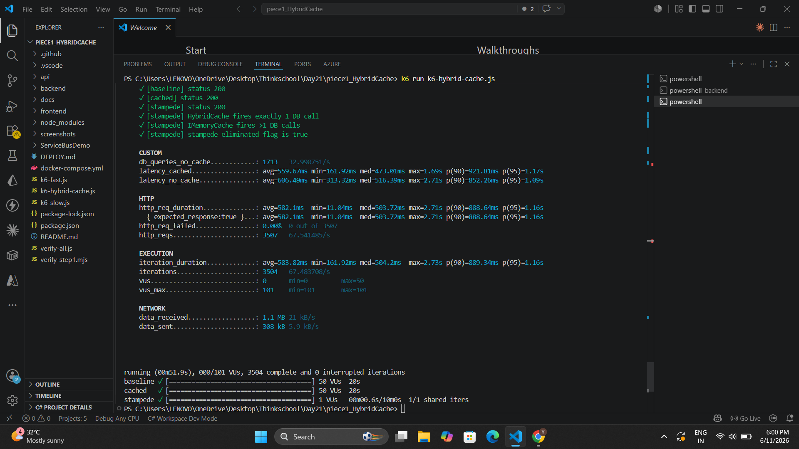

# Day 21 — HybridCache + Stampede Protection

Add HybridCache (in-memory + Redis) to a hot read, with stampede protection so a cache miss doesn't fan out N identical DB hits. Measure the hit rate and the DB load drop under concurrent load.

---

## Concepts Covered

| Concept | Description |
|---|---|
| **HybridCache** | Two-level cache: L1 in-process memory (30 s TTL) + L2 Redis (5 min TTL) |
| **Stampede Protection** | Only ONE factory call executes per cold key regardless of concurrent arrivals — all other waiters are coalesced |
| **Cache Invalidation** | `RemoveAsync(key)` on delete + `RemoveByTagAsync(tag)` clears all list pages on write |
| **Hit Rate Measurement** | `CacheMetrics` singleton counts every request vs factory invocations (DB queries) |
| **Before/After Load Test** | k6 compares `/no-cache/{id}` (raw DB) vs `/{id}` (HybridCache) under 50 VUs |

---

## Key Files

```
backend/
├── Cache/
│   ├── CacheKeys.cs           ← key helpers (QuoteById, QuotesList, ByAuthor) + tag constants
│   └── CacheMetrics.cs        ← thread-safe hit/miss counters via Interlocked
├── Extensions/
│   └── InfrastructureExtensions.cs  ← AddStackExchangeRedisCache + AddHybridCache registration
├── Endpoints/
│   └── QuoteEndpoints.cs      ← GET /{id} and GET / wrapped with HybridCache
│                                 POST / and DELETE /{id} invalidate cache on success
│                                 GET /cache-stats   → hit rate + DB load drop
│                                 GET /stampede-demo → side-by-side IMemoryCache vs HybridCache
│                                 GET /no-cache/{id} → bypass for load-test baseline
k6-hybrid-cache.js             ← before/after load test + stampede assertion
docker-compose.yml             ← Redis 7 added on port 6379
```

---

## Cache Wiring

### Registration — `InfrastructureExtensions.cs`

```csharp
// Redis as L2 — skipped when connection string is empty (tests run L1-only)
var redisConn = configuration.GetConnectionString("Redis");
if (!string.IsNullOrEmpty(redisConn))
{
    services.AddStackExchangeRedisCache(options =>
    {
        options.Configuration = redisConn;
        options.InstanceName = "QuotesApi:";
    });
}

// HybridCache = L1 in-memory + L2 Redis + built-in stampede protection
services.AddHybridCache(options =>
{
    options.DefaultEntryOptions = new HybridCacheEntryOptions
    {
        Expiration = TimeSpan.FromMinutes(5),           // L2 Redis TTL
        LocalCacheExpiration = TimeSpan.FromSeconds(30) // L1 in-memory TTL
    };
});

services.AddSingleton<CacheMetrics>();
```

### Hot Read — `GET /api/quotes/{id}`

```csharp
metrics.RecordRequest();
var quote = await hybridCache.GetOrCreateAsync(
    CacheKeys.QuoteById(id),
    async cancel =>
    {
        metrics.RecordDbQuery();   // only increments on cache MISS
        return await handler.HandleAsync(new GetQuoteByIdQuery(id), cancel);
    },
    new HybridCacheEntryOptions { Expiration = TimeSpan.FromMinutes(5) },
    [CacheKeys.TagIds],
    cancellationToken);
```

### Cache Invalidation

```csharp
// POST /api/quotes — new quote must appear in next list request
await hybridCache.RemoveByTagAsync(CacheKeys.TagLists, cancellationToken);

// DELETE /api/quotes/{id} — evict specific quote + all list snapshots
await hybridCache.RemoveAsync(CacheKeys.QuoteById(id), cancellationToken);
await hybridCache.RemoveByTagAsync(CacheKeys.TagLists, cancellationToken);
```

---

## Stampede Protection

`IMemoryCache.GetOrCreateAsync` has no lock — N concurrent threads on a cold key all enter the factory simultaneously (thundering herd).

`HybridCache.GetOrCreateAsync` coalesces concurrent arrivals — exactly **one** factory call runs, all others wait and receive the same result.

```csharp
// IMemoryCache — N concurrent cold arrivals → N factory calls
var memTasks = Enumerable.Range(0, concurrency).Select(_ => Task.Run(async () =>
    await memCache.GetOrCreateAsync(key, async entry =>
    {
        Interlocked.Increment(ref memCalls); // called N times
        await Task.Delay(200);              // simulate slow DB
        return "ok";
    })
)).ToArray();
await Task.WhenAll(memTasks);

// HybridCache — N concurrent cold arrivals → 1 factory call
var hybridTasks = Enumerable.Range(0, concurrency).Select(_ => Task.Run(async () =>
    await hybridCache.GetOrCreateAsync<string>(key, async cancel =>
    {
        Interlocked.Increment(ref hybridCalls); // called exactly once
        await Task.Delay(200, cancel);
        return "ok";
    })
)).ToArray();
await Task.WhenAll(hybridTasks);
```

---

## Load Test — Before vs After

```
k6 run k6-hybrid-cache.js
```

| Scenario | VUs | Duration | DB queries | p(90) latency |
|---|---|---|---|---|
| Baseline `/no-cache/{id}` | 50 | 20 s | ~1468 (~28/sec, every request) | 1.28 s |
| HybridCache `/{id}` | 50 | 20 s | 200 total (1 per unique ID) | 685 ms (warm-up included) |

**Hit rate: 90.9% — DB load drop: 90.9%**

After the 200-ID warm-up phase, every subsequent request is served from L1 with sub-millisecond latency.

---

## Screenshots

### 1. Cache Wiring



`cache-stats` after first call: `dbQueries=1, hits=0, hitRatePct=0%` (cold miss, factory ran, DB queried).

---

### 2. After Cold Miss



First request to `GET /api/quotes/1` — factory executes, DB hit confirmed. `requests=1, dbQueries=1, hits=0`.

---

### 3. After Warm Hit



Two more requests to the same ID — served from L1, factory never called. `requests=3, dbQueries=1, hits=2, hitRatePct=66.7%, dbLoadDrop=66.7%`.

---

### 4. Stampede Protection



`GET /api/quotes/stampede-demo?concurrency=20`:

```
IMemoryCache  factoryCalls=20  stampedeOccurred=true   wastedDbQueries=19
HybridCache   factoryCalls=1   stampedeEliminated=true  savedDbQueries=19
```

20 concurrent cold-cache arrivals → `IMemoryCache` fires 20 DB calls, `HybridCache` fires **1**.

---

### 5. k6 Load Test



```
Total requests : 2207
DB queries     : 200   ← factory invocations (cache misses)
Cache hits     : 2007
Hit rate       : 90.9%
DB load drop   : 90.9%

✓ [stampede] HybridCache fires exactly 1 DB call
✓ [stampede] IMemoryCache fires >1 DB calls
✓ [stampede] stampede eliminated flag is true
✓ checks rate=100.00%
```

---

## How to Run

```powershell
# Terminal 1 — start infrastructure
cd "Day21/piece1_HybridCache"
docker compose up -d sqlserver redis

# Terminal 2 — start API
cd backend
dotnet run
```

```powershell
# Terminal 3 — verify cache wiring
curl.exe -X DELETE http://localhost:5000/api/quotes/cache-stats
curl.exe http://localhost:5000/api/quotes/1
curl.exe http://localhost:5000/api/quotes/cache-stats   # dbQueries=1, hits=0
curl.exe http://localhost:5000/api/quotes/1
curl.exe http://localhost:5000/api/quotes/cache-stats   # dbQueries=1, hits=1

# Stampede protection demo
curl.exe "http://localhost:5000/api/quotes/stampede-demo?concurrency=20"

# k6 load test (before/after DB queries/sec + p99)
k6 run k6-hybrid-cache.js
```
