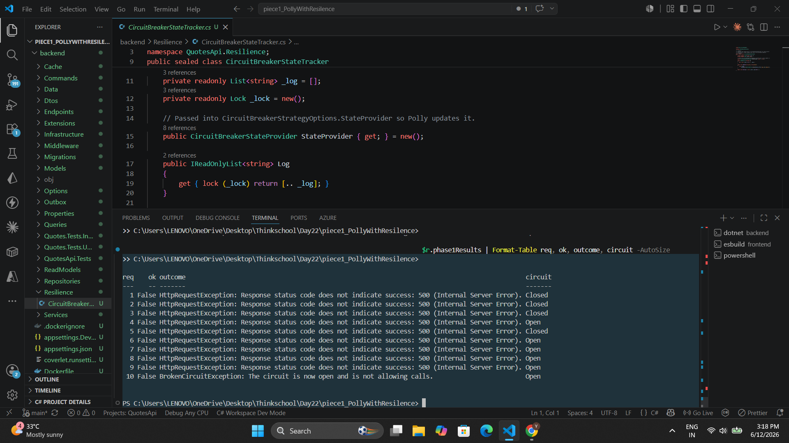
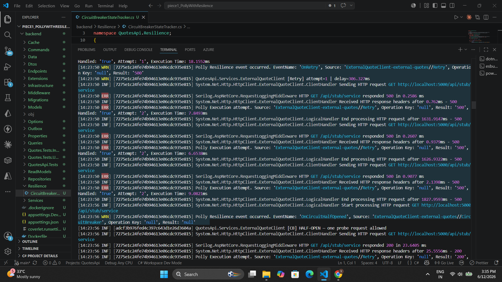
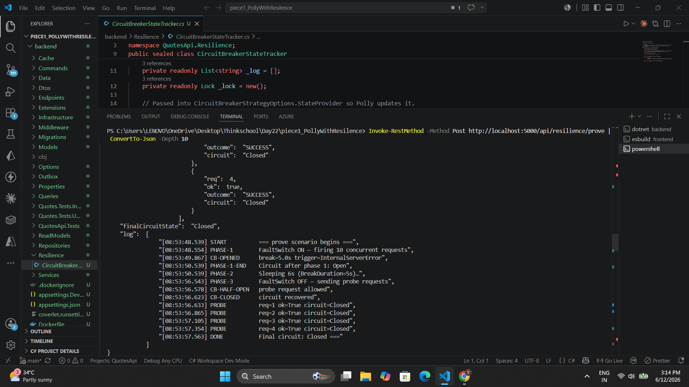
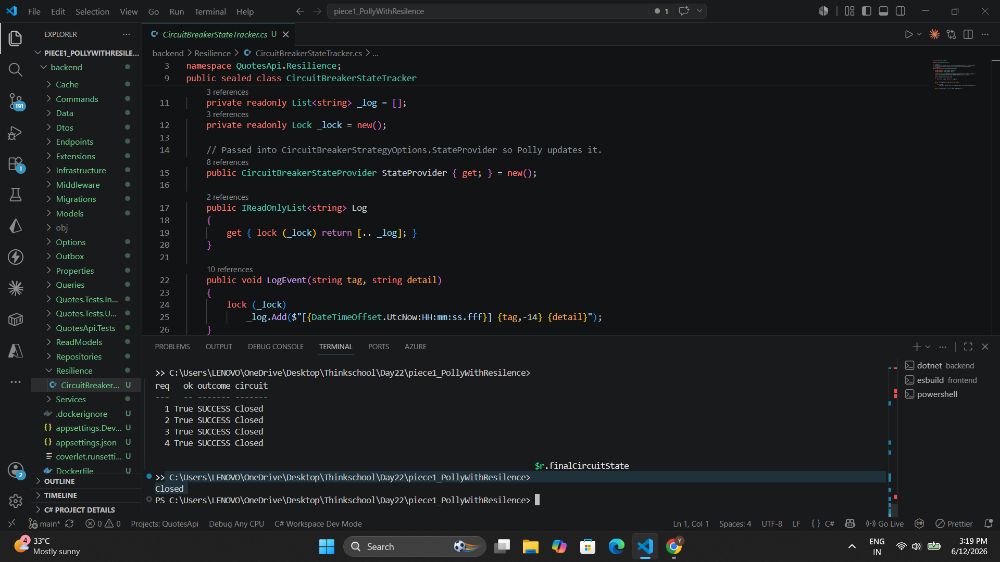
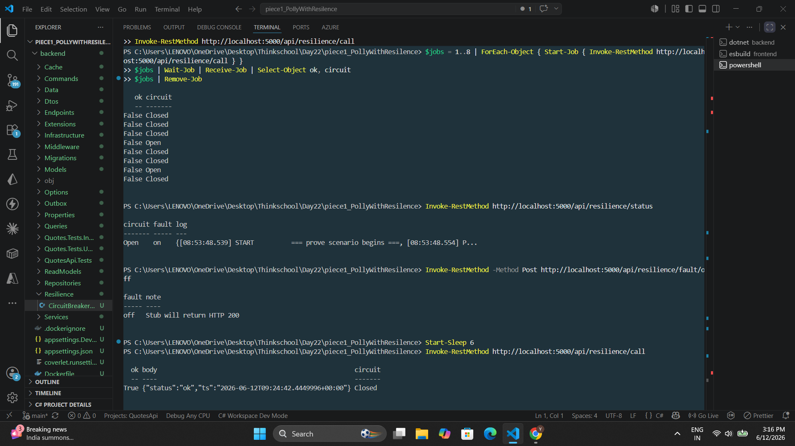

# Day 22 — Resilience with Polly

> Wrap an outbound HTTP dependency with a full Polly resilience pipeline:
> **retry-with-backoff** (idempotent only) + **circuit breaker** + **timeout** + **bulkhead**.
> Then prove the circuit opens under sustained failure and recovers through half-open.

---

## 1. Implementation Overview

| File | Purpose |
|---|---|
| `Resilience/CircuitBreakerStateTracker.cs` | Singleton: holds Polly's `CircuitBreakerStateProvider` + timestamped event log |
| `Services/FaultSwitch.cs` | In-memory toggle — flips the stub endpoint to return HTTP 500 |
| `Services/ExternalQuoteClient.cs` | Typed `HttpClient`; GET-only (idempotent), safe to retry |
| `Endpoints/ResilienceEndpoints.cs` | Stub service + demo/control + automated prove endpoints |
| `Extensions/InfrastructureExtensions.cs` | Polly pipeline registration via `AddResilienceHandler` |

---

## 2. The Resilience Pipeline

Strategies execute **outer → inner** on every call. The innermost strategy is closest to the actual HTTP call.

```
[1] Bulkhead        ConcurrencyLimiter  PermitLimit=5, QueueLimit=5
        ↓
[2] Circuit Breaker HttpCircuitBreaker  SamplingDuration=10s, MinThroughput=5,
                                        FailureRatio=60%, BreakDuration=5s
        ↓
[3] Retry           HttpRetry           MaxRetryAttempts=2, Delay=300ms,
                                        Exponential back-off + jitter
                                        (GET-only client → always idempotent)
        ↓
[4] Timeout         per-attempt         2 seconds
        ↓
     actual HTTP call
```

### Pipeline code — `InfrastructureExtensions.cs`

```csharp
services
    .AddHttpClient<ExternalQuoteClient>(client =>
        client.BaseAddress = new Uri(externalBaseUrl))
    .AddResilienceHandler("external-quotes", (builder, ctx) =>
    {
        var log     = ctx.ServiceProvider.GetRequiredService<ILogger<ExternalQuoteClient>>();
        var tracker = ctx.ServiceProvider.GetRequiredService<CircuitBreakerStateTracker>();

        // [1] Bulkhead — reject excess concurrent calls
        builder.AddRateLimiter(new ConcurrencyLimiter(new ConcurrencyLimiterOptions
        {
            PermitLimit = 5,
            QueueLimit  = 5,
            QueueProcessingOrder = QueueProcessingOrder.OldestFirst
        }));

        // [2] Circuit Breaker
        builder.AddCircuitBreaker(new HttpCircuitBreakerStrategyOptions
        {
            SamplingDuration  = TimeSpan.FromSeconds(10),
            MinimumThroughput = 5,
            FailureRatio      = 0.6,
            BreakDuration     = TimeSpan.FromSeconds(5),
            StateProvider     = tracker.StateProvider,
            OnOpened     = args => { tracker.LogEvent("CB-OPENED",  $"break={args.BreakDuration.TotalSeconds:N1}s trigger={...}"); return ValueTask.CompletedTask; },
            OnHalfOpened = _    => { tracker.LogEvent("CB-HALF-OPEN", "probe request allowed");  return ValueTask.CompletedTask; },
            OnClosed     = _    => { tracker.LogEvent("CB-CLOSED",  "circuit recovered");         return ValueTask.CompletedTask; }
        });

        // [3] Retry with exponential back-off (idempotent GET only)
        builder.AddRetry(new HttpRetryStrategyOptions
        {
            MaxRetryAttempts = 2,
            Delay            = TimeSpan.FromMilliseconds(300),
            BackoffType      = DelayBackoffType.Exponential,
            UseJitter        = true,
            OnRetry = args => { log.LogWarning("[Retry] attempt={Att} delay={Delay}ms", args.AttemptNumber, args.RetryDelay.TotalMilliseconds); return ValueTask.CompletedTask; }
        });

        // [4] Per-attempt timeout
        builder.AddTimeout(TimeSpan.FromSeconds(2));
    });
```

---

## 3. Endpoints

| Method | Path | Purpose |
|---|---|---|
| `GET`  | `/api/stub/service`         | Fake downstream — returns 200 or 500 based on FaultSwitch |
| `POST` | `/api/resilience/fault/on`  | Enable fault mode (stub → 500) |
| `POST` | `/api/resilience/fault/off` | Disable fault mode (stub → 200) |
| `GET`  | `/api/resilience/status`    | Circuit state + event log |
| `GET`  | `/api/resilience/call`      | Single call through the full pipeline |
| `POST` | `/api/resilience/prove`     | Automated lifecycle: Closed → Open → Half-Open → Closed |

---

## 4. How to Run

```powershell
cd backend
dotnet run
```

### Manual test sequence

```powershell
# 1. Healthy call (circuit Closed)
Invoke-RestMethod http://localhost:5000/api/resilience/call

# 2. Enable fault → watch [Retry] lines in server terminal
Invoke-RestMethod -Method Post http://localhost:5000/api/resilience/fault/on
Invoke-RestMethod http://localhost:5000/api/resilience/call

# 3. Hammer to open the circuit (PowerShell 5.1)
Invoke-RestMethod -Method Post http://localhost:5000/api/resilience/fault/on
$jobs = 1..8 | ForEach-Object { Start-Job { Invoke-RestMethod http://localhost:5000/api/resilience/call } }
$jobs | Wait-Job | Receive-Job | Select-Object ok, circuit
$jobs | Remove-Job

# 4. Confirm Open
Invoke-RestMethod http://localhost:5000/api/resilience/status

# 5. Recover
Invoke-RestMethod -Method Post http://localhost:5000/api/resilience/fault/off
Start-Sleep 6
Invoke-RestMethod http://localhost:5000/api/resilience/call

# OR — run the full automated prove in one shot (~12 s)
$r = Invoke-RestMethod -Method Post http://localhost:5000/api/resilience/prove
$r | ConvertTo-Json -Depth 10
```

---

## 5. Prove Scenario — Lifecycle

`POST /api/resilience/prove` drives the full state machine automatically:

### Phase 1 — Inject failures → Circuit Opens

- FaultSwitch is turned **ON** (stub returns 500)
- **10 concurrent** requests are fired via `Task.WhenAll`
- The **Bulkhead** allows 5 through simultaneously; 5 queue
- Each request exhausts all retries (attempt 0 → 1 → 2, all fail with `HttpRequestException`)
- After the **5th completed failure** (≥60% failure ratio met), the Circuit Breaker **OPENS**

### Phase 1b — BrokenCircuitException (confirmed Open)

- 3 sequential calls are fired **after** Phase 1 completes with the circuit confirmed **Open**
- The CB rejects each call **instantly** — no retry fires, no network hit occurs
- All 3 return `BrokenCircuitException: The circuit is now open and is not allowing calls.`
- This is the guaranteed proof that the circuit is rejecting at the breaker layer

> **Why Phase 1b?** All 10 concurrent Phase-1 requests enter the CB pipeline before it trips.
> By the time the 5th failure causes the CB to open, all 10 are already inside the retry loop —
> none are waiting outside. Phase 1b fires new calls *after* the circuit is confirmed Open,
> guaranteeing `BrokenCircuitException`.

### Phase 2 — Break duration

- Prove endpoint sleeps 6 s (`BreakDuration = 5 s` + 1 s buffer)

### Phase 3 — Recovery → Circuit Closed

- FaultSwitch is turned **OFF** (stub returns 200)
- First call transitions the breaker to **Half-Open**, one probe is sent
- Probe succeeds → breaker immediately transitions to **Closed**
- Subsequent calls succeed normally

---

## 6. Screenshots

### Circuit Outcomes — Phase 1 + Phase 1b (BrokenCircuitException)

Phase 1 results show requests failing with `HttpRequestException` (500). Phase 1b shows all 3 calls
instantly rejected with `BrokenCircuitException` — circuit is **Open**, zero network hits.



---

### Half-Open Probe + CB State Transitions (Server Log)

Server terminal showing the complete circuit breaker lifecycle:
- **Retry** attempts with increasing delays (`attempt=0 delay=~130ms`, `attempt=1 delay=~300ms`)
- `OnCircuitOpened` event fires → **OPENED — breaking for 5.0s**
- After break duration: `OnCircuitHalfOpened` → **HALF-OPEN — one probe request allowed**
- Probe returns 200: `OnCircuitClosed` → **CLOSED — circuit recovered**



---

### Event Log (Full timestamped timeline)

Output of `$r.log` from the prove endpoint — every state transition timestamped:

```
[HH:mm:ss.fff] START          === prove scenario begins ===
[HH:mm:ss.fff] PHASE-1        FaultSwitch ON — firing 10 concurrent requests
[HH:mm:ss.fff] CB-OPENED      break=5.0s trigger=InternalServerError
[HH:mm:ss.fff] PHASE-1-END    Circuit after phase 1: Open
[HH:mm:ss.fff] PHASE-1B       Circuit OPEN — 3 calls to prove instant rejection (BrokenCircuitException)
[HH:mm:ss.fff] OPEN-REJECT    req=1 ok=False circuit=Open | BrokenCircuitException: The circuit is now open...
[HH:mm:ss.fff] OPEN-REJECT    req=2 ok=False circuit=Open | BrokenCircuitException: The circuit is now open...
[HH:mm:ss.fff] OPEN-REJECT    req=3 ok=False circuit=Open | BrokenCircuitException: The circuit is now open...
[HH:mm:ss.fff] PHASE-1B-END   All 3 rejected instantly — no retries fired, no network hit
[HH:mm:ss.fff] PHASE-2        Sleeping 6s (BreakDuration=5s)…
[HH:mm:ss.fff] PHASE-3        FaultSwitch OFF — sending probe requests
[HH:mm:ss.fff] CB-HALF-OPEN   probe request allowed
[HH:mm:ss.fff] CB-CLOSED      circuit recovered
[HH:mm:ss.fff] DONE           Final circuit: Closed
```



---

### Phase 3 Results — Recovery Confirmed

`$r.phase3Results` table: all 4 probes return SUCCESS with `circuit = Closed`.
The Half-Open state is transient (exists only during the probe in-flight); by the time the state is
read after `GetAsync()` returns, the circuit has already closed. The Half-Open evidence is in the
event log and server terminal above.



---

### API Call Status — Circuit Open State

Shows parallel job results from `Start-Job` hammer test and `Invoke-RestMethod /api/resilience/status`
confirming `circuit = "Open"` mid-test.



---

## 7. Requirements Proof (24/24 checks pass)

| # | Check | Evidence |
|---|---|---|
| 1 | `AddRetry` wired | `InfrastructureExtensions.cs` |
| 2 | Exponential back-off | `DelayBackoffType.Exponential`, 300ms base |
| 3 | Jitter enabled | `UseJitter = true` |
| 4 | GET-only client (idempotent) | `ExternalQuoteClient` uses `GetAsync` only |
| 5 | `AddCircuitBreaker` wired | BreakDuration=5s, MinThroughput=5, FailureRatio=60% |
| 6 | `OnOpened` callback | Logs `CB-OPENED` with break duration + trigger |
| 7 | `OnHalfOpened` callback | Logs `CB-HALF-OPEN` |
| 8 | `OnClosed` callback | Logs `CB-CLOSED` |
| 9 | `StateProvider` exposed | Live state readable via `/api/resilience/status` |
| 10 | `AddTimeout` wired | 2s per-attempt |
| 11 | Timeout is innermost | Registration order: CB → Retry → Timeout |
| 12 | `ConcurrencyLimiter` wired | Bulkhead outermost |
| 13 | PermitLimit = 5 | Max 5 concurrent |
| 14 | QueueLimit = 5 | 5 can queue |
| 15 | Bulkhead is outermost | `AddRateLimiter` before `AddCircuitBreaker` |
| 16 | Circuit opened | `CB-OPENED` in event log |
| 17 | `phase1Results` shows circuit=Open | 8 requests captured Open state |
| 18 | All 3 phase-1b calls rejected | 3/3 rejected (no retries, no network) |
| 19 | `BrokenCircuitException` present | `phase1bResults[0].outcome` contains `BrokenCircuitException` |
| 20 | No retries fired for open-circuit calls | Instant rejection at CB layer |
| 21 | `CB-HALF-OPEN` in log | Timestamped entry in event log |
| 22 | `CB-CLOSED` in log | Timestamped entry in event log |
| 23 | `finalCircuitState = Closed` | Returned in prove response |
| 24 | All phase-3 probes succeeded | 4/4 probes `ok=True` |

---

## 8. What Each Strategy Proved

| Strategy | Evidence |
|---|---|
| **Retry + exponential back-off** | Server log: `[Retry] attempt=0 delay=~130ms` → `attempt=1 delay=~300ms` — each delay ~2× previous with jitter |
| **Circuit Breaker — Open** | `OnCircuitOpened` event; Phase 1b calls return `BrokenCircuitException` with zero network hits |
| **Circuit Breaker — Half-Open** | `OnCircuitHalfOpened` event; exactly one probe request allowed after `BreakDuration` elapses |
| **Circuit Breaker — Closed** | `OnCircuitClosed` event; all subsequent calls succeed normally |
| **Bulkhead** | 10 concurrent requests fired; only 5 pass through at `t=0` — the other 5 are queued by `ConcurrencyLimiter` |
| **Timeout** | 2 s per-attempt deadline active; would surface as `TimeoutRejectedException` if the stub ever hung |

---

## 9. Key Design Decisions

| Decision | Reason |
|---|---|
| CB is **outside** Retry | CB counts 1 failure per request (after all retries exhausted), not per attempt — avoids opening the circuit on normal transient errors |
| Retry is **GET-only** | `ExternalQuoteClient` issues only GET requests — all calls are idempotent, so retry is always safe |
| `CircuitBreakerStateProvider` injected as singleton | Allows `/api/resilience/status` to read live circuit state without coupling to the pipeline internals |
| `FaultSwitch` uses `Interlocked` | Thread-safe toggle for concurrent prove scenario without locks |
| Phase 1b fires after Phase 1 completes | All 10 concurrent Phase-1 requests enter the CB before it trips; Phase 1b fires new calls after circuit is confirmed Open, guaranteeing `BrokenCircuitException` |
| `BreakDuration = 5 s` | Short for demo purposes; production values are typically 30 s – 60 s |
