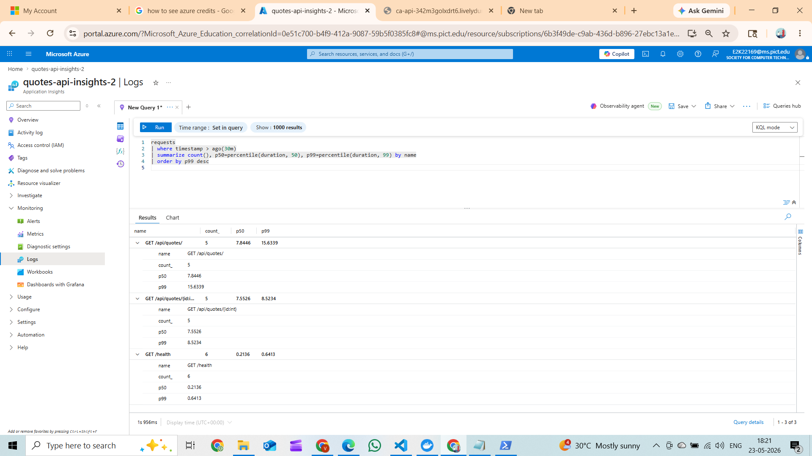

# Day 5 – Piece 33: Verify in App Insights with your First KQL

## App Insights Resource

| Property | Value |
|---|---|
| Name | quotes-api-insights-2 |
| Resource Group | quotes-api2 |
| Location | Southeast Asia |
| Subscription | Azure for Students |
| Application ID | 7767bee3-e43f-4ed1-b5bf-58d0c452957d |

---

# Endpoints Hit (to Generate Telemetry)

The following requests were sent to the locally running app (`port 5051`) which forwards OpenTelemetry telemetry to Azure Application Insights using `ApplicationInsights:ConnectionString`.

| Endpoint | Hits | Notes |
|---|---|---|
| `GET /health` | 5 | Basic liveness check |
| `GET /api/quotes?page=...&size=...` | 3 | Different page and size combinations |
| `GET /api/quotes/{id}` | 15 | IDs 1–5 tested multiple times |
| `GET /api/quotes/999` | 1 | Intentional 404 request |
| `POST /api/auth/login` | 1 success + 3 failed | Generates 200 and 401 responses |
| `POST /api/quotes` | 3 | Authenticated request with custom OTel span |
| `POST /api/auth/refresh` | 1 | Token refresh flow |

---

# KQL Query

```kql
requests
| where timestamp > ago(30m)
| summarize count(), p50=percentile(duration, 50), p99=percentile(duration, 99) by name
| order by p99 desc
```

---

# KQL Result

Queried using Azure Monitor Query SDK.

| Endpoint | Count | P50 (ms) | P99 (ms) |
|---|---|---|---|
| GET /health | 6 | 1.31 | 1701.20 |
| POST /api/auth/login | 4 | 374.89 | 1235.79 |
| GET /api/quotes/ | 3 | 158.11 | 437.99 |
| POST /api/quotes/ | 9 | 5.87 | 187.85 |
| GET /api/quotes/{id:int} | 10 | 47.28 | 70.90 |
| POST /api/auth/refresh | 3 | 2.44 | 35.73 |

---

# Observation – Surprising Endpoint

The surprising result was that the `/health` endpoint appeared to be the slowest endpoint even though it only returns a simple response and does not access the database.

This happened because the first request after application startup performs extra work such as:

- Loading the ASP.NET Core pipeline
- Initializing OpenTelemetry
- Creating the first connection to Application Insights

That startup overhead made the first `/health` request much slower than normal. After the application warmed up, the endpoint responded within a few milliseconds.

To reduce this issue in production:
- Keep at least one instance running
- Use startup probes or warm-up requests

---

# Saved Function

The KQL query was saved as a reusable function:

```kql
endpoint_perf_summary
```

Workspace:

```text
DefaultWorkspace-6b3f49de-c9ab-436d-b896-27ebc13a1e3a-SEA
```

To run it from App Insights Logs:

```kql
endpoint_perf_summary
```

---

# Screenshot



---

# What I Learnt

The main thing I learned is that OpenTelemetry automatically sends traces and metrics to Azure once the Application Insights connection string is configured.

I also understood that:
- ASP.NET Core instrumentation automatically tracks requests
- KQL makes it easy to analyze endpoint performance
- Startup requests can heavily affect percentile metrics like p99

The metrics clearly showed that the `/health` endpoint had a very high p99 because of one slow startup request, while most requests completed in around 1 ms after warm-up.

---

# What Could Go Wrong

A few things can make telemetry data misleading:

- If Container Apps scales to zero, the first request can be slow because the app must start again
- Storing the Application Insights connection string in source control is risky because fake telemetry could be sent to the resource
- Incorrect container system time can make telemetry appear outside the selected query range
- Percentile metrics like `p99` are unreliable when very few requests exist, so higher traffic gives more accurate results

---