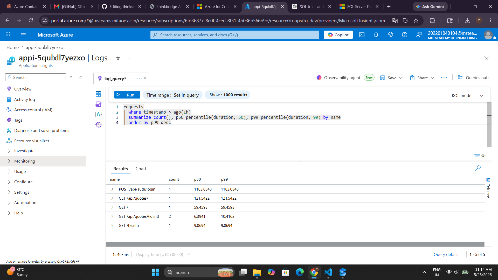
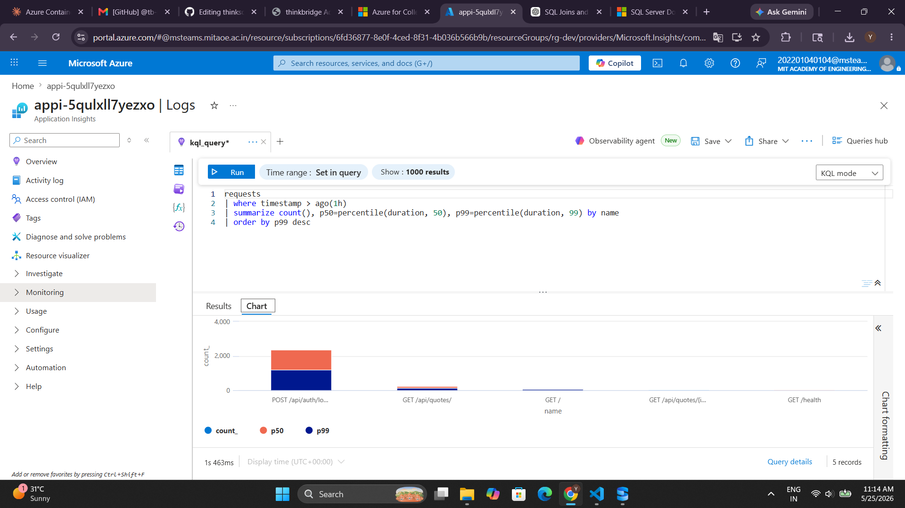

# Day 5 — Piece 33: Verify Telemetry in App Insights with KQL

## Live API URL

https://piece33-verifyappinsights.happyhill-feb8a1b3.southeastasia.azurecontainerapps.io

---

## Overview

This piece verifies that OpenTelemetry traces from the deployed ASP.NET Core API are landing in Azure Application Insights. We hit real endpoints, waited for ingestion, then queried the data using KQL.

---

## Azure Resources

| Resource | Name |
|---|---|
| Resource Group | `rg-dev` |
| Container App | `piece33-verifyappinsights` |
| Application Insights | `appi-5qulxll7yezxo` |
| Log Analytics Workspace | `log-5qulxll7yezxo` |
| Container Registry | `cr5qulxll7yezxo` |

---

## Endpoints Hit to Generate Telemetry

```powershell
GET  /health
POST /api/auth/login
GET  /api/quotes?page=1&size=5
GET  /api/quotes/{id}
POST /api/quotes
```

---

## KQL Query

```kql
requests
| where timestamp > ago(1h)
| summarize count(), p50=percentile(duration, 50), p99=percentile(duration, 99) by name
| order by p99 desc
```

---

## KQL Results

| name | count | p50 (ms) | p99 (ms) |
|---|---|---|---|
| POST /api/auth/login | 1 | 1183.03 | 1183.03 |
| GET /api/quotes/ | 1 | 121.54 | 121.54 |
| GET / | 1 | 59.46 | 59.46 |
| GET /api/quotes/{id:int} | 2 | 6.39 | 10.42 |
| GET /health | 1 | 9.07 | 9.07 |

---

## Screenshot




---

## Observation

**`POST /api/auth/login` was the slowest endpoint by far — p99 = 1183ms (~1.2 seconds).**

This was surprising because login is a simple credential check, but BCrypt password hashing is intentionally slow (it's a security feature — BCrypt adds CPU cost to resist brute-force attacks). Every login call pays that cost.

In contrast, `GET /health` responded in just 9ms and `GET /api/quotes/{id:int}` in ~10ms — proving the app itself is fast; the bottleneck is purely BCrypt.

---

## Saved KQL Function

Query saved as function **`EndpointLatency`** in App Insights Logs for reuse.

---

## Code Changes Required for Deployment

| File | Change | Reason |
|---|---|---|
| `QuotesApi.csproj` | Changed base image from `aspnet:10.0-alpine` to `aspnet:10.0` | Alpine uses musl libc — SQLite native library (`e_sqlite3`) failed to load |
| `appsettings.json` | Changed `Data Source=quotes.db` to `Data Source=/tmp/quotes.db` | Container filesystem is read-only; `/tmp` is always writable |
| `azure.yaml` | Changed `project: .` to `project: ./QuotesApi.csproj` | `azd` was picking up `.slnx` solution file causing MSBuild error |

---

## What I Learned

- OTel telemetry flows to App Insights via `UseAzureMonitor()` when `ApplicationInsights__ConnectionString` env var is set
- KQL `percentile()` function gives p50 (median) and p99 (worst-case) latency per endpoint
- BCrypt hashing dominates login latency — expected and intentional for security
- Alpine-based containers require musl-compatible native libraries; Debian base is safer for SQLite
- SQLite needs a writable path in containers — `/tmp` works but data is ephemeral

---

## Author

**Yash Rathi**
B.Tech Computer Engineering Student
Learning Cloud Computing & Azure
