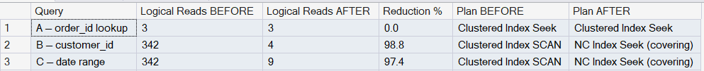

# Day 8 — Clustered vs Non-Clustered Indexes

## Setup

**Database:** `IndexDemo`  
**Table:** `dbo.Orders` — 100,000 rows  
**Tool:** SQL Server Management Studio (SSMS)

---

## Table Schema

```sql
CREATE TABLE dbo.Orders (
    order_id    INT            NOT NULL,
    customer_id INT            NOT NULL,
    order_date  DATE           NOT NULL,
    status      VARCHAR(20)    NOT NULL,
    amount      DECIMAL(10,2)  NOT NULL,
    CONSTRAINT PK_Orders PRIMARY KEY CLUSTERED (order_id)
);
```

---

## Index DDL

### 1. Clustered Index (created via PRIMARY KEY)

```sql
CONSTRAINT PK_Orders PRIMARY KEY CLUSTERED (order_id)
```

- Physically sorts the table rows by `order_id`
- Only one clustered index allowed per table
- Leaf pages are the data rows — no extra hop needed

### 2. Non-Clustered Index — customer_id lookups

```sql
CREATE NONCLUSTERED INDEX IX_Orders_CustomerID
    ON dbo.Orders (customer_id)
    INCLUDE (order_date, amount)
    WITH (FILLFACTOR = 85, SORT_IN_TEMPDB = ON);
```

- Key column: `customer_id` (used in WHERE clause)
- Included columns: `order_date`, `amount` (used in SELECT — avoids key lookup)
- Covering index — no extra hop to clustered index needed

### 3. Non-Clustered Index — date range queries

```sql
CREATE NONCLUSTERED INDEX IX_Orders_OrderDate
    ON dbo.Orders (order_date)
    INCLUDE (status, amount)
    WITH (FILLFACTOR = 80, SORT_IN_TEMPDB = ON);
```

- Key column: `order_date` (used in WHERE BETWEEN)
- Included columns: `status`, `amount` (used in SELECT — avoids key lookup)
- Covering index — no extra hop to clustered index needed

---

## Index Structure After Creation

| index_name | index_type | column_name | is_included_column |
|---|---|---|---|
| PK_Orders | CLUSTERED | order_id | 0 |
| IX_Orders_CustomerID | NONCLUSTERED | order_date | 1 |
| IX_Orders_CustomerID | NONCLUSTERED | amount | 1 |
| IX_Orders_CustomerID | NONCLUSTERED | customer_id | 0 |
| IX_Orders_OrderDate | NONCLUSTERED | status | 1 |
| IX_Orders_OrderDate | NONCLUSTERED | amount | 1 |
| IX_Orders_OrderDate | NONCLUSTERED | order_date | 0 |

`is_included_column = 0` → key column (part of B-tree seek)  
`is_included_column = 1` → included column (stored in leaf page only, not part of seek)

---

## Query A — Point Lookup by order_id

```sql
SELECT * FROM dbo.Orders
WHERE order_id = 49999;
```

**Actual result:**

| order_id | customer_id | order_date | status | amount |
|---|---|---|---|---|
| 49999 | 3521 | 2023-12-10 | Cancelled | 916.70 |

**STATISTICS IO — BEFORE index:**
```
Table 'Orders'. Scan count 0, logical reads 3
```

**STATISTICS IO — AFTER index:**
```
Table 'Orders'. Scan count 0, logical reads 3
```

**Execution plan BEFORE:** Clustered Index Seek  
**Execution plan AFTER:** Clustered Index Seek  

No change — `order_id` is the clustered index key so it was already optimal before any NC index was added.

---

## Query B — Lookup by customer_id

```sql
SELECT customer_id, order_date, amount
FROM dbo.Orders
WHERE customer_id = 1234;
```

**Actual result (13 rows):**

| customer_id | order_date | amount |
|---|---|---|
| 1234 | 2024-03-20 | 171.30 |
| 1234 | 2023-09-14 | 176.27 |
| 1234 | 2023-02-15 | 83.42 |
| 1234 | 2024-07-11 | 277.78 |
| 1234 | 2024-11-21 | 416.51 |
| 1234 | 2024-06-13 | 723.36 |
| 1234 | 2023-02-17 | 486.36 |
| 1234 | 2024-12-18 | 255.36 |
| 1234 | 2023-03-29 | 941.35 |
| 1234 | 2024-07-06 | 414.82 |
| 1234 | 2023-02-02 | 254.20 |
| 1234 | 2024-08-20 | 366.48 |
| 1234 | 2023-12-23 | 861.64 |

**STATISTICS IO — BEFORE index (no NC index on customer_id):**
```
Table 'Orders'. Scan count 1, logical reads 342
```

**STATISTICS IO — AFTER index (IX_Orders_CustomerID):**
```
Table 'Orders'. Scan count 1, logical reads 4
```

**Execution plan BEFORE:** Clustered Index Scan — read all 100,000 rows to find 13  
**Execution plan AFTER:** NC Index Seek (covering) — jumped directly to 13 rows, no key lookup

---

## Query C — Date Range

```sql
SELECT order_date, status, amount
FROM dbo.Orders
WHERE order_date BETWEEN '2024-01-01' AND '2024-01-31';
```

**Actual result:** 4,286 rows returned

**STATISTICS IO — BEFORE index (no NC index on order_date):**
```
Table 'Orders'. Scan count 1, logical reads 342
```

**STATISTICS IO — AFTER index (IX_Orders_OrderDate):**
```
Table 'Orders'. Scan count 1, logical reads 9
```

**Execution plan BEFORE:** Clustered Index Scan — read all 100,000 rows  
**Execution plan AFTER:** NC Index Seek (covering) — read only January pages, no key lookup

---

## Logical Reads — Before vs After Summary

| Query | Logical Reads BEFORE | Logical Reads AFTER | Change | Plan BEFORE | Plan AFTER |
|---|---|---|---|---|---|
| A — order_id lookup | 3 | 3 | No change | Clustered Index Seek | Clustered Index Seek |
| B — customer_id | 342 | 4 | 98.8% faster | Clustered Index SCAN | NC Index Seek (covering) |
| C — date range | 342 | 9 | 97.4% faster | Clustered Index SCAN | NC Index Seek (covering) |

---



---

## Write-Side Cost (Tax)

```sql
INSERT INTO dbo.Orders
VALUES (100001, 999, '2025-05-26', 'Pending', 299.99);
```

**Actual STATISTICS IO output:**
```
Table 'Orders'. Scan count 0, logical reads 7, physical reads 7
```

| Operation | B-trees written BEFORE indexes | B-trees written AFTER indexes | Impact |
|---|---|---|---|
| INSERT one row | 1 | 3 | 3x more write operations |

**Observed write-side cost (one line):**  
A single `INSERT` now touches 3 B-tree structures — `PK_Orders` (clustered) + `IX_Orders_CustomerID` + `IX_Orders_OrderDate` — so every write maintains 3 indexes instead of 1, which is the direct cost of faster reads.

---

## Key Takeaways

| Concept | What it means |
|---|---|
| Clustered index | Table rows physically stored in key order. One per table. Seek = 1 hop. |
| Non-clustered index | Separate B-tree with key + row pointer. Seek = 2 hops unless covering. |
| Covering index | INCLUDE columns eliminate the key lookup hop. Always prefer this. |
| FILLFACTOR | Leaves free space in pages to reduce splits on future inserts. |
| Write tax | Every additional index = one more B-tree updated on every INSERT/UPDATE/DELETE. |
