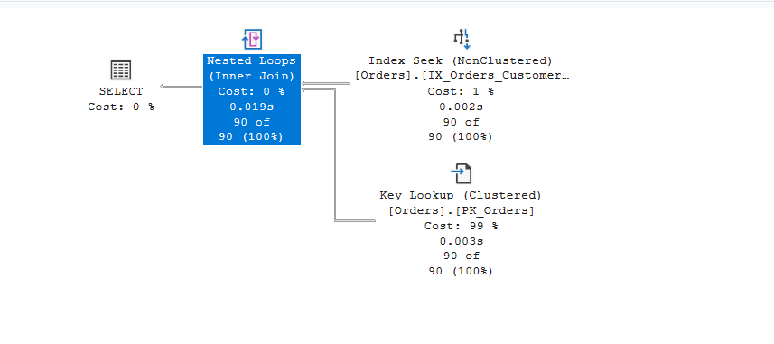
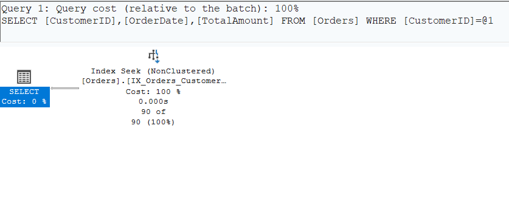
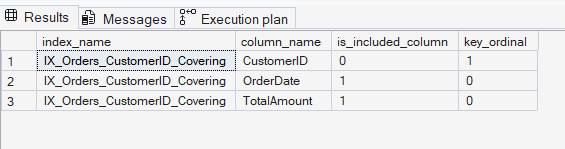

# Day 8 — Covering Indexes + INCLUDE

## Setup

```sql
CREATE TABLE Orders (
    OrderID     INT           NOT NULL IDENTITY(1,1),
    CustomerID  INT           NOT NULL,
    OrderDate   DATE          NOT NULL,
    TotalAmount DECIMAL(10,2) NOT NULL,
    Status      NVARCHAR(20)  NOT NULL,
    Notes       NVARCHAR(200) NULL,
    CONSTRAINT PK_Orders PRIMARY KEY CLUSTERED (OrderID)
);
-- 50 000 rows inserted across 500 customers
```

---

## BEFORE — Partial Index (Key Lookup present)

```sql
CREATE NONCLUSTERED INDEX IX_Orders_CustomerID
    ON Orders (CustomerID);          -- only seek column, nothing else
```

Query:
```sql
SET STATISTICS IO ON;
SELECT CustomerID, OrderDate, TotalAmount
FROM   Orders
WHERE  CustomerID = 42;
SET STATISTICS IO OFF;
```

### Execution Plan

```
SELECT
  └── Nested Loops (Inner Join)
        ├── Index Seek    IX_Orders_CustomerID      SEEK: CustomerID = 42
        └── Key Lookup    PK_Orders (LOOKUP)        ← fetches OrderDate, TotalAmount per row
```



**Why the lookup happens:** `IX_Orders_CustomerID` only stores `CustomerID` + `OrderID` (row locator).
`OrderDate` and `TotalAmount` are missing, so SQL Server follows each `OrderID` back into the
clustered index — one round-trip per matching row.

### STATISTICS IO

```
Table 'Orders'. Scan count 1, logical reads 217
```

---

## The Fix — Index with INCLUDE

```sql
DROP INDEX IX_Orders_CustomerID ON Orders;

CREATE NONCLUSTERED INDEX IX_Orders_CustomerID_Covering
    ON Orders (CustomerID)
    INCLUDE (OrderDate, TotalAmount);
--  ^^^^^^^^^^^^^^^^^^^^^^^^^^^^^^^^^
--  Stored at the leaf level only.
--  Not part of the B-tree key, but available without a lookup.
```

### Index structure confirmed from catalog

```sql
SELECT c.name, ic.is_included_column, ic.key_ordinal
FROM sys.indexes i
JOIN sys.index_columns ic ON ic.object_id = i.object_id AND ic.index_id = i.index_id
JOIN sys.columns c        ON c.object_id  = i.object_id AND c.column_id = ic.column_id
WHERE i.name = 'IX_Orders_CustomerID_Covering';
```

| column_name | is_included_column | key_ordinal |
|---|---|---|
| CustomerID  | 0 (key)            | 1           |
| OrderDate   | **1 (included)**   | 0           |
| TotalAmount | **1 (included)**   | 0           |


---

## AFTER — Covering Index (Key Lookup gone)

Same query, same data:

```sql
SET STATISTICS IO ON;
SELECT CustomerID, OrderDate, TotalAmount
FROM   Orders
WHERE  CustomerID = 42;
SET STATISTICS IO OFF;
```

### Execution Plan

```
SELECT
  └── Index Seek    IX_Orders_CustomerID_Covering   SEEK: CustomerID = 42
```



Single operator. Nested Loops and Key Lookup are completely gone.
All three columns (`CustomerID`, `OrderDate`, `TotalAmount`) come directly from the index leaf.

### STATISTICS IO

```
Table 'Orders'. Scan count 1, logical reads 2
```

---

## Logical Reads Delta

| | Logical Reads | Plan |
|---|---|---|
| BEFORE | **217** | Index Seek + Nested Loops + Key Lookup |
| AFTER  | **2**   | Index Seek only                        |
| Saved  | **215 reads (99% fewer)** | |

---

## How the Leaf Pages Differ

```
BEFORE  IX_Orders_CustomerID  (leaf page)
┌──────────────┬──────────┐
│ CustomerID   │ OrderID  │   ← OrderDate, TotalAmount NOT here
│ 42           │ 1023     │     → must go back to PK_Orders
│ 42           │ 5841     │     → must go back to PK_Orders
└──────────────┴──────────┘

AFTER   IX_Orders_CustomerID_Covering  (leaf page)
┌──────────────┬──────────┬────────────┬─────────────┐
│ CustomerID   │ OrderID  │ OrderDate  │ TotalAmount │   ← everything here
│ 42           │ 1023     │ 2023-11-28 │ 5635.99     │     → no lookup needed
│ 42           │ 5841     │ 2021-12-20 │ 2355.99     │
└──────────────┴──────────┴────────────┴─────────────┘

```



This task showed how a covering index with INCLUDE columns removes Key Lookup operations and significantly reduces logical reads by serving the query directly from the index.
