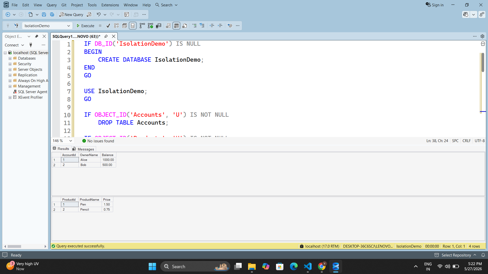
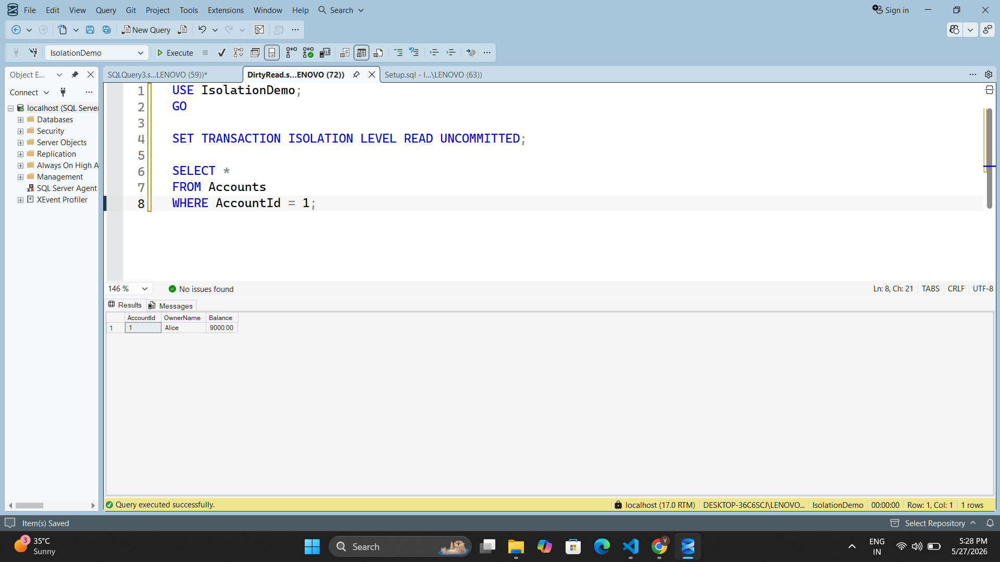
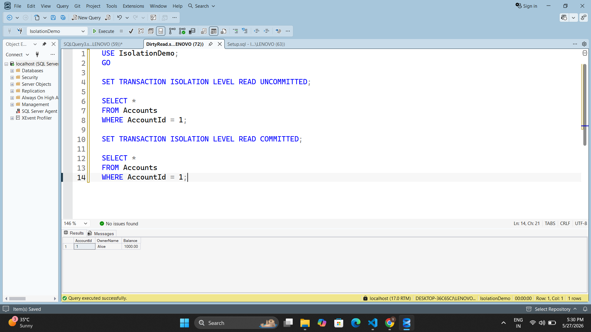
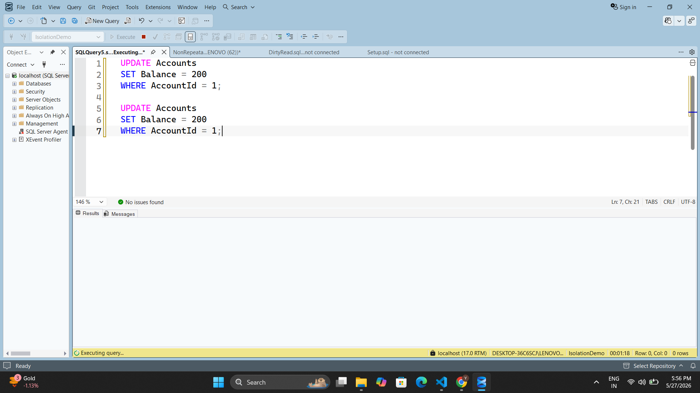
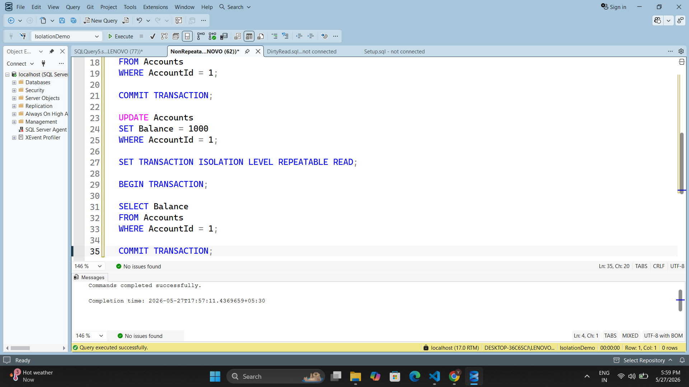
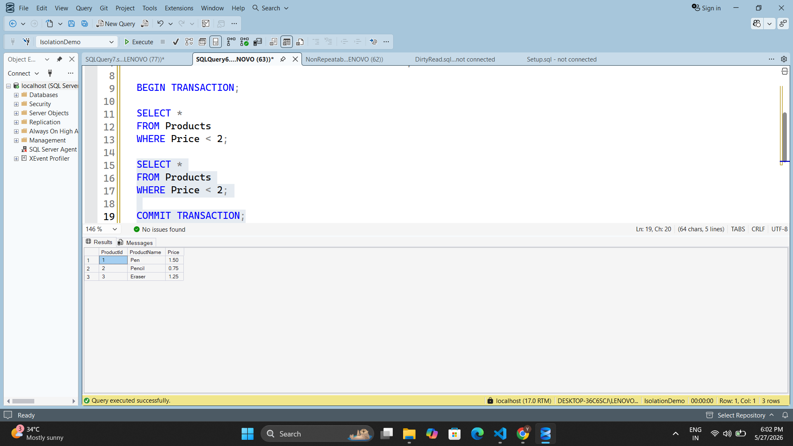
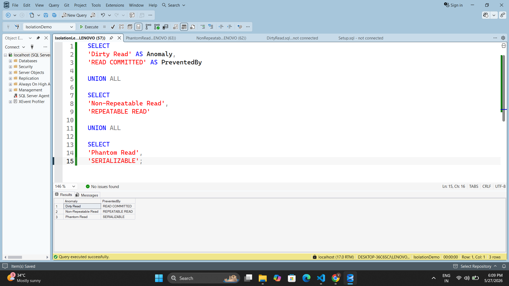

# Day 9 — Piece 1: Transaction Isolation Levels in SQL Server

Demonstrates the three classic read anomalies in SQL Server and which isolation level prevents each one, using a hands-on multi-session approach.

---

## Database Setup

**File:** [Setup.sql](Setup.sql)

Creates a fresh `IsolationDemo` database with two tables:

| Table      | Purpose                          |
|------------|----------------------------------|
| `Accounts` | Bank accounts (Dirty Read & Non-Repeatable Read demos) |
| `Products` | Product catalogue (Phantom Read demo) |

**Seed data:**
- Alice — Balance: `1000.00`
- Bob — Balance: `500.00`
- Pen — Price: `1.50`
- Pencil — Price: `0.75`



---

## Anomaly 1 — Dirty Read

**File:** [DirtyRead.sql](DirtyRead.sql)

A dirty read occurs when Session A reads data that Session B has written but **not yet committed**. If B later rolls back, A has read data that never officially existed.

**Timeline:**
```
B: BEGIN TRAN → UPDATE Alice balance 1000 → 9000
A: READ Alice balance  ← sees 9000  (dirty! not committed)
B: ROLLBACK            ← 9000 never really existed
A: READ Alice balance  ← now sees 1000 again
```

### Dirty Read Demonstrated — READ UNCOMMITTED

`READ UNCOMMITTED` holds no shared locks, so Session A can see B's uncommitted value of `9000`.



### Dirty Read Prevented — READ COMMITTED

`READ COMMITTED` (SQL Server default) waits until Session B commits or rolls back before returning a result. Session A sees the correct value of `1000`.



---

## Anomaly 2 — Non-Repeatable Read

**File:** [NonRepeatableRead.sql](NonRepeatableRead.sql)

A non-repeatable read occurs when Session A reads the **same row twice** inside one transaction and gets **different values** because Session B committed an UPDATE in between.

**Timeline:**
```
A: BEGIN TRAN → READ Alice balance → 1000
B:              UPDATE Alice balance → 200, COMMIT
A:              READ Alice balance → 200   ← different value!
A: END TRAN
```

### Non-Repeatable Read Demonstrated — READ COMMITTED

Session B updates Alice's balance to `200` between A's two reads. Session A sees `1000` on the first read and `200` on the second.



### Non-Repeatable Read Prevented — REPEATABLE READ

`REPEATABLE READ` holds a shared lock on every row it reads until the transaction ends. Session B's `UPDATE` is **blocked** until A commits, so both reads return `1000`.



---

## Anomaly 3 — Phantom Read

**File:** [PhantomRead.sql](PhantomRead.sql)

A phantom read occurs when Session A runs the **same range query twice** inside one transaction and gets a **different number of rows** because Session B inserted or deleted rows in between.

> Key distinction from Non-Repeatable Read:
> - **Non-Repeatable** = same row, different **value**
> - **Phantom** = same filter, different **number of rows**

**Timeline:**
```
A: BEGIN TRAN → SELECT products WHERE price < 2.00 → 2 rows
B:              INSERT Eraser (price 1.25), COMMIT
A:              SELECT products WHERE price < 2.00 → 3 rows!  ← phantom!
A: END TRAN
```

### Phantom Read Demonstrated — REPEATABLE READ

`REPEATABLE READ` locks existing rows but cannot prevent new rows from being inserted. Session B inserts `Eraser` and A's second scan sees 3 rows.



### Phantom Read Prevented — SERIALIZABLE (Session B Blocked)

`SERIALIZABLE` acquires a **range lock** on the scanned key range (`Price < 2.00`). Session B's `INSERT` is blocked until A's transaction commits — the second scan still returns the original 2 rows.


---

## Isolation Level Summary

**File:** [IsolationLevelTable.sql](IsolationLevelTable.sql)

| Isolation Level    | Dirty Read | Non-Repeatable Read | Phantom Read | Notes |
|--------------------|:----------:|:-------------------:|:------------:|-------|
| `READ UNCOMMITTED` | YES        | YES                 | YES          | No locks held on reads. Fastest, least safe. |
| `READ COMMITTED`   | NO         | YES                 | YES          | SQL Server default. Releases shared locks immediately after read. |
| `REPEATABLE READ`  | NO         | NO                  | YES          | Holds shared locks until end of transaction. Blocks UPDATEs on read rows. |
| `SERIALIZABLE`     | NO         | NO                  | NO           | Holds range locks. Blocks INSERTs/DELETEs in the scanned range. Safest. |



---

## How to Run

1. Open **SQL Server Management Studio (SSMS)**.
2. Run [Setup.sql](Setup.sql) to create the `IsolationDemo` database and seed data.
3. Run each demo file in separate SSMS query windows as instructed by the comments inside each file:
   - [DirtyRead.sql](DirtyRead.sql) — requires 2 sessions
   - [NonRepeatableRead.sql](NonRepeatableRead.sql) — requires 2 sessions
   - [PhantomRead.sql](PhantomRead.sql) — requires 2 sessions
4. Run [IsolationLevelTable.sql](IsolationLevelTable.sql) to see the summary of all isolation levels.

> Each demo file has clearly marked `SESSION A` and `SESSION B` blocks with step-by-step instructions in the comments.
