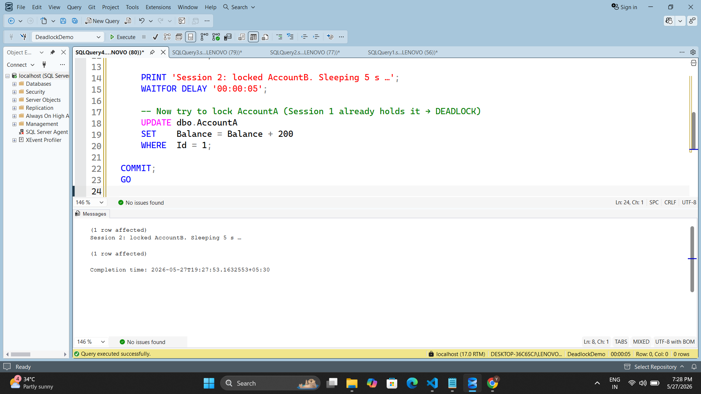
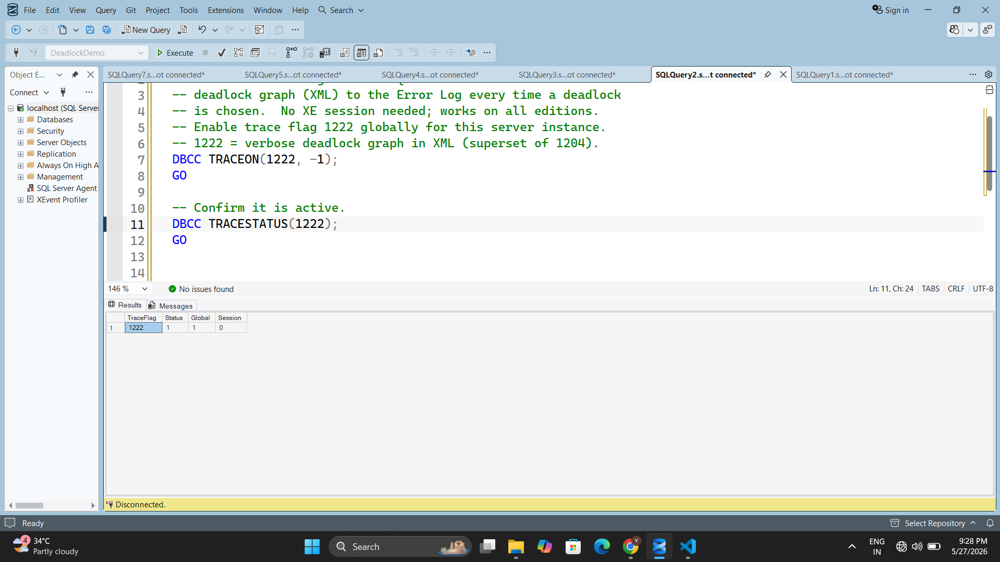
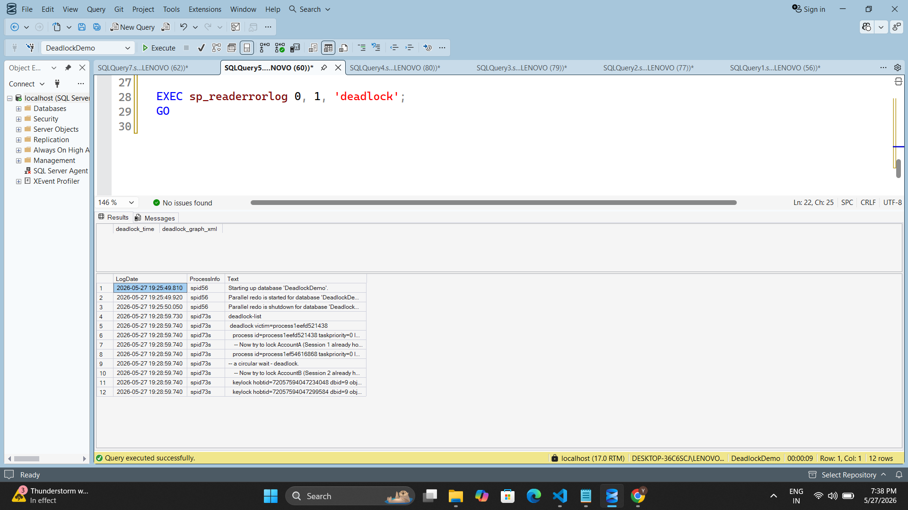

# Day 9 — Piece 2: Deadlock Reproduce & Resolve

Deadlocks are a design smell you must be able to diagnose. This exercise forces a classic two-resource deadlock across two sessions, captures the deadlock graph using Trace Flag 1222 and the `system_health` Extended Events session, then resolves it with consistent lock ordering.

---

## Concept: What Is a Deadlock?

A deadlock occurs when two (or more) sessions each hold a lock on a resource the other needs, forming a **circular wait**. Neither session can proceed, so SQL Server picks one as the **victim** (rolls it back) and lets the other continue.

```
Session 1                          Session 2
──────────────────────────────────────────────────
X-lock AccountA ✓
         WAIT 5 s               X-lock AccountB ✓
                                        WAIT 5 s
try X-lock AccountB ←─ blocked ─ blocked ─→ try X-lock AccountA
         ↑                                       ↑
         └──────────── circular wait ────────────┘
                    SQL Server picks one as VICTIM
                    → Msg 1205 rolled back
```

SQL Server's deadlock monitor wakes up every **5 seconds**, detects the cycle, and terminates the cheapest transaction (fewest log bytes) as the victim.

---

## Files

| # | File | What it does |
|---|------|-------------|
| 00 | `00_setup.sql` | Create `DeadlockDemo` database with `AccountA` and `AccountB` tables, seed one row each |
| 01 | `01_enable_deadlock_trace.sql` | Enable Trace Flag 1222 — writes full XML deadlock graph to the SQL Server Error Log |
| 02 | `02_session1_deadlock.sql` | **Repro — Session 1:** locks A then B (pauses 5 s between) |
| 03 | `03_session2_deadlock.sql` | **Repro — Session 2:** locks B then A (opposite order → deadlock) |
| 04 | `04_read_deadlock_graph.sql` | Query `system_health` ring buffer or `sp_readerrorlog` to retrieve the graph |
| 05 | `05_deadlock_graph_sample.xml` | Annotated sample of the XML deadlock graph produced by SQL Server |
| 06 | `06_fix_consistent_lock_order.sql` | **Fix:** both sessions lock A → B; circular wait becomes impossible |
| 07 | `07_cleanup.sql` | Disable TF 1222, drop the demo database |

---

## Step-by-Step Execution

### Step 1 — Setup

Run `00_setup.sql` once in any query window.

```sql
USE master;
-- drops and recreates DeadlockDemo
-- creates dbo.AccountA (Id=1, Balance=1000)
-- creates dbo.AccountB (Id=1, Balance=2000)
```

> **Screenshot to take:** After running, capture the Messages tab showing "Commands completed successfully" and the two rows in Object Explorer under `DeadlockDemo > Tables`.



---

### Step 2 — Enable Trace Flag 1222

Run `01_enable_deadlock_trace.sql`.

```sql
DBCC TRACEON(1222, -1);   -- server-wide, persists until reboot or TRACEOFF
DBCC TRACESTATUS(1222);   -- confirm TraceFlag=1222, Status=1, Global=1
```

> **Screenshot to take:** Capture the `DBCC TRACESTATUS` results grid — you should see `TraceFlag=1222`, `Status=1`, `Global=1`, `Session=0`.



> **Note:** The built-in `system_health` XE session captures deadlock graphs automatically on all editions — no additional setup needed.

---

### Step 3 — Reproduce the Deadlock

Open **two separate query windows** in SSMS and run:

1. **Window 1** → `02_session1_deadlock.sql` (locks A first, sleeps 5 s, then tries B)
2. **Window 2** → `03_session2_deadlock.sql` — start **1–2 seconds after** Window 1 (locks B first, sleeps 5 s, then tries A)

#### Session 1 core logic
```sql
BEGIN TRANSACTION;
    UPDATE dbo.AccountA SET Balance = Balance - 100 WHERE Id = 1;  -- X-lock A
    WAITFOR DELAY '00:00:05';
    UPDATE dbo.AccountB SET Balance = Balance + 100 WHERE Id = 1;  -- waits → DEADLOCK
COMMIT;
```

#### Session 2 core logic
```sql
BEGIN TRANSACTION;
    UPDATE dbo.AccountB SET Balance = Balance - 200 WHERE Id = 1;  -- X-lock B
    WAITFOR DELAY '00:00:05';
    UPDATE dbo.AccountA SET Balance = Balance + 200 WHERE Id = 1;  -- waits → DEADLOCK
COMMIT;
```

Within ~5 seconds SQL Server detects the cycle and the victim session receives:

```
Msg 1205, Level 13, State 51
Transaction (Process ID 52) was deadlocked on lock resources
with another process and has been chosen as the deadlock victim.
Rerun the transaction.
```

> **Screenshot to take:** Capture both SSMS query windows side-by-side. The victim window shows the red Msg 1205 error. The surviving window shows "Commands completed successfully."


---

### Step 4 — Capture the Deadlock Graph

Run `04_read_deadlock_graph.sql`.

**Option A — system_health ring buffer (works on all editions, no config needed):**
```sql
SELECT
    xdr.value('@timestamp', 'datetime2') AS deadlock_time,
    xdr.query('.')                       AS deadlock_graph_xml
FROM (
    SELECT CAST(target_data AS XML) AS ring_data
    FROM   sys.dm_xe_session_targets t
    JOIN   sys.dm_xe_sessions        s ON s.address = t.event_session_address
    WHERE  s.name        = 'system_health'
    AND    t.target_name = 'ring_buffer'
) AS data
CROSS APPLY ring_data.nodes('//RingBufferTarget/event[@name="xml_deadlock_report"]') AS xr(xdr)
ORDER BY deadlock_time DESC;
```

**Option B — Error Log (requires TF 1222):**
```sql
EXEC sp_readerrorlog 0, 1, 'deadlock';
```

---

### Step 5 — Read the Deadlock Graph

The XML graph (see `05_deadlock_graph_sample.xml` for a fully annotated example) has three key sections:

```xml
<deadlock victim="process2">          <!-- spid of the rolled-back session -->
  <process-list>
    <process id="process1" ...        <!-- Session 1: holds A, waits for B -->
    <process id="process2" ...        <!-- Session 2: holds B, waits for A (VICTIM) -->
  </process-list>
  <resource-list>
    <keylock objectname="dbo.AccountB"  <!-- held by process2, wanted by process1 -->
    <keylock objectname="dbo.AccountA"  <!-- held by process1, wanted by process2 -->
  </resource-list>
</deadlock>
```

The two `<keylock>` nodes with swapped `<owner>` / `<waiter>` pairs confirm the circular wait.

> **Screenshot to take:** In the XML viewer, expand `<resource-list>` so both `<keylock>` nodes are visible with their `<owner>` and `<waiter>` children. This is the proof of the circular wait.



---

## The Fix — Consistent Lock Ordering

**Root cause:** Sessions acquire the same two resources in opposite orders, making a circular wait possible.

**Fix:** Enforce a single global acquisition order — always lock `AccountA` before `AccountB` in every transaction, regardless of which account is the logical source or destination.

```sql
-- Fixed Session 1: A → B  (same as before, no change needed)
BEGIN TRANSACTION;
    UPDATE dbo.AccountA SET Balance = Balance - 100 WHERE Id = 1;  -- lock A
    WAITFOR DELAY '00:00:05';
    UPDATE dbo.AccountB SET Balance = Balance + 100 WHERE Id = 1;  -- lock B
COMMIT;

-- Fixed Session 2: A → B  (reordered — was B → A)
BEGIN TRANSACTION;
    UPDATE dbo.AccountA SET Balance = Balance + 200 WHERE Id = 1;  -- lock A first (blocks until S1 commits)
    UPDATE dbo.AccountB SET Balance = Balance - 200 WHERE Id = 1;  -- lock B after
COMMIT;
```

**Result:** Session 2 blocks on `AccountA` until Session 1 commits — normal blocking, not a deadlock. Once Session 1 releases its locks, Session 2 proceeds and completes successfully. No victim, no data loss.


### Why It Works 

> When every transaction acquires locks in the same global order, no circular wait can form — the second session simply queues behind the first instead of holding a resource the first one needs.

---

## Deadlock vs. Blocking

| | Blocking | Deadlock |
|---|---|---|
| Cause | One session waits for another to release a lock | Two sessions wait on each other — circular wait |
| Resolution | Automatically resolves when the holder commits/rolls back | SQL Server kills one session (Msg 1205) |
| Data loss | None | Victim transaction is fully rolled back |
| Fix | Tune query duration / add indexes | Consistent lock ordering / shorter transactions |

---

## Cleanup

Run `07_cleanup.sql` to disable the trace flag and drop the database.

```sql
DBCC TRACEOFF(1222, -1);
USE master;
DROP DATABASE IF EXISTS DeadlockDemo;
```
